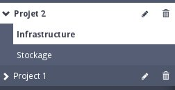
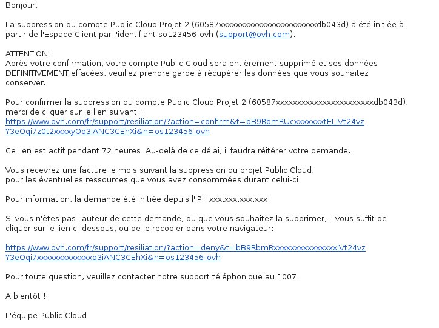
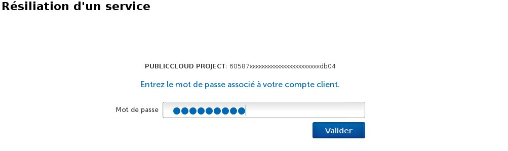

## 
Es kann verschiedene Gründe dafür geben, dass Sie Ihr Public Cloud Projekt löschen möchten.
Dies ist ab sofort von Ihrem Kundencenter aus möglich.

Nach der Löschung Ihres Projekts wird eine letzte Rechnung über Ihren Verbrauch bis dahin erstellt.
In dieser Anleitung erfahren Sie, welche Schritte Sie ausführen müssen, um Ihr Projekt zu löschen.

## Voraussetzungen

- Ein Public Cloud Projekt

## 

- Klicken Sie auf den kleinen Papierkorb rechts neben Ihrem Projekt

{.thumbnail}

- Eine Bestätigungsmeldung erscheint und fasst die zu löschenden Services noch einmal für Sie zusammen. Bestätigen Sie dies.

{.thumbnail}

- Anschließend erscheint ein Pop-Up, dass eine E-Mail an Sie verschickt wird.

{.thumbnail}

- In dieser Mail finden Sie zwei Links: Mit dem ersten können Sie die Löschung endgültig bestätigen, mit dem zweiten können Sie die Löschung stornieren.

{.thumbnail}

- Wenn Sie Ihr Projekt tatsächlich löschen wollen, geben Sie Ihr Passwort ein und bestätigen Sie die Löschung.

{.thumbnail}

## 

- [Projekte delegieren]({legacy}1914)
- [Rechnungen verstehen und verwalten]({legacy}2031)

## 
[Cloud]({legacy}1785)

