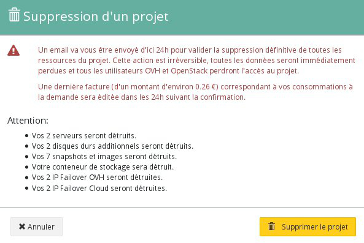
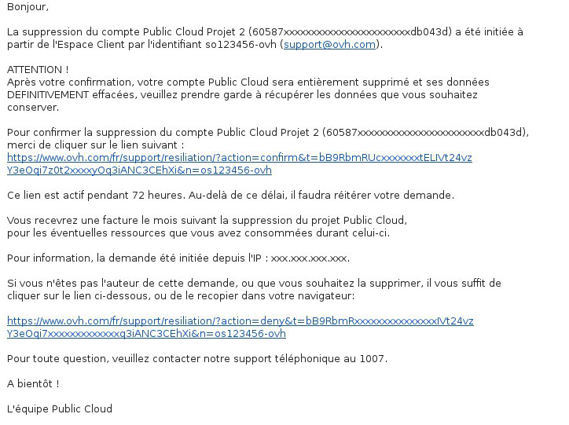

## Preambule
Pour diverses raisons, vous pouvez être amené à souhaiter la résiliation de votre projet Public Cloud. Cela est désormais faisable directement depuis votre Espace Client OVH.

Une suppression de votre projet déclenchera la création d'une dernière facture correspondant à votre utilisation en cours. Ce guide vous explique les différentes manipulations à effectuer pour supprimer votre projet.

### Prérequis
- Un projet Public Cloud

## Suppression du projet
- Cliquer sur la corbeille à droite de votre projet

{.thumbnail}

- Un message de confirmation apparaitra et récapitulera l'ensemble de vos services qui seront supprimés.

{.thumbnail}

- Une pop-up apparait ensuite pour vous confirmer qu'un mail vous a été envoyé.

{.thumbnail}

- Un fois le mail recu, celui ci qui contiendra 2 liens : Le premier pour confirmer la suppression, le second pour annuler celle ci.

{.thumbnail}

- Il suffira donc ensuite de valider cette suppression en inscrivant votre mot de passe :

{.thumbnail}