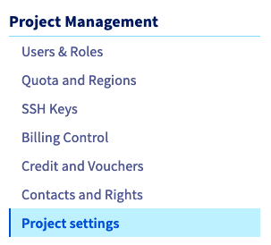
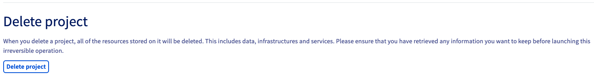
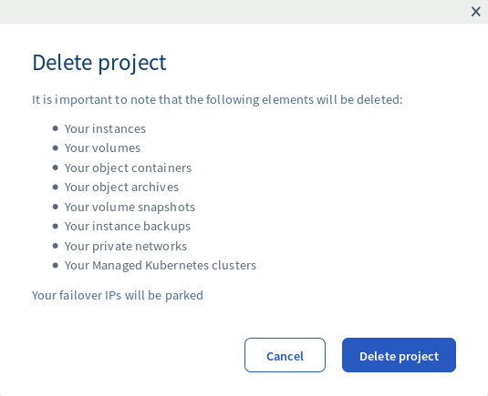

**Última atualização a 6 de dezembro de 2019**

## Objetivo

Quando o seu projeto [Public Cloud](https://docs.ovh.com/pt/public-cloud/){.external} deixa de ser necessário, pode eliminá-lo diretamente na [Área de Cliente OVHcloud](https://www.ovh.com/auth/?action=gotomanager){.external}.

Quando elimina o seu projeto Public Cloud, será criada uma fatura final pelo valor remanescente em dívida.

> [!warning]
>
Tenha em conta que eliminar um projeto não é a mesma coisa que desativar as suas instâncias Public Cloud. Quando elimina um projeto, os recursos que este inclui serão destruídos. Esta ação não pode ser anulada.
>

**Este guia explica como eliminar um projeto Public Cloud.**

## Requisitos

* Um projeto [Public Cloud](https://www.ovhcloud.com/pt/public-cloud/){.external} na sua conta OVH
* Acesso à [Área de Cliente OVHcloud](https://www.ovh.com/auth/?action=gotomanager){.external}

## Instruções

Primeiro, inicie sessão na [Área de Cliente OVHcloud](https://www.ovh.com/auth/?action=gotomanager){.external} e clique no menu `Public Cloud`{.action}.

Em seguida, clique em `Definições do projeto`{.action} sob Gestão de Projetos.

{.thumbnail}

Em seguida, clique no separador `Eliminar projeto`{.action}.

{.thumbnail}

Verá agora uma mensagem de confirmação, que indica os recursos que ficarão em espera ou que serão destruídos quando o projeto for eliminado. Leia a mensagem atentamente e, em seguida, quando estiver pronto para continuar, clique em `Eliminar projeto`{.action}.

{.thumbnail}

Ao clicar no botão para eliminar, receberá um e-mail a perguntar se pretende confirmar ou cancelar a eliminação do projeto. Depois de clicar na hiperligação de confirmação, será encaminhado para uma página web onde deverá introduzir a palavra-passe da sua conta. Depois de introduzir e confirmar a sua palavra-passe, o seu projeto será eliminado.

## Quer saber mais?

[Primeiros Passos com Public Cloud](https://docs.ovh.com/pt/public-cloud/comecar_com_o_public_cloud_identificar-se_e_criar_um_projeto/){.external}.

Fale com a nossa comunidade de utilizadores: <https://community.ovh.com/en/>
