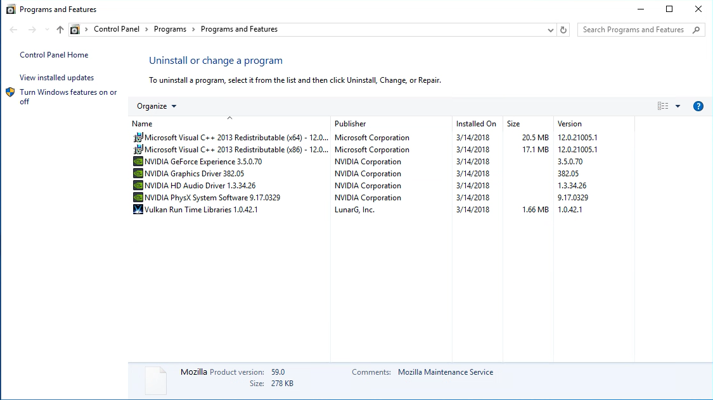
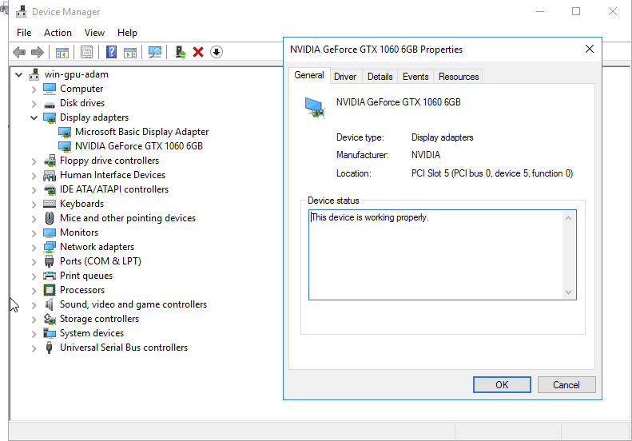

**Última atualização: 13/09/2018**

## Sumário

As instâncias GPU são tecnicamente similares às instâncias da gama 2017, mas dispõem ainda de uma placa gráfica (Graphic Processing Unit ou GPU). A tecnologia utilizada (*pci_passthrough*) permite que o sistema operativo da instância controle a GPU exatamente como numa máquina física.

As GPU disponibilizadas são as NVIDIA GeForce GTX 1060, GTX 1070 ou GTX 1080Ti. 

> [!warning]
>
> As instâncias GPU por enquanto só se encontram disponíveis no datacenter de GRA3, GRA5 e BHS3. Talvez tenha de criar um novo projeto e selecionar a nova gama 2017. Para mais informações, consulte este [manual](https://docs.ovh.com/gb/en/public-cloud/faq-how-to-understand-the-new-flavor-naming-rules-for-the-2017-range/) (sobre a nova nomenclatura na gama 2017 - versão inglesa).
> 

**Este manual explica como criar uma instância GPU em Linux ou Windows**


## Requisitos

- Ter criado um projeto Public Cloud com acesso às regiões em que a GPU está disponível (GRA3, GRA5 e BHS3).

## Instruções

Encontrará a seguir as informações necessárias para criar uma instância GPU via Linux ou via Windows.


### Em Linux

Todas as imagens que disponibilizamos podem ser utilizadas numa instância GPU.

> [!primary]
>
> Se não se sentir à vontade com a compilação manual de módulos de núcleo, recomendamos que utilize um sistema operativo oficialmente suportado por Nvidia, para o qual são fornecidos drivers de tipo *chave-na-mão*: <https://developer.nvidia.com/cuda-downloads>.
> 

Depois de iniciar sessão na [Área de Cliente OVH](https://www.ovh.com/auth/?action=gotomanager){.external}, vá ao seu projeto Public Cloud, clique em `Adicionar servidor`{.action} e selecione uma instância GPU:

{.thumbnail}

Depois de alguns segundos, a instância será iniciada. De seguida, poderá aceder à mesma e verificar a presença da placa gráfica: 

```ssh
lspci | grep -i nvidia
00:05.0 VGA compatible controller: NVIDIA Corporation Device 1c03 (rev a1)
00:06.0 Audio device: NVIDIA Corporation Device 10f1 (rev a1)
```

A placa gráfica, embora já presente, ainda não está utilizável: falta instalar os drivers NVIDIA. Pode encontrar a lista dos pacotes no seguinte endereço: [Lista dos pacotes Linux disponíveis](http://developer.download.nvidia.com/compute/cuda/repos/){.external}.

A seguir, basta introduzir os seguintes comandos:

```sh
wget URL_do_pacote_a_descarregar
sudo dpkg -i cuda-repo-XXXX-XXXXXX
sudo apt-get update
sudo apt-get upgrade
sudo apt-get install cuda
sudo reboot
```

> [!primary]
>
> O comando Linux pode variar em função do sistema operativo. Em caso de dúvida, verifique na documentação oficial da sua versão Linux.
> 


Uma vez reiniciada a instância, a placa gráfica surge no utilitário NVIDIA:

```sh
nvidia-smi
Wed Apr 26 13:05:25 2017
+-----------------------------------------------------------------------------+
| NVIDIA-SMI 375.51                 Driver Version: 375.51                    |
|-------------------------------+----------------------+----------------------+
| GPU  Name        Persistence-M| Bus-Id        Disp.A | Volatile Uncorr. ECC |
| Fan  Temp  Perf  Pwr:Usage/Cap|         Memory-Usage | GPU-Util  Compute M. |
|===============================+======================+======================|
|   0  GeForce GTX 106...  Off  | 0000:00:05.0     Off |                  N/A |
|  0%   22C    P0    26W / 120W |      0MiB /  6072MiB |      0%      Default |
+-------------------------------+----------------------+----------------------+

+-----------------------------------------------------------------------------+
| Processes:                                                       GPU Memory |
|  GPU       PID  Type  Process name                               Usage      |
|=============================================================================|
|  No running processes found                                                 |
+-----------------------------------------------------------------------------+
```

A instância GPU já se encontra plenamente funcional e utilizável.


### Em Windows

Existem algumas incompatibilidades entre o driver NVIDIA e a solução de virtualização *KVM/pci_passthrough*. **As imagens Windows padrão não funcionam.**

A OVH disponibiliza imagens especiais que assentam num BIOS virtual UEFI e que permitem um funcionamento correto do driver:

{.thumbnail}


> [!warning]
>
> Não nos é possível garantir que a solução funcionará com todas as versões futuras do driver NVIDIA.
>
> Antes de qualquer atualização do driver NVIDIA, é fortemente recomendado que faça um snapshot que lhe permita reverter as alterações, caso necessário.
>

Uma vez a instância GPU iniciada, é preciso instalar o driver NVIDIA a partir do [site oficial](http://www.nvidia.fr/Download/index.aspx){.external}.

Inicie uma instância utilizando uma das características da GPU (win-g1-15, win-g1-30, etc.).

Alguns minutos mais tarde, a instância é iniciada. Depois, só falta instalar o piloto necessário, que de seguida aparecerá aqui:


{.thumbnail}

{.thumbnail}


## Quer saber mais?

Fale com a nossa comunidade de utilizadores: [Comunidade OVH](https://community.ovh.com/en/){.external}