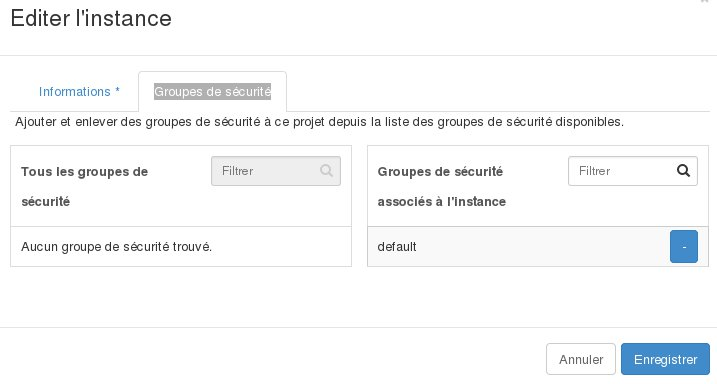

## 
Wenn Sie die Sicherheitsgruppen Ihrer Instanz konfigurieren möchten, um beispielsweise Gruppen hinzuzufügen oder zu entfernen, können Sie dazu einfach im OpenStack Horizon Manager Ihre Instanz bearbeiten.

Mit dieser Funktion können Sie bei Bedarf auch den Namen Ihrer Instanz ändern.

## Voraussetzungen

- [Erstellung eines Zugangs zu Horizon]({legacy}1773)
- Eine erstellte Instanz

## 
Um eine Instanz zu bearbeiten gehen Sie wie folgt vor:

- Verbinden Sie sich mit Horizon
- Klicken Sie in dem Menü auf der linken Seite auf Instanzen
- Wählen Sie für die gewünschte Instanz in der Dropdown-Liste Instanz bearbeiten aus

{.thumbnail}

## Rubrik "Info"
Hier können Sie den Namen der Instanz ändern.

Name: Geben Sie den gewünschten Namen für die Instanz ein.

{.thumbnail}

## Sicherheitsgruppen
Hier können Sie auf die Instanz angewandte Sicherheitsgruppe ändern.

Wählen Sie einfach die gewünschte Sicherheitsgruppe für die Instanz aus oder ab.

{.thumbnail}

- Klicken Sie zum Abschluss auf Speichern

## 
[Zurück zum Index der Cloud Hilfen]({legacy}1785)

