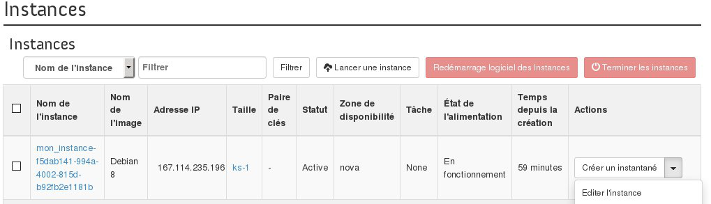

## Preambule
Si vous souhaitez configurer les groupes de sécurité de votre instance, que cela soit pour en enlever ou en ajouter, vous pouvez effectuer cela depuis l'interface OpenStack Horizon en éditant votre instance. Cette fonctionnalité vous permet aussi de modifier le nom de votre instance.

Ce guide vous indique la procédure à suivre afin d'effectuer cela.

### Prérequis
- [Créer un accès à Horizon]({legacy}1773){.ref}
- Une instance

## Edition d'une instance
Pour Editer une instance, il faut :

- Se connecter à Horizon
- Cliquer sur Instances dans le menu à gauche.
- Sélectionner Éditer l'instance dans la liste déroulante correspondant à l'instance.

{.thumbnail}

Cette section permet de modifier le nom de l'instance

**Nom**  : indiquer le nom souhaité pour l'instance.

{.thumbnail}

Cette section permet de modifier le groupe de sécurité à appliquer sur l'instance.

Sélectionner ou désélectionner le groupe de sécurité pour l'instance.

{.thumbnail}

- Pour terminer cliquer sur Enregistrer
