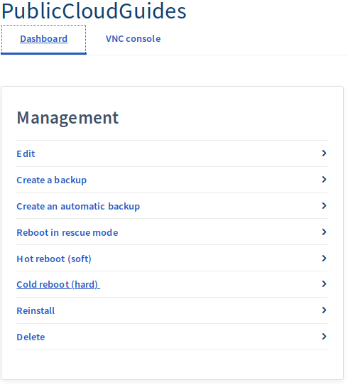
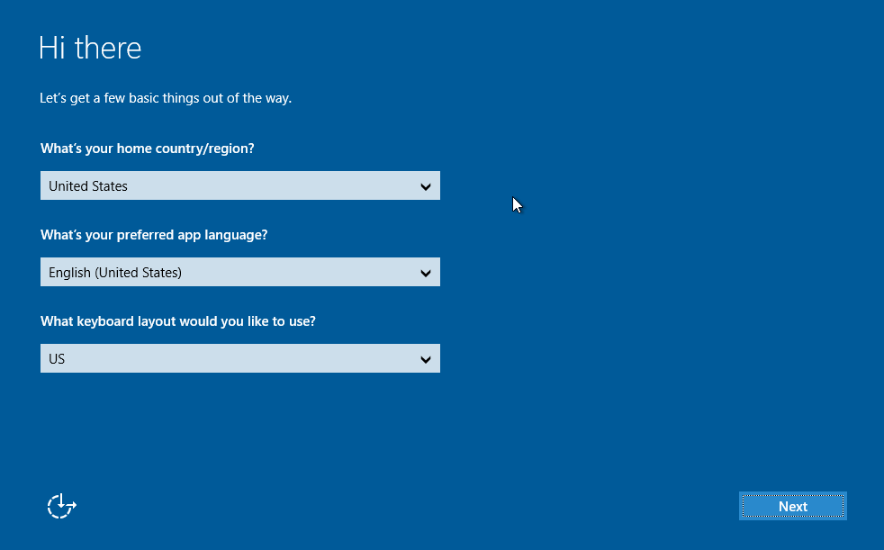
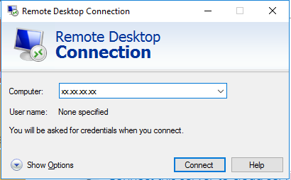
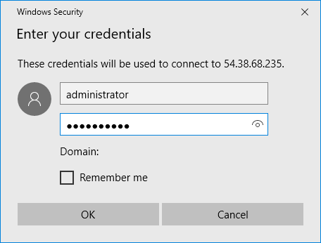
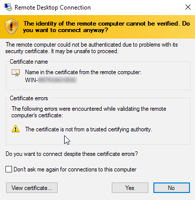

**Last updated 2nd October 2018**

## Objective

Logging in to your OVH Public Cloud instances is similar to a standard login for a VPS or Dedicated Server, but each instance has a specific user account.

**This guide will explain how to log in to your OVH Public Cloud instances using Windows and Linux.**

## Requirements

* access to the [OVH Control Panel](https://www.ovh.com/auth/?action=gotomanager){.external}
* an [OVH Public Cloud instance](https://www.ovh.co.uk/public-cloud/instances/){.external} created in your account

## Instructions

### Logging in to a Linux instance using a Linux/Mac operating system

Run the following SSH command to log in to your OVH Public Cloud instance, replacing ‘user’ as required, and ‘instance_IP’ with your instance’s IP address:

```sh
ssh user@instance_IP
```

The Public Cloud user will be different, depending on which operating system you are using. The table below features a (non-exhaustive) list of users, by operating system:

|Operating system|User|
|---|---|
|Arch Linux|arch|
|CentOS 6|centos|
|CentOS 7|centos|
|CoreOS|core|
|Debian 7|debian|
|Debian 8|debian|
|Debian 9|debian|
|Fedora 25|fedora|
|Fedora 26|fedora|
|FreeBSD 11.0 ZFS|freeBSD|
|Ubuntu 14.04|ubuntu|
|Ubuntu 16.04|ubuntu|
|Ubuntu 16.10|ubuntu|
|Ubuntu 17.04|ubuntu|

> [!primary]
>
> By logging in directly, you will have the standard user rights. If you would like to become the root user, you can use the sudo -i or sudo su command.
>


**Warning regarding the SSH remote server fingerprint:**

When you log in for the first time, you will need to confirm the authenticity of the host by clicking `yes`.

```sh
The authenticity of host 217.xxx.xxx.98 (217.xxx.xx.98) cant be established.
ECDSA key fingerprint is f4:95:09:ce:b6:63:73:ea:54:db:76:5e:64:f1:5e:6d.
Are you sure you want to continue connecting (yes/no)?`
```


### Logging in to a Linux instance using a Windows operating system

To log in to a Linux instance using Windows, you can use a software program like [PuTTY](https://www.putty.org/){.external}, or for the latest Windows 10 releases, you can use [native features](https://docs.microsoft.com/en-us/windows/wsl/about){.external}. You can then follow the same instructions as above.


### Logging in to a Windows instance

#### Finalise the installation

Once you have created your instance, you will need to finalise something called *sysprep*. To do this, log in to the [OVH Control Panel](https://www.ovh.com/auth/?action=gotomanager){.external} and launch the VNC console:



In the first step, choose your country, language and keyboard layout, then click `Next`{.action}:



You will then need to choose the *administrator* password:


Lastly, confirm the changes you have made by clicking `Finish`{.action}. The instance will reboot, and you can then log in to your Windows server.


#### Logging in to Windows

You will need to log in to your Windows instance directly from your Windows PC, using the `Remote desktop` feature:


In the next steps, you will then need to enter your instance’s IP address (first login step via remote desktop), then enter your username (administrator) and the password you have set:





A message will then appear, asking you to confirm your login details. Click `Yes`{.action}:



You will then be logged in to your instance.

> [!primary]
>
> If you experience any issues logging in to your Windows instance, please ensure that your Windows firewall authorises RDP connections. Please refer to our guide to [Windows server configuration](https://docs.ovh.com/gb/en/vps/windows-first-config/){.external} if you need more information.
> 


## Go further

Join our community of users on <https://community.ovh.com/en/>.