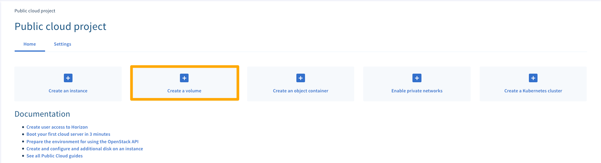
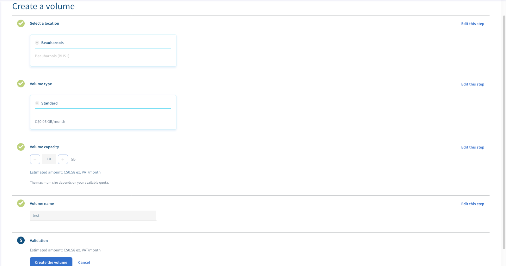
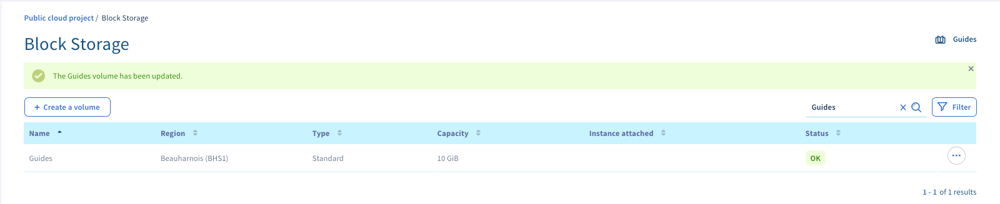
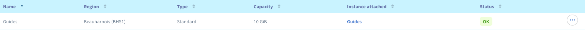

## Preamble
You can create additional volumes (or additional disks) for your Public Cloud instances. This is useful if:

- You want to increase your storage capacity without changing the instance model
- You want to have a highly available and high-performances storage space
- You want to be able to move your storage space as well as the data contained on another instance
- You want to install the system on a separate Ceph disk rather than a SSD disk

This guide will explain how to create an additional volume and then how to attach it to one of your instances.

### Prerequisites
- A [Public Cloud instance](../first_steps_start_my_first_server_within_3_minutes/){.external}

## Creating the volume
- Log in to the OVHcloud Customer [Control Panel](https://ca.ovh.com/manager/cloud/){.external}
- Click the `Add`{.action} button and select `Add a hard disk`{.action}

{.thumbnail}

A new menu will display.

{.thumbnail}

From this new menu, you can:

- Name your volume
- Select the volume type:

|Classic|200 IOPS guaranteed|
|---|---|
|High performance|Up to 3000 IOPS|

- Choose the volume capacity starting from 10GB.
- Choose the region for your volume

> [!primary]
>
> To attach a volume to an instance, they must both
> be located in the same region.
> 

- Make your hard disk bootable by checking "boot disk" if you want to start the system from this disk.
- Validate the creation of the volume.
A new window will be displayed with your volume:

{.thumbnail}

## Volume attachment
You can then attach your additional volume to an instance by clicking on the `···`{.action} button on the right of your volume and selecting `Attach to instance`{.action}

Select your instance in the drop down menu and click `Confirm` {.action}

Once this is done, it will show the instance that it is attached to.

{.thumbnail}

> [!primary]
>
> To continue, you will probably need to [configure](../howto_configure_an_additionnal_volumee){.external} this
> new volume on your instance.
> 
