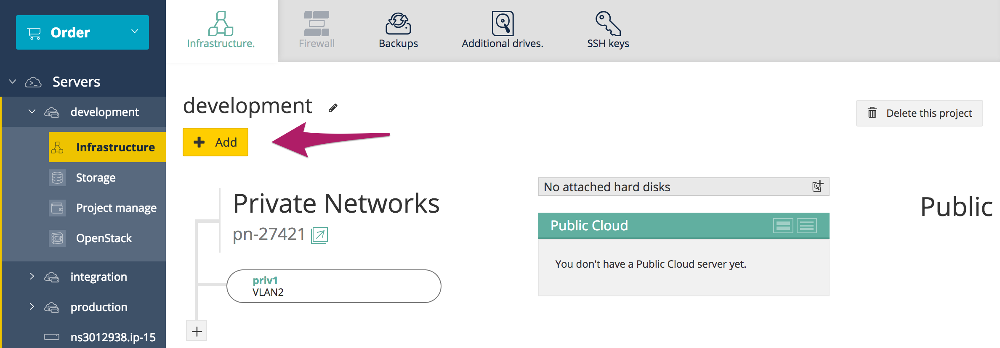
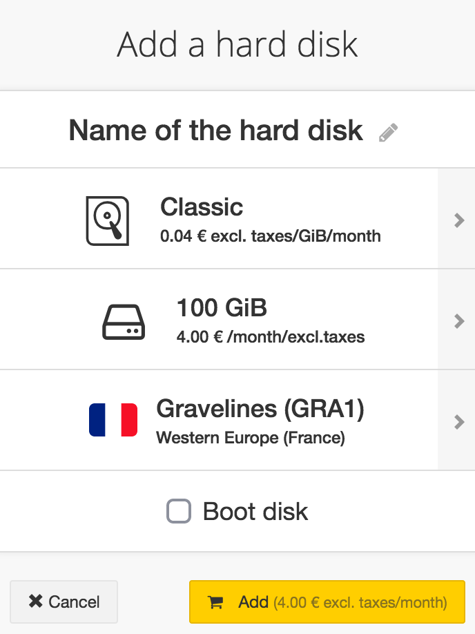
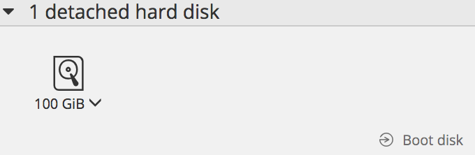
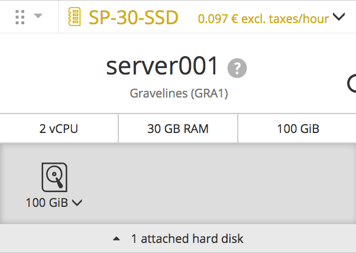

## Preambule
Il est possible de créer des volumes additionnels (ou disques additionnels) pour vos instances Public Cloud. Cela peut être utile dans le cas où :

- Vous souhaitez augmenter votre capacité de stockage sans pour autant changer de modèle d'instance.
- Vous souhaitez disposer d'un espace de stockage hautement disponible et performant.
- Vous souhaitez pouvoir déplacer votre espace de stockage ainsi que les données contenues sur une autre instance.
- Vous souhaitez installer le système sur un disque Ceph à part plutôt que le disque SSD.

Ce guide vous explique comment créer un volume supplémentaire puis comment le rattacher sur l'une de vos instances.

### Prérequis
- Disposer d'une [instance Public Cloud](../guide.fr-fr.md){.ref}

## Création du volume
- Se connecter à [l'espace client OVH](https://www.ovh.com/manager/cloud/){.external}
- Cliquer sur le bouton `Ajouter`{.action} et sélectionner `Ajouter un disque`{.action}

{.thumbnail}

Un nouveau menu va s'ouvrir.

{.thumbnail}

Vous pouvez, depuis ce nouveau menu :

- Nommer votre volume
- Sélectionner le type de volume :
|---|---|
|Classique|200 IOPS garanties|
|Haute performance|Jusqu'à 3000 IOPS|

- Choisir la capacité du volume : à partir de 10GB
- Choisir la région de votre volume

> [!primary]
>
> Pour qu'un volume soit rattaché à une instance, il est nécessaire que les
> deux soient localisés dans la même région.
> 

- Rendre votre disque bootable en cochant "boot disk" dans le cas où vous souhaitez démarrer le système à partir de ce disque.
- Valider la création du volume
Une nouvelle fenêtre apparaitra avec votre volume :

{.thumbnail}

## Attachement du volume
Vous pouvez ensuite attacher votre volume supplémentaire à une instance :

- En faisant un glisser/déposer de votre volume sur votre instance.
- En cliquant sur la flèche en bas à droite de votre volume et sélectionner `Attacher à un serveur`{.action}

Une fois cela fait, celui-ci apparaitra juste en-dessous de votre instance :

{.thumbnail}

> [!primary]
>
> Pour continuer, vous aurez certainement besoin de configurer ce
> nouveau volume sur votre instance
> <docs/cloud/public-cloud/howto_configure_an_additionnal_volume>.
> 