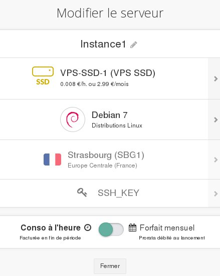
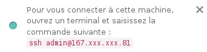

## 
Der Menübereich "Cloud" im OVH Kundencenter wurde so konzipiert, um Ihnen eine möglichst einfache und schnelle Verwaltung Ihrer Instanzen zu ermöglichen. 

Sie finden dort all Ihre Projekte unterteilt in zwei Abschnitte:

- Infrastruktur: alle Instanzen, Backups, Festplatten, SSH Keys, etc.
- Speicher: alle Container

In dieser Hilfe geht es um die Verwaltung Ihrer Instanzen. Insbesondere erfahren Sie, wie Sie Ihre Instanzen bearbeiten, neu starten oder löschen können.

## Voraussetzungen

- [Erstellung der SSH Schlüssel]({legacy}1769)
- [Erstellung einer Instanz im OVH Kundencenter]({legacy}1775)

## 
Hier sehen Sie das Menü Ihrer Instanz:

{.thumbnail}
Sie finden darin folgende Informationen:

- Modell und Kosten Ihrer Instanz
- Name und Region
- Verfügbare Ressourcen
- Ggf. zusätzliche Festplatten
- IP-Adresse Ihrer Instanz (rechts)

## Bearbeitung einer Instanz
Klicken Sie auf "Bearbeiten", damit sich folgendes Fenster öffnet:

{.thumbnail}
Über dieses Menü können Sie:

- Ihre Instanz neu benennen
- Das Modell wechseln
- Ihre Instanz mit einem anderen Betriebssystem neu installieren

## Bitte beachten Sie:
Bei der Neuinstallation werden alle Daten gelöscht.

- Von der stundengenauen Abrechnung zum günstigen Monatstarif wechseln

## Bitte beachten Sie:
Es wird eine neue Rechnung erstellt mit Ihrem anteiligen Verbrauch bis zum Tag der Umstellung.

## Erstellung eines Backups
Sie können über dieses Menü auch ein Backup Ihrer Instanz erstellen.
Für weitere Informationen lesen Sie bitte folgende Hilfe:

- [Ein Backup einer Instanz erstellen]({legacy}1881)

## Verbindungsinformationen
Hier können Sie ein neues Fenster öffnen mit dem SSH-Befehl für die Verbindung mit Ihrer Instanz.

{.thumbnail}

## VNC-Konsole
Sie können auch auf die VNC-Konsole Ihrer Instanz zugreifen.

So haben Sie direkten Zugriff auf Ihre Instanz. Sie müssen zuvor lediglich ein Passwort für einen "root"-Benutzer Ihrer Instanz erstellen.

Hierbei kann Ihnen folgende Hilfe nützlich sein:

- [Zugriff auf die Konsole einer Instanz in Horizon]({legacy}1782)

## Neustart der Instanz
Ihre Instanz kann über dieses Menü auch neu gestartet werden. Hierfür gibt es zwei Möglichkeiten:

- Warmstart (Software)
- Kaltstart (Hardware)

## Neuinstallation der Instanz
Sie können Ihre Instanz mit demselben Betriebssystem neu installieren.

## Bitte beachten Sie:
Bei der Neuinstallation werden alle Daten gelöscht.

## Löschung der Instanz
Die letzte angebotene Möglichkeit ist die Löschung Ihrer Instanz. So wird Ihnen im Falle der stundengenauen Abrechnung Ihre Instanz ab der Löschung nicht mehr in Rechnung gestellt.

## Bitte beachten Sie:
Ihre Instanz und die darauf gespeicherten Daten können danach nicht mehr wiederhergestellt werden.

## 

- [Die ersten Schritte mit Ihrer Windows Instanz]({legacy}1995)
- [Root-Rechte erlangen und Passwort festlegen]({legacy}1786)

## 
... lesen Sie auch unsere anderen Hilfen zum Thema Cloud!

