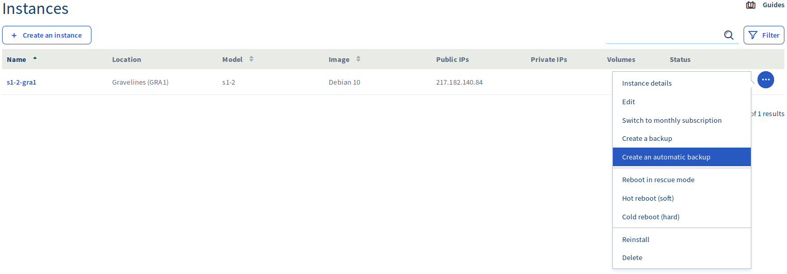

**Última actualización: 26/03/2019**

## Objetivo

Es posible gestionar las instancias de Public Cloud de OVHcloud directamente desde el [área de cliente](https://www.ovh.com/auth/?action=gotomanager){.external}, donde podrá consultar todos sus proyectos de infraestructura (instancias, backups, discos, llaves SSH...) y de almacenamiento (incluida la lista de contenedores).

**Esta guía explica cómo empezar a utilizar una instancia de Public Cloud.**

### Requisitos

- [Haber creado una instancia de Public Cloud](../crear_una_instancia_desde_el_area_de_cliente_de_ovh/) desde su cuenta de cliente.
- [Haber creado una llave SSH](../crear-llave-ssh/).

### Procedimiento

### Acceder a la interfaz de administración de la instancia.

Conéctese al [área de cliente de OVHcloud](https://www.ovh.com/auth/?action=gotomanager){.external}, acceda a la sección «Public Cloud» y seleccione el servicio Public Cloud de su interés. A continuación, haga clic en la pestaña `«Instancias»`{.action} a la izquierda.

En esa página, verá un resumen de todas sus instancias. En ella se presentan varios datos:

- El modelo de su instancia
- El nombre y la región de la instancia en cuestión
- Cualquier posible disco duro
- La dirección IP de su instancia
- El estado de la instancia

{.thumbnail}

### Editar la configuración de una instancia.

En la interfaz de administración de la instancia, haga clic en los 3 puntos a la derecha de la instancia y seleccione `«Editar»`{.action}.

{.thumbnail}

En la ventana que se abre, puede:

- Cambiar el nombre de la instancia
- Cambiar el modelo de la instancia 
- Reinstalar la instancia en otro sistema operativo (**tenga en cuenta que se borrarán todos los datos almacenados en la instancia si selecciona esta opción**)
- Cambiar la modalidad de pago de facturación por horas a tarifa mensual (entonces se emitirá una factura por la parte proporcional al período restante del mes)

{.thumbnail}
{.thumbnail}
{.thumbnail}

### Crear una copia de seguridad de una instancia.

Puede crear una copia de seguridad de una instancia desde su página de administración.  Para hacerlo, haga clic en los 3 puntos a la derecha de la instancia y seleccione `«Crear una copia de seguridad»`{.action}. Entonces verá esta página con toda la información necesaria: 

{.thumbnail}

A continuación, se mostrará la siguiente información: 

{.thumbnail}

Después de confirmar, se mostrará la siguiente información:

{.thumbnail}

Una vez realizada la copia de seguridad, podrá verla en la sección `«Copia de Seguridad de la Instancia`{.action}: 

{.thumbnail}

Si necesita ayuda, puede consultar nuestra guía [«Guardar una copia de seguridad de una instancia»](../guardar_copia_de_seguridad_de_una_instancia/).

### Crear automáticamente una copia de seguridad de una instancia.

Puede programar una copia de seguridad automática de una instancia desde su página de administración. Para hacerlo, haga clic en los 3 puntos de la derecha y seleccione `«Crear automáticamente una copia de seguridad»`{.action}: 

{.thumbnail}

Se mostrará la siguiente página: 

{.thumbnail}

Una vez que haya seleccionado la información necesaria y haya hecho clic en «Crear», se le redirigirá a la siguiente página: 

{.thumbnail}

En cualquier momento, puede acceder a `«Gestión del flujo de trabajo»`{.action} para eliminar el proceso de copia de seguridad automática actual: 

{.thumbnail}

Si necesita ayuda, puede consultar nuestra guía [«Guardar una copia de seguridad de una instancia»](../guardar_copia_de_seguridad_de_una_instancia/). 

### Recuperar la información de inicio de sesión.

En la interfaz de administración de la instancia, haga clic en `«Datos de la instancia»` y compruebe la información que aparece a continuación de `«Información de inicio de sesión»`{.action}. Ahí, puede recuperar los comandos SSH que necesita utilizar para conectarse a su instancia.

{.thumbnail}
{.thumbnail}

### Acceso a la consola VNC.

Utilizando la consola VNC, puede acceder directamente a su instancia. No obstante, tenga en cuenta que tendrá que haber establecido una contraseña para el administrador.

Para acceder a esta consola, haga clic en `«Consola VNC»`{.action} en el panel de la instancia.

{.thumbnail}

Entonces se abrirá la consola:

{.thumbnail}

### Reiniciar una instancia.

Hay dos formas diferentes de reiniciar una instancia:

- Reinicio en caliente (mediante <i>software</i>)
- Reinicio en frío (mediante <i>hardware</i>)

En la interfaz de administración de la instancia, haga clic en los 3 puntos a la derecha de la instancia y seleccione ora `«Reinicio en caliente (mediante software)»`{.action}, ora `«Reinicio en frío (mediante hardware)»`{.action}.

Entonces confirme su petición en la ventana que se abre.

{.thumbnail}

### Reinstalar una instancia.

Puede reinstalar una instancia y conservar el mismo sistema operativo. **Tenga en cuenta que se borrarán todos los datos guardados en su instancia si opta por reinstalar.**

En la interfaz de administración de la instancia, haga clic en los 3 puntos a la derecha de la instancia y seleccione `«Reinstalar»`{.action}. Haga clic en «Confirmar» para iniciar el proceso.

{.thumbnail}

### Eliminar una instancia.

También puede eliminar una instancia. **Esta operación eliminará permanentemente la instancia y todos los datos que contiene.**

En la interfaz de administración de la instancia, haga clic en el icono de la flecha desplegable y seleccione `«Eliminar»`{.action}. Haga clic en «Confirmar» para iniciar el proceso. 

{.thumbnail}

## Más información

Interactúe con nuestra comunidad de usuarios en <https://community.ovh.com/en/>.