**Ultimo aggiornamento 04/12/2019**

## Obiettivo

La sezione Cloud dello [Spazio Cliente OVHcloud](https://www.ovh.com/auth/?action=gotomanager){.external} è stata progettata per consentire una gestione semplice e veloce delle istanze attive.  Da questa interfaccia è possibile visualizzare tutti i progetti di infrastruttura (istanze, backup, dischi, chiavi SSH, ecc…) e storage (inclusa la lista dei container).

**Questa guida ti mostra le operazioni di base da effettuare sulla tua istanza Public Cloud OVHcloud.**

### Prerequisiti

- [Aver creato un’istanza Public Cloud OVHcloud](../crea_unistanza_dallo_spazio_cliente_ovh/)
- [Aver creato una chiave SSH](../creare-chiave-ssh/)

### Procedura

### Accedi alla gestione dell’istanza

Per iniziare, accedi all’area “Cloud” dello [Spazio Cliente OVHcloud](https://www.ovh.com/auth/?action=gotomanager){.external} e seleziona il tuo servizio. Poi, clicca su `Istanze`{.action} nel riquadro a sinistra.

L’interfaccia mostra la tua infrastruttura e diverse informazioni relative all’istanza:

- modello e costo
- nome e localizzazione
- eventuali dischi aggiuntivi associati
- indirizzo IP
- stato

{.thumbnail}

### Modifica la configurazione dell’istanza

Nella pagina di gestione dell’istanza clicca sui tre puntini a destra dell’istanza e seleziona l’opzione `Modifica`{.action}.

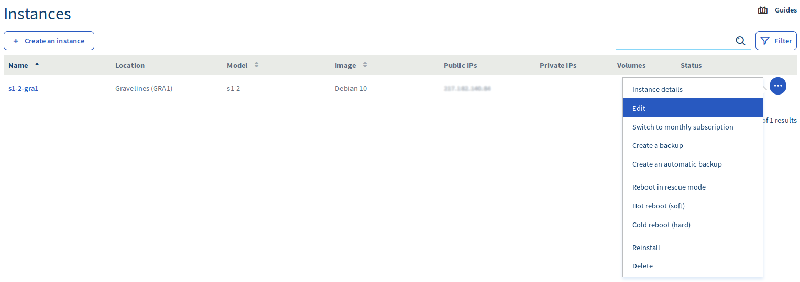{.thumbnail}

Nella nuova finestra è possibile:

- rinominare l’istanza 
- modificare il modello dell’istanza 
- reinstallare l’istanza su un altro sistema operativo (**attenzione: questa operazione comporta la cancellazione di tutti i dati**)
- passare dalla fatturazione oraria al forfait mensile (in questo caso viene generata una nuova fattura, calcolando il prorata temporis in base al giorno di attivazione del mese in corso)

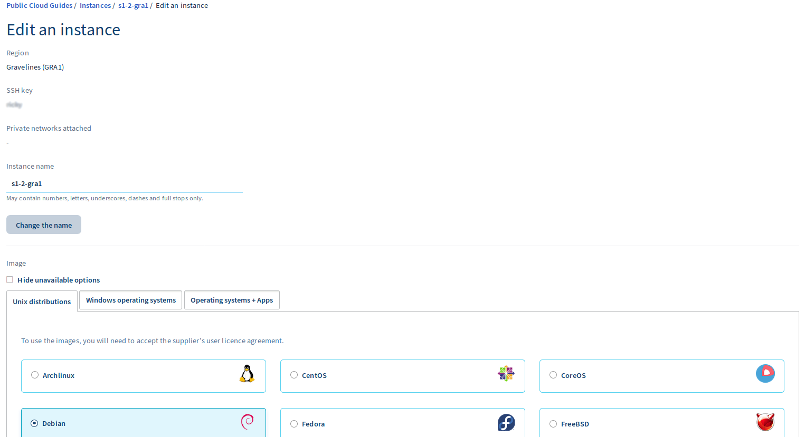{.thumbnail}
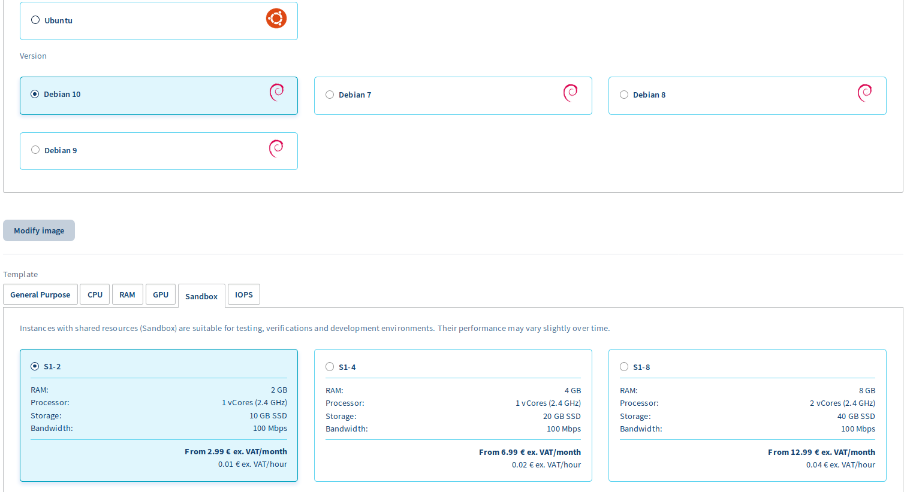{.thumbnail}
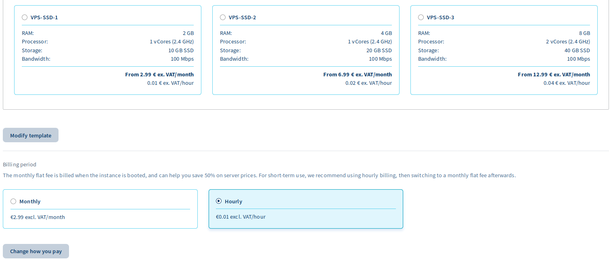{.thumbnail}

### Effettua un backup dell’istanza

Per creare un backup dell’istanza torna alla pagina di gestione,  clicca sui tre puntini a destra dell’istanza e poi su `Crea uno Snapshot`{.action}. Visualizzi questa pagina con tutte le informazioni necessarie: 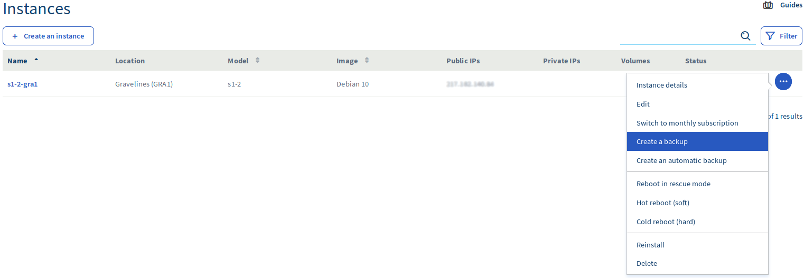{.thumbnail}.

A questo punto, visualizzi le seguenti informazioni:{.thumbnail}

Dopo la conferma, visualizzi queste informazioni: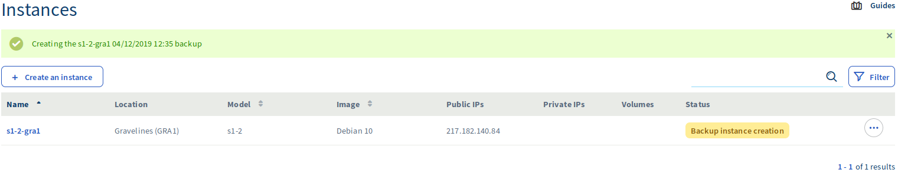{.thumbnail}

Una volta terminata l’operazione, visualizzi l’istantanea nella sezione `Instance Backup`{.action}: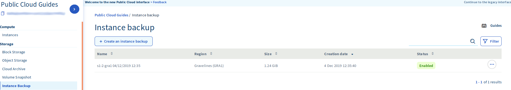{.thumbnail}

Per maggiori informazioni, consulta la guida [Effettuare lo Snapshot di un’istanza](../effettuare-snapshot-di-un-istanza/)

### Effettua un backup automatico dell’istanza

Per creare un backup automatico dell’istanza torna alla pagina di gestione, clicca sui tre puntini a destra e poi su`Crea uno Snapshot automatico`{.action}.

Quindi visualizzi questa pagina: {.thumbnail}

Dopo aver inserito le informazioni necessarie e aver cliccato su ‘Crea’, sarai reindirizzato alla pagina seguente:{.thumbnail}

In qualsiasi momento è possibile andare alla sezione`Gestione Workflow`{.action}per rimuovere il processo di backup automatico in corso{.thumbnail}

Per maggiori informazioni, consulta la guida [Effettuare lo Snapshot di un’istanza](../effettuare-snapshot-di-un-istanza/)

### Recupera le informazioni di connessione

Sempre nella pagina di gestione dell’istanza, clicca su`Dettagli dell’istanza` e verifica i dati presenti in`Informazioni di connessione`{.action}. Nella nuova finestra è disponibile il comando SSH da utilizzare per accedere all’istanza.

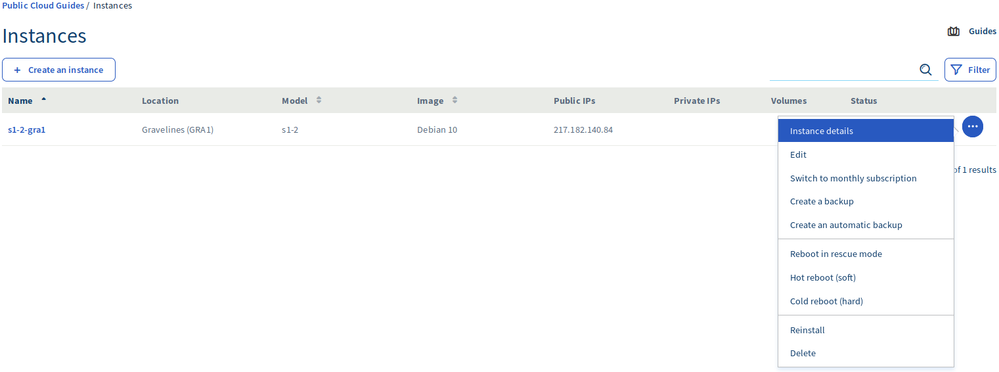{.thumbnail}
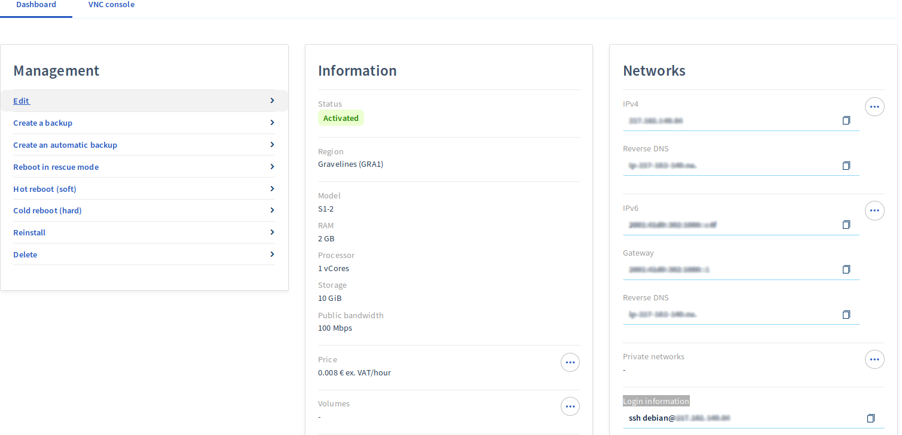{.thumbnail}

### Accedi alla console VNC

La console VNC è un software di controllo remoto con cui è possibile accedere direttamente all’istanza.  Per poter stabilire la connessione tramite questo programma è necessario aver impostato una password di root.

Per utilizzare la console accedi alla pagina di gestione dell’istanza e seleziona l’opzione `Console VNC`{.action}.

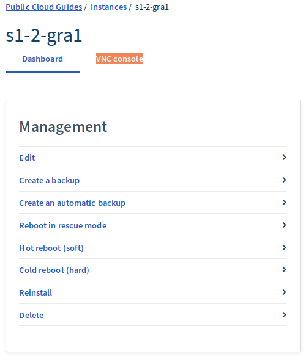{.thumbnail}

La console sarà quindi disponibile:

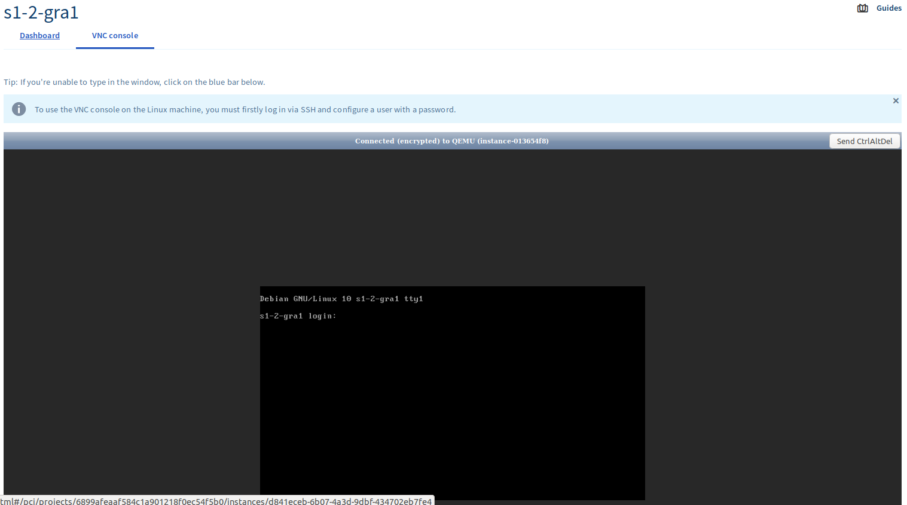{.thumbnail}

### Riavvia l’istanza

Il riavvio dell’istanza può essere effettuato in 2 modi diversi:

- a caldo (software)
- a freddo (hardware)

Nella pagina di gestione dell’istanza clicca sui tre puntini a destra dell’istanza e seleziona l’opzione `Riavvia a caldo`{.action} o `Riavvia a freddo`{.action}.

Nella nuova finestra, conferma l’operazione.

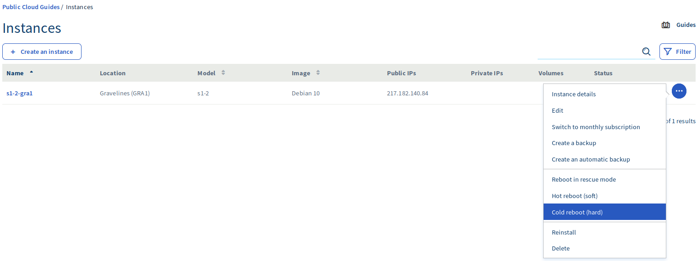{.thumbnail}

### Reinstalla l’istanza

La reinstallazione dell’istanza può essere eseguita anche mantenendo lo stesso sistema operativo. **Ti ricordiamo che questa operazione comporta la cancellazione di tutti i dati esistenti.**

Nella pagina di gestione dell’istanza clicca sui tre puntini a destra dell’istanza e seleziona l’opzione `Reinstalla`{.action}. Nella nuova finestra, clicca su ‘Conferma’ per avviare la procedura.

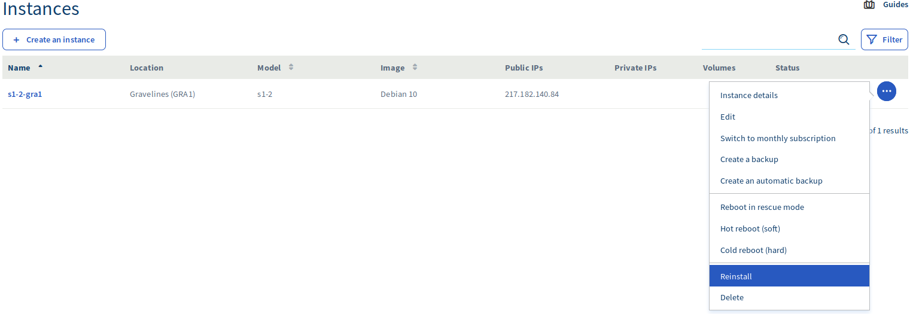{.thumbnail}

### Elimina l’istanza

Un’istanza può essere eliminata in qualsiasi momento. Ricorda però che **confermare questa operazione comporta la cancellazione definitiva di tutti i dati in essa contenuti, che non potranno più essere recuperati.**

Nella pagina di gestione dell’istanza clicca sui tre puntini a destra dell’istanza e seleziona l’opzione `Elimina`{.action}. Nella nuova finestra, clicca su ‘Conferma’ per avviare la procedura. 

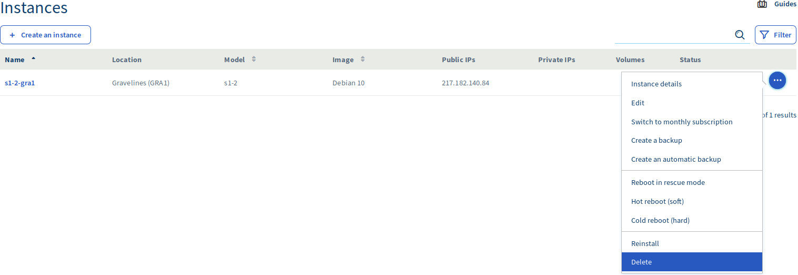{.thumbnail}

## Per saperne di più 

Contatta la nostra Community di utenti all’indirizzo <https://community.ovh.com/en/>.