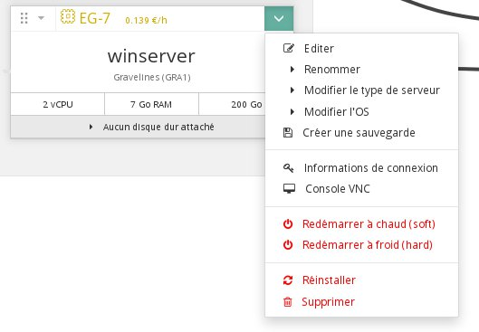
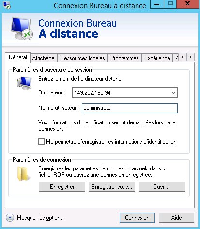
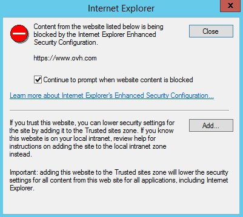
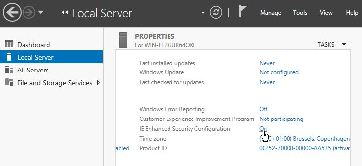
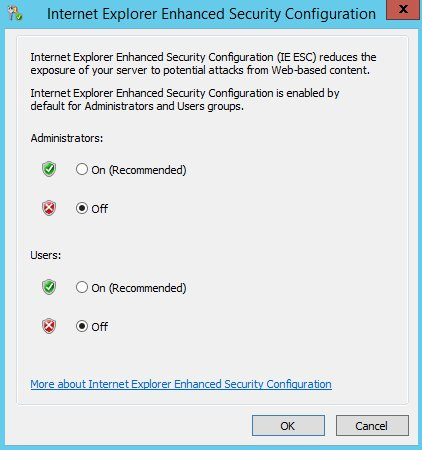
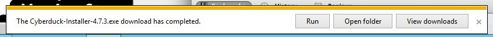

## 
Sie können die Public Cloud verwenden, um Ihre SSI-Webseiten oder Ihre nur mit Windows kompatiblen Applikationen zu hosten.
Die Installation von Windows Server 2012 r2 ist nur auf unseren Instanzen der Typen EG und SP möglich (es fallen zusätzliche Kosten für die Lizenz an).

Die ersten Schritte mit einer Windows Instanz unterscheiden sich von denen mit Linux. So gibt es etwa keine Konfiguration der SSH-Schlüssel, und um Ihr Administrator-Passwort zu konfigurieren, müssen Sie die VNC-Konsole verwenden.

In dieser Hilfe erfahren Sie alles über die ersten Schritte mit Ihrer Windows Instanz.


## Voraussetzungen

- [Erstellung einer Instanz im OVH Kundencenter]({legacy}1775) unter Windows Server 2012.


## Konfiguration des Passworts
Da für Ihre Windows Instanz kein SSH-Schlüssel konfiguriert werden kann, müssen Sie zunächst ein Passwort konfigurieren.

Verwenden Sie hierfür die VNC-Konsole:


- Starten Sie die VNC-Konsole der Instanz über Ihr Kundencenter.


{.thumbnail}

- Geben Sie das Passwort für den Administrator-Account an.


{.thumbnail}

## ACHTUNG!
Die Tastaturbelegung der VNC-Komnsole entspricht nicht notwendigerweise der von Ihnen verwendeten Tastaturbelegung. Überprüfen Sie daher am besten Ihr Passwort mehrfach, bevor Sie es bestätigen.


## Remote Desktop
Wenn Sie das Passwort konfiguriert haben, können Sie sich per Remote Desktop mit Ihrer Instanz verbinden.

Über einen Linux-Rechner:


```
user@poste :~$ rdesktop 149.202.160.94 -k fr -u administrator

-------
Verwendete Argumente:
-k: Tastaturtyp
-u: Benutzer
```


Oder über einen anderen Windows-Rechner:

{.thumbnail}


## Zugang zum Internet
Beim Internet Explorer ist standardmäßig die verstärkte Sicherheitskonfiguration ("Enhanced Security") aktiviert. Daher wird folgender Warnhinweis erscheinen:

{.thumbnail}
Außerdem sind bei dieser Funktion Downloads verboten.

Um diese Probleme zu umgehen, deaktivieren Sie die Funktion "Enhanced Security".


- Klicken Sie im "Server Manager" auf "Local Server".


{.thumbnail}

- Klicken Sie dann auf "IE Enhanced Security Configuration" und deaktivieren Sie die Funktion.


{.thumbnail}
Nun können Sie frei navigieren und auch Ihre Dateien downloaden.

{.thumbnail}


## 
... lesen Sie auch unsere anderen Hilfen zum Thema Cloud!

