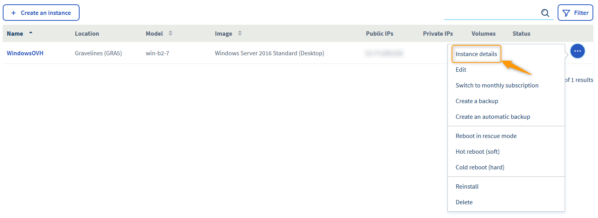
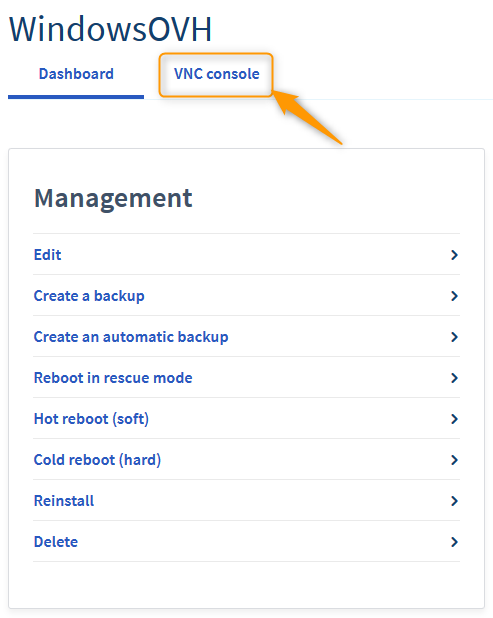
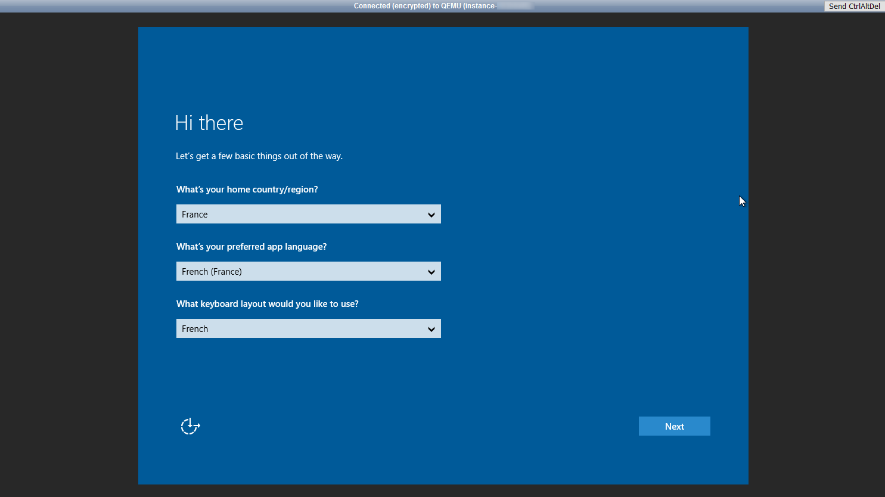
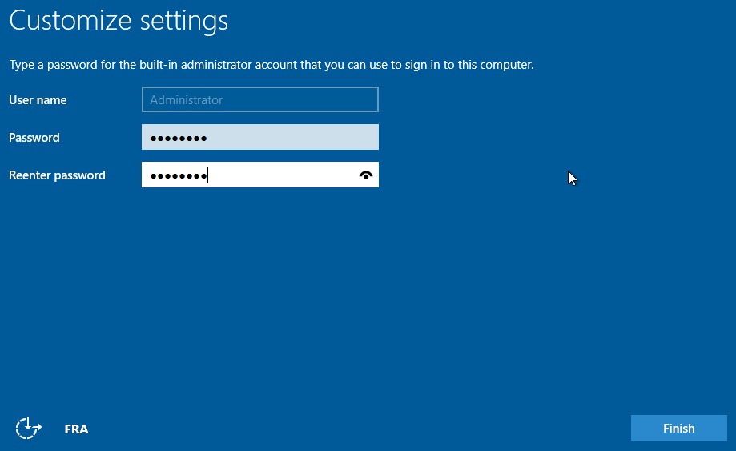
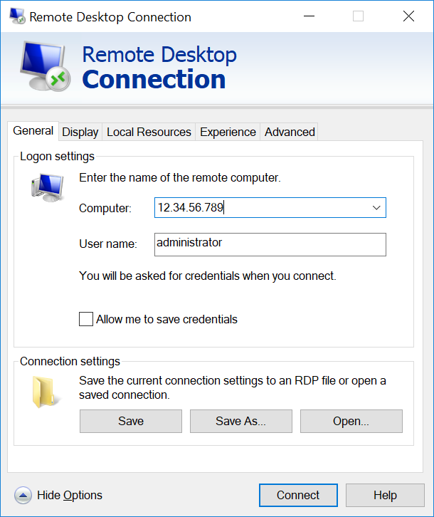
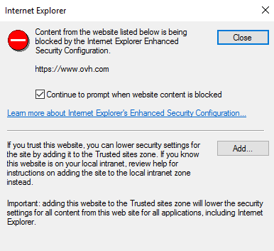
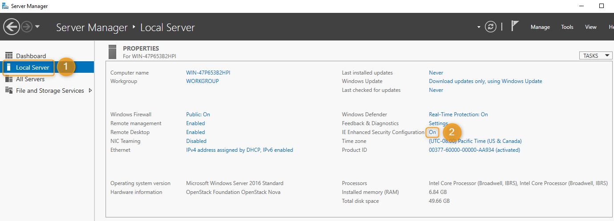
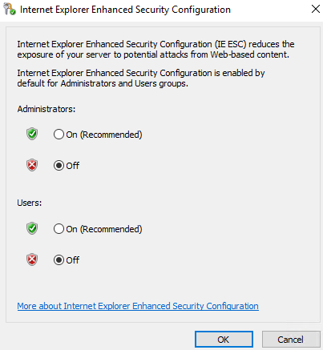

**Dernière mise à jour le 25/11/2019**

## Objectif

Il est possible d’utiliser le Public Cloud si vous souhaitez héberger des sites Web sous IIS ou encore vos applications compatibles uniquement avec Windows. Nos instances peuvent être installées sur des distributions [Windows Desktop](https://www.ovh.com/fr/public-cloud/prices/){.external}.

Une fois votre instance créée, il sera nécessaire de terminer l'installation de celle-ci via la console VNC.

**Ce guide vous explique la procédure à suivre afin de pouvoir accéder à votre instance Windows après son installation.**

## Prérequis

- Avoir créé un projet Public Cloud.
- Avoir crée [une instance dans l'espace client](https://docs.ovh.com/fr/public-cloud/creer-instance-espace-client/) sous une distribution Windows Desktop.

## En pratique

### Étape 1: configurer votre mot de passe

Contrairement à une instance Linux, une instance Windows n'est pas installée avec une clé SSH pré-configurée. 

Il est donc nécessaire de terminer l'installation via la console VNC :

- Cliquez sur les  `...`{.action} à droite de votre instance puis sur `Détail de l'instance`{.action} :

{.thumbnail}

- Rendez-vous dans l'onglet `Console VNC`{.action}

{.thumbnail}

- Sélectionnez les informations de langage et clavier puis renseignez le mot de passe de votre choix :

{.thumbnail}

> [!primary]
>
> Certaines touches du clavier de la console VNC ne correspondent pas forcément au clavier AZERTY. N’hésitez pas à vérifier à plusieurs reprises votre mot de passe avant de le valider.
>

{.thumbnail}

### Étape 2: accéder au bureau à distance

Une fois le mot de passe défini, vous pouvez accéder à votre instance Windows via une connexion en bureau à distance.

Depuis un poste sous Windows :

{.thumbnail}

Pour vous connecter depuis un poste sous Linux, tapez la commande suivante :

```
rdesktop 12.34.56.789 -u administrator
```
 
### Étape 3: améliorer la navigation sur Internet

Par défaut, la sécurité renforcée d'Internet Explorer est activée. Lors de votre navigation, un message d’avertissement apparaitra à de nombreuses reprises afin de vous mettre en garde et bloquer les téléchargements :

{.thumbnail}

Afin d'éviter ce comportement, vous pouvez désactiver la sécurité renforcée depuis votre gestionnaire de serveur.

- Ouvrez le **Gestionnaire de serveur** puis sélectionnez l'onglet `Serveur local`{.action} (1).

{.thumbnail}

- Cliquez sur `Actif`{.action} (2) à coté de **Configuration de sécurité renforcée d'Internet Explorer** afin de pouvoir désactiver l'option.

{.thumbnail}

## Aller plus loin

[Accès et sécurité dans Horizon](https://docs.ovh.com/fr/public-cloud/acces-et-securite-dans-horizon/){.external}

[Accéder à la console d'une instance dans Horizon](https://docs.ovh.com/fr/public-cloud/acceder-a-la-console-dune-instance-dans-horizon/){.external}

[Ajouter du crédit Cloud](https://docs.ovh.com/fr/public-cloud/ajouter-du-credit-cloud/){.external}

Échangez avec notre communauté d'utilisateurs sur <https://community.ovh.com>
