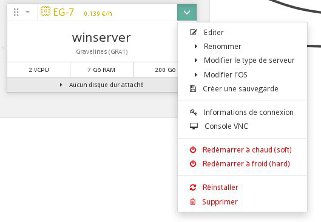
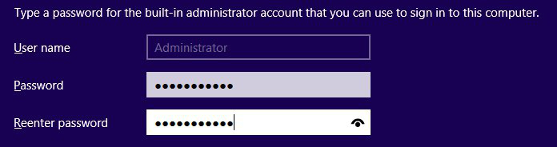
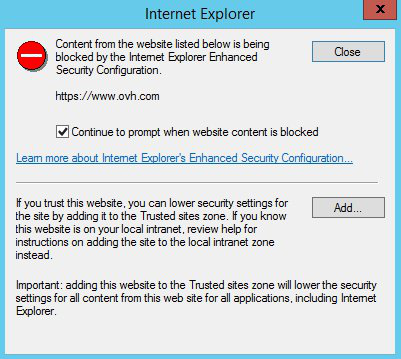
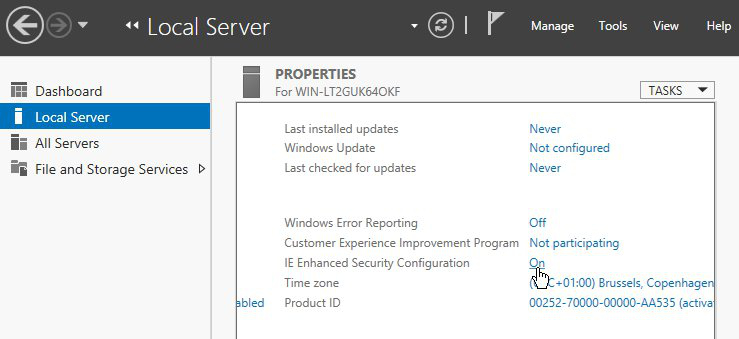

## Préambule
Il est possible d'utiliser le Public Cloud si vous souhaitez héberger des site Web sous IIS ou encore vos applications compatibles uniquement avec Windows. En effet, pour les instances de types EG et SP uniquement, il est possible d'installer Windows Server 2012 r2 (à raison d'un coût supplémentaire pour la licence).

Les premiers pas avec une instance Windows différerent de ceux avec une instance sous Linux. Par exemple, il n'y a pas de configuration de clé SSH par exemple, et le passage par la console VNC est nécessaire afin de configurer votre mot de passe administrateur.

Ce guide vous explique comment débuter avec une instance Windows.


### Prérequis
- [Créer une instance dans l'espace client OVH](../guide.fr-fr.md){.ref} sous Windows Server 2012


## Premier Pas

### Configuration du mot de passe
Étant donné qu'aucune clé SSH ne peut être configurée sur votre instance Windows, il faudra dans un premier temps configurer un mot de passe.

Pour cela, on utilisera la console VNC :

- Lancer la console VNC de l'instance depuis l'Espace Client OVH


{.thumbnail}

- Saisir le mot de passe pour le compte administrator


{.thumbnail}


> [!alert]
>
> Certaines touches du clavier de la console VNC ne correspondent pas forcément
> au clavier AZERTY, n'hésitez pas à vérifier à plusieurs reprises votre mot
> de passe avant de le valider.
> 


### Acces Bureau distant
Une fois le mot de passe configuré, il vous est possible de vous connecter sur votre instance en bureau distant.

Par exemple depuis un poste sous Linux :


```bash
user@poste :~$ rdesktop 149.202.160.94 -k fr -u administrator

-------
Légendes des arguments :
-k : Type de clavier
-u : Utilisateur
```

Ou depuis un autre poste Windows


{.thumbnail}


### Acces a Internet
Par défaut, la sécurité renforcée pour Internet Explorer est activée. Lors de votre navigation, un message d'avertissement apparaitra à de nombreuses reprises afin de vous mettre en garde :


{.thumbnail}

De plus, les téléchargements ne seront pas autorisés.

Pour cela, il faudra donc désactiver la sécurité renforcée.

- Se rendre sur le tableau de bord Windows dans la partie "Local Server"


{.thumbnail}

- Cliquer sur "IE Enhanced Security Configuration" et désactiver la sécurité renforcée


{.thumbnail}

Vous serez désormais en mesure de naviguer librement et de télécharger des fichiers.


{.thumbnail}