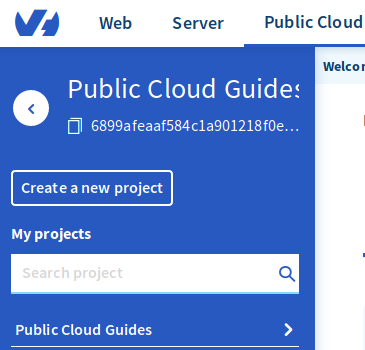

**Ostatnia aktualizacja: 14 listopada 2019**

## Wprowadzenie

Po utworzeniu [instancji Public Cloud](https://www.ovh.pl/public-cloud/){.external} nie otrzymasz e-maila zawierającego dane do logowania, ponieważ do uwierzytelniania są używane bezpieczne klucze SSH, a nie nazwy użytkownika i hasła.

**Ten przewodnik zawiera informacje o tworzeniu klucza SSH w celu umożliwienia logowania do instancji.**

> [!primary]
>
Klucze SSH nie służą do uwierzytelniania w instancjach z systemem operacyjnym Windows. W przypadku instancji z systemem Windows są używane nazwa użytkownika i hasło.
>

## Wymagania początkowe

* projekt [Public Cloud](https://www.ovh.pl/public-cloud/){.external} na koncie OVHcloud
* dostęp do [Panelu klienta OVHcloud](https://www.ovh.com/auth/?action=gotomanager){.external}

## W praktyce

### Tworzenie klucza SSH w systemie Linux i Mac

Najpierw otwórz aplikację terminalu (wiersza polecenia), a później wygeneruj 4096-bitowy klucz SSH przy użyciu następującego polecenia:

```sh
# ssh-keygen -b 4096
```

Wykonanie polecenia spowoduje wyświetlenie następującego komunikatu z monitem o zapisanie nowo utworzonego klucza:

```sh
Generating public/private rsa key pair.
Enter file in which to save the key (/home/user/.ssh/id_rsa):
```

> [!warning]
>
> Prywatną część klucza należy przechowywać w bezpiecznym miejscu, a dostęp do niego powinny mieć tylko uprawnione osoby.
> 

Po zapisaniu klucza w wierszu polecenia zostaną wyświetlone następujące informacje:

```ssh
Your identification has been saved in /home/user/.ssh/id_rsa.
Your public key has been saved in /home/user/.ssh/id_rsa.pub.
The key fingerprint is:
0a:3a:a4:ac:d1:40:6d:63:6d:fd:d9:fa:d6:b2:e0:36 user@host
The key's randomart image is:
+---[RSA 4096]----+
|      .          |
|                 |
| .               |
|. . . .          |
|. .=.o .S.       |
| =o.o. ..   .    |
|o +   .  . o ..  |
|.. .      oEoo . |
|o.        .o+oo  |
+-----------------+
```

Klucz można wyświetlić i odczytać przy użyciu następującego polecenia:

```ssh
# cat .ssh/id_rsa.pub
```

Uruchomienie tego polecenia spowoduje wyświetlenie następujących informacji:

```ssh
cat /home/user/.ssh/id_rsa.pub
ssh-rsa AAAAB3NzaC1yc2EAAAADAQABAAABAQC8teh2NJ42qYZV98gTNhumO1b6rMYIkAfRVazl
k6dSS3xf2MXJ4YHsDacdjtJ+evXCFBy/IWgdkFtcvsGAMZ2N1RdvhDyQYcy6NDaJCBYw1K6Gv5fJ
SHCiFXvMF0MRRUSMneYlidxU3U2q66yt/wPmw1yRsQagtNKHAzFUCSOB1nFz0RkqvqgARrHTY0bd
aS0weA//aK9f6z+Y4THPbcCj4xPH4iGikFMPrFivP8Z6tidzVpAtbr1sXmJGZazYWrU3FoK2a1sF
i4ANmLy7NULWK36yU0Rp9bFJ4o0/4PTkZiDCsK0QyHhAJXdLN7ZHpfJtHIPCnexmwIMLfIhCWhO5
 user@host
```

### Tworzenie klucza SSH w systemie Windows

#### Za pomocą programu PuTTY

[PuTTY](https://www.chiark.greenend.org.uk/~sgtatham/putty/){.external} to popularny klient SSH do systemu Windows. Umożliwia zdalne połączenie z serwerem systemu Linux. Jego oprogramowanie pomocnicze, [PuTTYgen](https://the.earth.li/~sgtatham/putty/latest/w64/puttygen.exe){.external}, służy do tworzenia kluczy SSH.

Najpierw pobierz oprogramowanie [PuTTYgen](https://the.earth.li/~sgtatham/putty/latest/w64/puttygen.exe){.external}, które umożliwi wygenerowanie klucza.

Następnie uruchom oprogramowanie i jako typ klucza wybierz RSA, jako liczbę bitów do wygenerowania wpisz 4096, a następnie kliknij przycisk `Generate`{.action} (Generuj).

{.thumbnail}

Następnie losowo przesuwaj kursorem myszy w obszarze pod paskiem postępu, jak pokazano poniżej.

{.thumbnail}

Przesuwanie kursora myszy spowoduje wypełnianie paska postępu. Całkowite wypełnienie paska postępu wskazuje, że klucz jest gotowy.

{.thumbnail}

### Importowanie klucza SSH do Panelu klienta OVHcloud

Najpierw zaznacz i skopiuj tekst klucza publicznego, a następnie zaloguj się do [Panelu klienta OVHcloud](https://www.ovh.com/auth/?action=gotomanager){.external}.

Kliknij menu `Public Cloud`{.action}.

{.thumbnail}

Wybierz projekt Public Cloud z lewego menu{.action}.

{.thumbnail}

Wybierz kartę `Klucze SSH`{.action}. Następnie wklej 4096-bitowy klucz we wskazanym polu, nadaj mu nazwę i kliknij przycisk `Dodaj ten klucz`{.action}.

{.thumbnail}

Klucz zostanie zapisany w Panelu klienta OVHcloud na potrzeby uwierzytelniania.

## Sprawdź również

Przyłącz się do społeczności naszych użytkowników na stronie <https://community.ovh.com/en/>.