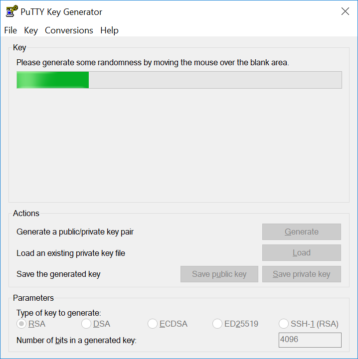
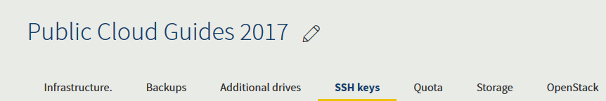
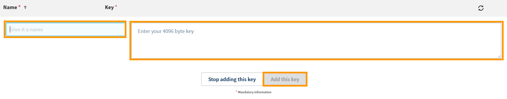

**Ostatnia aktualizacja z dnia 22-01-2019**

## Wprowadzenie

Po utworzeniu [instancji Public Cloud](https://www.ovh.pl/public-cloud/instances/){.external} nie otrzymasz e-maila zawierającego dane do logowania. W tym przypadku uwierzytelnienie wymaga użycia bezpiecznych kluczy SSH. 

**Dowiedz się, jak wygenerować klucz SSH, aby zalogować się do Twojej instancji.**

> [!primary]
>
Pamiętaj, że klucze SSH nie są używane do uwierzytelnienia w instancjach z systemem operacyjnym Windows. W instancjach z Windowsem należy używać loginu i hasła.
>

## Wymagania początkowe

* Utworzenie projektu [Public Cloud](https://www.ovh.pl/public-cloud/instances/){.external} na Twoim koncie OVH
* Dostęp [do Panelu klienta OVH](https://www.ovh.com/auth/?action=gotomanager){.external}

## W praktyce

### Utworzenie klucza SSH w systemie Linux i Mac

Otwórz aplikację Terminal (wiersz poleceń), następnie wprowadź następującą komendę, aby wygenerować klucz SSH 4096 bitów:

```sh
# ssh-keygen -b 4096
```

Pojawi się następujący wynik i zostajesz poproszony o zapisanie nowo utworzonego klucza.

```sh
Generating public/private rsa key pair.
Enter file in which to save the key (/home/user/.ssh/id_rsa):
```

> [!warning]
>
> Prywatna część klucza musi być przechowywana w bezpieczny sposób, a dostęp do niej mogą mieć jedynie upoważnione osoby.
> 

Po zapisaniu klucza wiersz poleceń wyświetla następujące elementy:

```ssh
Your identification has been saved in /home/user/.ssh/id_rsa.
Your public key has been saved in /home/user/.ssh/id_rsa.pub.
The key fingerprint is:
0a:3a:a4:ac:d1:40:6d:63:6d:fd:d9:fa:d6:b2:e0:36 user@host
The key's randomart image is:
+---[RSA 4096]----+
375.51                    |
375.51                    |
375.51                    |
375.51                    |
|. .=.o .S.       |
| =o.o. ..   .    |
|o +   .  . o ..  |
|.. .      oEoo . |
|o.        .o+oo  |
+-----------------+
```

Możesz odczytać i wyświetlić klucz za pomocą następującego polecenia:

```ssh
# cat .ssh/id_rsa.pub
```

Po wprowadzeniu polecenia wyświetlą się następujące elementy:

```ssh
cat /home/user/.ssh/id_rsa.pub
ssh-rsa AAAAB3NzaC1yc2EAAAADAQABAAABAQC8teh2NJ42qYZV98gTNhumO1b6rMYIkAfRVazl
k6dSS3xf2MXJ4YHsDacdjtJ+evXCFBy/IWgdkFtcvsGAMZ2N1RdvhDyQYcy6NDaJCBYw1K6Gv5fJ
SHCiFXvMF0MRRUSMneYlidxU3U2q66yt/wPmw1yRsQagtNKHAzFUCSOB1nFz0RkqvqgARrHTY0bd
aS0weA//aK9f6z+Y4THPbcCj4xPH4iGikFMPrFivP8Z6tidzVpAtbr1sXmJGZazYWrU3FoK2a1sF
i4ANmLy7NULWK36yU0Rp9bFJ4o0/4PTkZiDCsK0QyHhAJXdLN7ZHpfJtHIPCnexmwIMLfIhCWhO5
 user@host
```

### Utworzenie klucza SSH w systemie Windows

#### Za pomocą PuTTY

[PuTTY](https://www.chiark.greenend.org.uk/~sgtatham/putty/){.external} jest popularnym klientem SSH dla systemu Windows. Możesz używać go do zdalnego logowania się do serwera Linux. Za pomocą oprogramowania towarzyszącego, [PuTTYgen](https://the.earth.li/~sgtatham/putty/latest/w64/puttygen.exe){.external}, możesz tworzyć klucze SSH.

Pobierz oprogramowanie [PuTTYgen](https://the.earth.li/~sgtatham/putty/latest/w64/puttygen.exe){.external}, którego użyjesz do generowania klucza.

Uruchom oprogramowanie i wybierz RSA jako typ klucza. Następnie wprowadź 4096 jako liczbę bitów do wygenerowania i kliknij przycisk `Wygeneruj`{.action}. 

{.thumbnail}

Następnie przesuwaj kursorem losowo w obszarze pod paskiem postępu, jak pokazano poniżej.

{.thumbnail}

Przy przesuwaniu kursora pasek postępu zaczyna się wypełniać. Kiedy się wypełni, klucz będzie gotowy.

{.thumbnail}

### Importowanie klucza SSH do Panelu klienta OVH

Wybierz i skopiuj treść z Twojego klucza publicznego, następnie zaloguj się do [Panelu klienta](https://www.ovh.com/auth/?action=gotomanager){.external}.

Teraz kliknij menu `Cloud`{.action}.

{.thumbnail}

Wybierz Twój projekt Public Cloud w menu po lewej stronie, następnie kliknij `Infrastruktura`{.action}.

{.thumbnail}

Wybierz zakładkę `Klucz SSH`{.action}.

{.thumbnail}

Wklej klucz 4096 bitów w przewidzianym do tego celu polu. Nadaj mu nazwę i kliknij przycisk `Dodaj klucz`{.action}.

{.thumbnail}

Twój klucz zostanie teraz zapisany w Panelu klienta w celu uwierzytelnienia.

## Sprawdź również

Przyłącz się do społeczności naszych użytkowników na stronie <https://community.ovh.com/en/>.