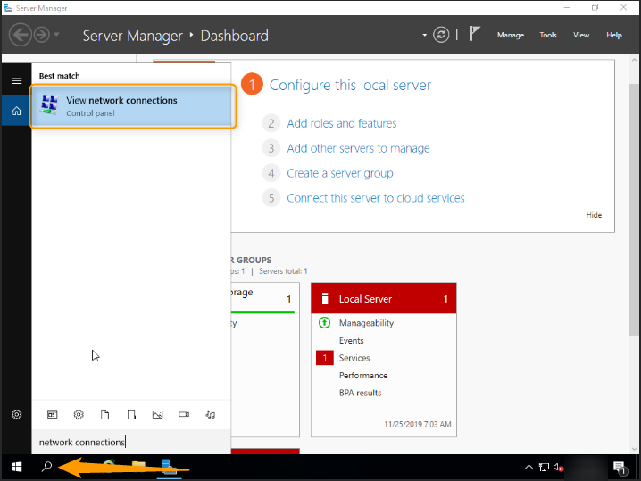

**Last updated 31st January 2020**

## Objective

Internet Protocol version 6 (IPv6) is the latest version of Internet Protocol (IP). It is designed to resolve the long-anticipated exhaustion of IPv4 addresses, by using addresses made up of 128-bits rather than the standard 32-bits of IPv4.

Each Public Cloud instance is delivered with an IPv4 address and an IPv6 address.

By default, only the IPv4 address is configured.

**This guide will show you how to configure an IPv6 address on a Public Cloud instance.**

## Requirements

* a Public Cloud instance (any model)
* knowledge of SSH
* basic network knowledge

## Instructions

### Glossary

Here is a short glossary of the terms used in this tutorial:

|Glossary|Description|
|---|---|
|IPV6_BLOCK|The IPv6 block assigned to your service.|
|YOUR_IPV6|The IPv6 address assigned to your service.|
|IPv6_PREFIX|The prefix of your IPv6 block (e.g. 2607:5300:60:62ac::/128 -> netmask = 128)|
|IPv6_GATEWAY|The gateway of your IPv6 block.|


### Retrieve your network information.

Log in to the OVHcloud Control Panel, and go to the `Instances`{.action} menu. Then click on `Instance details`{.action}.

{.thumbnail}

All the information you need is in the **Network** section.

{.thumbnail}

### Examples of persistent configuration.

> [!primary] **Examples**
> 
>The information below is provided as an example.
>
>Since you are the admin of your services, you will need to adapt the information to match your distribution or operating system.
>

First of all, connect to your instance via SSH.

#### **On Debian / Ubuntu**

If we assume that your interface is eth0 and you are using a Debian OS, the configuration to add should look like this:

File to edit (with su privileges): /etc/network/interfaces

```
iface eth0 inet6 static
address YOUR_IPV6
netmask IPV6_PREFIX
post-up /sbin/ip -6 route add IPV6_GATEWAY dev eth0
post-up /sbin/ip -6 route add default via IPV6_GATEWAY dev eth0
pre-down /sbin/ip -6 route del default via IPV6_GATEWAY dev eth0
pre-down /sbin/ip -6 route del IPV6_GATEWAY dev eth0
```

Here is a concrete example:

```
iface eth0 inet6 static
address 2001:41d0:xxx:xxxx::999
netmask 128
post-up /sbin/ip -6 route add 2001:41d0:xxx:xxxx::111 dev eth0
post-up /sbin/ip -6 route add default via 2001:41d0:xxx:xxxx::111 dev eth0
pre-down /sbin/ip -6 route del default via 2001:41d0:xxx:xxxx::111 dev eth0
pre-down /sbin/ip -6 route del 2001:41d0:xxx:xxxx::111 dev eth0
```
#### **On RedHat / CentOS**

If we assume that your interface is eth0, the configuration should look like this:

File to edit (with sudo privileges): /etc/sysconfig/network-scripts/ifcfg-eth0

```
IPV6INIT=yes
IPV6ADDR=YOUR_IPV6/IPV6_PREFIX
IPV6_DEFAULTGW=IPV6_GATEWAY
```

Here is a concrete example:

```
IPV6INIT=yes
IPV6ADDR=2001:41d0:xxx:xxxx::999
IPV6_DEFAULTGW=2001:41d0:xxx:xxxx::111
```

#### **On Windows**

Go to `Network Connections`{.action} in Windows.

{.thumbnail}

Then go to `Properties`{.action} for your network card by right-clicking on it.

{.thumbnail}

Next, click on `IPv6`{.action}, and `Properties`{.action}.

{.thumbnail}

Lastly, enter your IPv6 details.

{.thumbnail}

### Diagnostic

Have you configured your IPv6, but found that not nothing is working? 

There is a simple operation to determine whether the error is in your configuration, or on the OVHcloud network.

Firstly, [put your instance into rescue-pro mode](../put_an_instance_in_rescue_mode/).

Next, use the template commands below to configure your IP non-persistently, replacing ‘YOUR_IPV6’, ‘IPV6_PREFIX’, etc. with your own details:

```
ip addr add YOUR_IPV6/IPV6_PREFIX dev eth0
ip -6 route add IPV6_GATEWAY dev eth0
ip -6 route add default via IPV6_GATEWAY dev eth0
```

Test your network again via a ping6, for example:

```
ping6 ipv6.google.com
```
If your instance responds, it is likely that there is an error in one of the steps taken for your initial configuration.

In any case, please feel free to reach out to our support ream with the elements tested above, and we can perform an analysis on our end.

## Go further

Join our community of users on <https://community.ovh.com/en/>.
