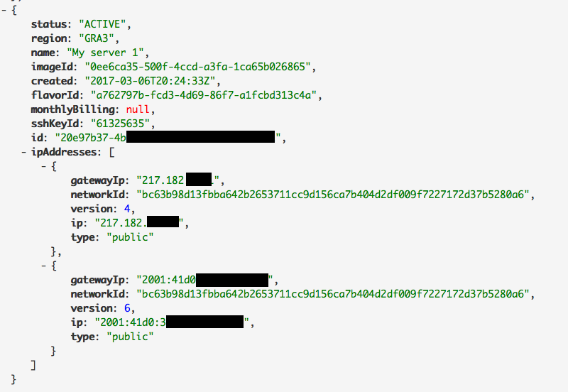

## Préambule
Internet Protocol version 6 (IPv6) est la dernière version du Internet Protocol (IP). Il est conçu pour résoudre l’épuisement longuement anticipé des adresses IPv4 en utilisant des adresses composées de 128-bits au lieu du traditionnel 32-bits de l’IPv4.

Chaque instance Public Cloud est livrée avec une adresse IPv4 et une adresse IPv6.

Par défaut, seule l'adresse IPv4 est configurée.

Dans ce tutoriel, nous allons vous apprendre à configurer une adresse IPv6 sur une instance Public Cloud.


> [!primary]
>
> Prérequis :
> - Une instance Public Cloud, le modèle importe peu.
> - Connaissance de SSH.
> - Connaissances basiques en réseaux.
>

### Lexique
Afin d'utiliser la même terminologie, voici un lexique rapide des termes utilisés dans ce tutoriel :

|Lexique|Description|
|---|---|
|IPV6_BLOCK|Bloc IPv6 assigné à votre service|
|YOUR_IPV6|L’adresse IPv6 assignée à votre service|
|IPv6_PREFIX|Le préfixe de votre bloc IPv6 (Ex: 2607:5300:60:62ac::/128 -> netmask = 128)|
|IPv6_GATEWAY|La passerelle de votre bloc IPv6|


## Obtenir les informations reseaux necessaires
La première étape consiste à récupérer 2 informations : l'adresse IPV6  et la Gateway IPv6 assignées à votre instance. Deux méthodes sont détaillées ci-dessous, via votre Espace Client ou via API.


### Via votre Espace Client
Connectez-vous à votre [Espace Client OVH](https://www.ovh.com/manager/cloud){.external}, puis dirigez-vous dans votre projet Public Cloud, rubrique `Infrastructure`{.action}.

Votre IPv6 et Gateway apparaissent sur la page principale, comme représenté sur cette capture d'écran :


{.thumbnail}

Chaque instance a donc deux IPs. Comme expliqué précédemment, par défaut seule l'IPv4 est configurée.

Votre Gateway devient visible en cliquant sur le `?`{.action} point d'interrogation, comme  ci-dessous :


{.thumbnail}

Laissez cette page ouverte, nous en aurons besoin dans la prochaine étape.


### Via API OVH


> [!primary]
>
> Si vous préférez passer par l'API pour récupérer vos informations réseaux, lisez la suite.
> Si vous êtes passés par l'Espace Client, vous pouvez passer à la prochaine section.
> 

Vous pouvez écrire un script ou tester notre console sur [https://api.ovh.com/](https://api.ovh.com/){.external}

Une fois connecté avec vos identifiants personnels, voici l'appel API nécessaire :


> [!api]
>
> @api {GET} /cloud/project/{serviceName}/instance
> 
Celui-ci vous retournera l'ensemble des instances de votre projet, et leurs spécificités. Dans notre cas cela s'apparente à :


{.thumbnail}

gardez cette page ouverte, nous en aurons besoin dans la prochaine étape.


## Appliquer IPv6 sur differentes distributions
Nous venons de récupérer toutes les informations nécessaires pour la configuration IPv6.

La premiere étape est de vous connecter en SSH à votre instance. Si besoin, suivez [nos guides](../guide.fr-fr.md){.ref} !

Ensuite, choisissez la méthode d'application en fonction de vos besoins.


### Application non persistante
Cette configuration sera perdue après un redémarrage de votre instance Public Cloud (configuration non persistante). Ces commandes sont à taper en *bash* dans votre console, avec les informations réseaux récupérées précedemment.

Considérant que votre interface est eth0, la configuration devrait ressembler à ceci :


```bash
ip addr add YOUR_IPV6/IPV6_PREFIX dev eth0
ip -6 route add IPV6_GATEWAY dev eth0
ip -6 route add default via IPV6_GATEWAY dev eth0
```

Dans notre exemple cela s'apparente à :


```bash
ip addr add 2001:41d0:xxx:xxxx::999/128 dev eth0
ip -6 route add 2001:41d0::xxx:xxxx::111 dev eth0
ip -6 route add default via 2001:41d0::xxx:xxxx::111 dev eth0
```


### Application persistante sur Debian &amp; derives (Ubuntu, Crunchbang, SteamOS...)
Considérant que votre interface est eth0, la configuration à rajouter devrait ressembler à ceci :

Fichier à modifier (avec privilèges sudo) : */etc/network/interfaces*


```bash
iface eth0 inet6 static
address YOUR_IPV6
netmask IPV6_PREFIX
post-up /sbin/ip -6 route add IPV6_GATEWAY dev eth0
post-up /sbin/ip -6 route add default via IPV6_GATEWAY dev eth0
pre-down /sbin/ip -6 route del default via IPV6_GATEWAY dev eth0
pre-down /sbin/ip -6 route del IPV6_GATEWAY dev eth0
```

Dans notre exemple cela s'apparente à :


```bash
iface eth0 inet6 static
address 2001:41d0:xxx:xxxx::999
netmask 128
post-up /sbin/ip -6 route add 2001:41d0:xxx:xxxx::111 dev eth0
post-up /sbin/ip -6 route add default via 2001:41d0:xxx:xxxx::111 dev eth0
pre-down /sbin/ip -6 route del default via 2001:41d0:xxx:xxxx::111 dev eth0
pre-down /sbin/ip -6 route del 2001:41d0:xxx:xxxx::111 dev eth0
```


### Application persistante sur Redhat &amp; derives (CentOS, ClearOS...)
Considérant que votre interface est eth0, la configuration devrait ressembler à ceci:

Fichier à modifier (avec privilèges sudo) : */etc/sysconfig/network-scripts/ifcfg-eth0*


```bash
IPV6INIT=yes
IPV6ADDR=YOUR_IPV6/IPV6_PREFIX
IPV6_DEFAULTGW=IPV6_GATEWAY
```

Dans notre exemple cela s'apparente à :


```bash
IPV6INIT=yes
IPV6ADDR=2001:41d0:xxx:xxxx::999
IPV6_DEFAULTGW=2001:41d0:xxx:xxxx::111
```

Fichier à créer (avec privilèges sudo) : */etc/sysconfig/network-scripts/route6-eth0*


```bash
IPV6_GATEWAY dev eth0
default via IPV6_GATEWAY
```

Dans notre exemple cela s'apparente à :


```bash
2001:41d0:xxx:xxxx::111 dev eth0
default via 2001:41d0:xxx:xxxx::111
```


## Tester la connexion
Pour vérifier la configuration, par exemple sur eth0 :


```bash
ip -6 addr show eth0
```

Pour tester la connexion, plusieurs méthodes sont possibles. Il faut avant tout comprendre qu'une communication IPv6 requiert IPv6 d'activé des 2 cotés de la connexion. un test possible est donc de réaliser un ping sur une IPv6, depuis votre instance Public Cloud :


```bash
ping6 ipv6.google.com
```