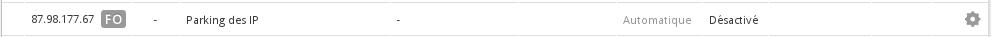
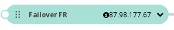
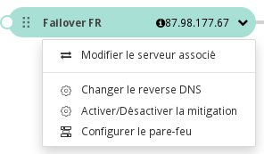
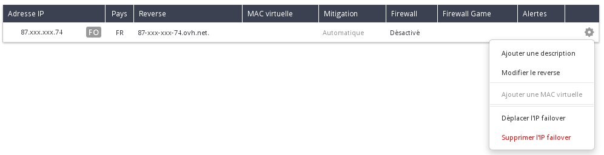

## 
Sie können eine Failover-IP von einer anderen OVH Dienstleistung zur Verwendung mit einer Ihrer Instanzen importieren, wenn Sie zum Beispiel:

- Mehrere Webseiten auf Ihrer Instanz betreiben
- Internationale Projekte hosten
- Ihre Aktivitäten von einem Dedicated Server auf eine Public Cloud Instanz migrieren möchten

In dieser Hilfe wird beschrieben, wie Sie eine Failover-IP in Ihr Public Cloud Projekt importieren können.

## Voraussetzungen

- Eine Failover-IP, die einem OVH Dedicated Server zugewiesen ist.

Beispiel: Im "Dedicated" Bereich des Kundencenters haben wir eine verfügbare IP-Adresse:

{.thumbnail}

## In die Public Cloud

- Begeben Sie sich in den "Cloud" Bereich Ihres Kundencenters.
- Klicken Sie auf "Hinzufügen" und wählen Sie "Import von Failover-IPs" aus:

{.thumbnail}
Es öffnet sich dann folgendes Fenster:

{.thumbnail}

- Setzen Sie ein Häkchen bei der gewünschten Failover-IP und klicken Sie auf "Bestätigen".
- Der Import nimmt einige Sekunden in Anspruch:

{.thumbnail}

- Der Import der IP-Adresse ist nun abgeschlossen:

{.thumbnail}

- Klicken Sie auf die Anzeige, um den virtuellen Server auszuwählen, an den die IP-Adresse angehängt werden soll:

{.thumbnail}

- Wählen Sie den gewünschten Server aus:

{.thumbnail}

- Bestätigen Sie die Operation.
- Die IP-Adresse ist nun der gewünschten Instanz zugewiesen.

{.thumbnail}

## Auf einen Dedicated Server
Sie können die Failover-IP bei Bedarf auch wieder zurück auf Ihren Dedicated Server migrieren.

Begeben Sie sich dazu in die Rubrik "IP" im "Dediziert" Bereich Ihres Kundencenters und klicken Sie auf Zahnrad-Symbol in der Zeile mit der Failover-IP:

{.thumbnail}
Dann können Sie Ihre IP-Adresse wieder auf Ihren Dedicated Server zurückziehen.

## 
[Zurück zum Index der Cloud Hilfen]({legacy}1785)

