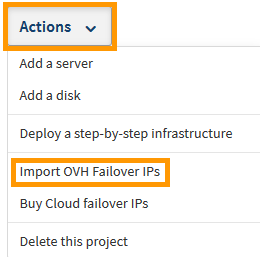
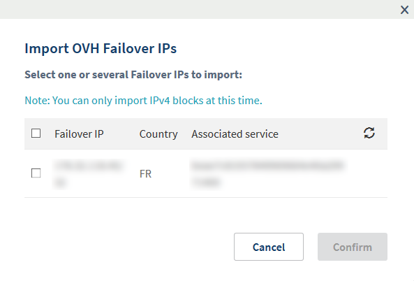
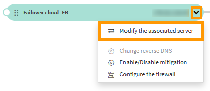
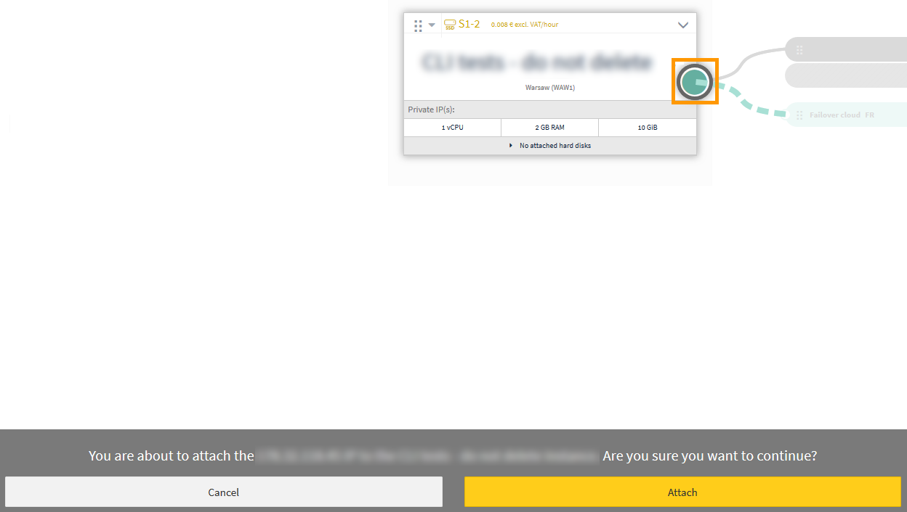

**Last updated 19th December 2018**

## Objective

If you need to configure a failover IP address on your instances because:

- you have multiple websites on your instance 
- you host international projects
- you want to migrate from a Dedicated Server to a Public Cloud instance

... you can import a failover IP address that is linked to a different OVH service.

**This guide explains how to import this failover IP into your OVH Public Cloud project.**

## Requirements

* access to the [OVH Control Panel](https://www.ovh.com/auth/?action=gotomanager){.external}
* a [failover IP address](https://www.ovh.co.uk/dedicated_servers/ip_failover.xml){.external} assigned to an [OVH Dedicated Server](https://www.ovh.co.uk/dedicated_servers/){.external}.

## Instructions

Firstly, log in to the [OVH Control Ppanel](https://www.ovh.com/auth/?action=gotomanager){.external} and click the `Cloud`{.action} menu. Then click the `Servers`{.action} side-menu to expand your list of projects.

When you've found your project in the list, click it and then select the `Infrastructure`{.action} tab.

{.thumbnail}

Next, Click the `Actions`{.action} button and then click `Import OVH Failover IPs`{.action}.

{.thumbnail}

Next, select the failover IP you want to import and then click the `Confirm`{.action} button.

{.thumbnail}

You will now see a confirmation message.

{.thumbnail}

When the failover IP has been successfully imported, click the dropdown arrow next to the the failover IP and then click `Modify the associated server`{.action}.

{.thumbnail}

Now click the grey circle on the right side of your instance. This indicates that you want to attach your failover IP to the instance. When you have done this, click the yellow `Attach`{.action} button at the bottom of your screen.

{.thumbnail}

Your failover IP will now be attached to your instance.

## Go further

Join our community of users on <https://community.ovh.com/en/>.