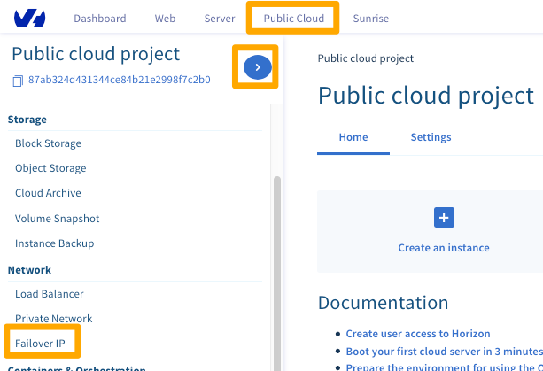
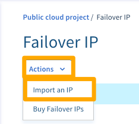
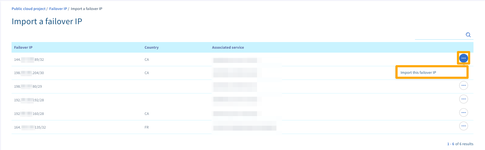
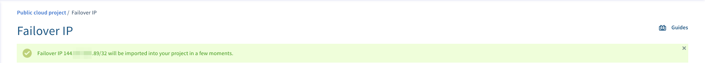
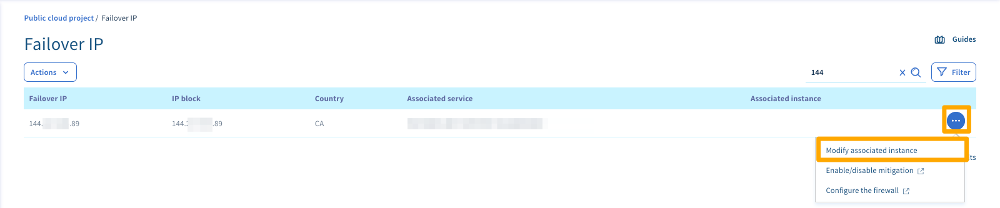
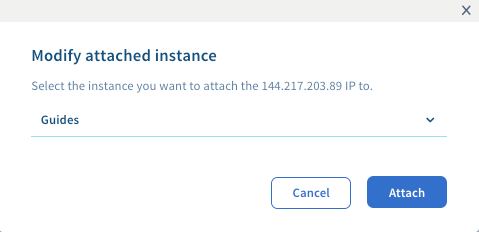

**Last updated 2018/12/18**

## Objective

If you need to configure a failover IP address on your instances because:

- you have multiple websites on your instance 
- you host international projects
- you want to migrate from a Dedicated Server to a Public Cloud instance

... you can import a failover IP address that is linked to a different OVHcloud service.

**This guide explains how to import this failover IP into your OVHcloud Public Cloud project.**

## Requirements

* access to the [OVHcloud Control Panel](https://ca.ovh.com/auth/?action=gotomanager){.external}
* a [failover IP address]({ovh_www}/dedicated-servers/ip_failover.xml){.external} assigned to an [OVHcloud Dedicated Server]({ovh_www}/ca/en/dedicated-servers/){.external}.

## Instructions

Firstly, log in to the [OVHcloud Control Panel](https://ca.ovh.com/auth/?action=gotomanager){.external} and click the `Publlic Cloud{.action} menu. Then click the Right Arrow side-menu to expand your list of projects.

When you've found your project in the list, click it and then select the `Failover IP`{.action} tab.

{.thumbnail}

Next, Click the `Actions`{.action} button and then click `Import an IP`{.action}.

{.thumbnail}

Next, select the failover IP you want to import and then click the `···`{.action} button beside it and click `Import this failover IP`{.action}.

{.thumbnail}

You will now see a confirmation message.

{.thumbnail}

When the failover IP has been successfully imported, click the `···`{.action} button  next to the the failover IP and then click `Modify associated instance`{.action}.

{.thumbnail}

Select the instance that you would like to attach the IP to from the drop down menu and then click the `Attach`{.action} button.

{.thumbnail}

Your failover IP will now be attached to your instance.

## Go further

Join our community of users on <https://community.ovh.com/en/>.
