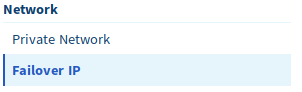
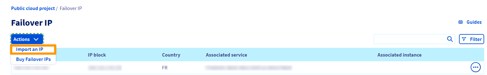
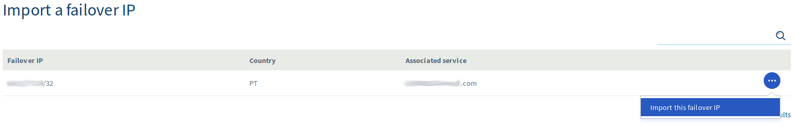
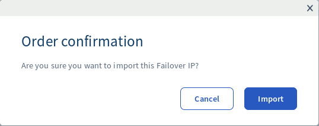
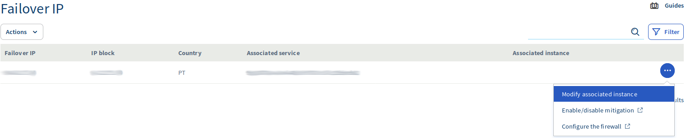
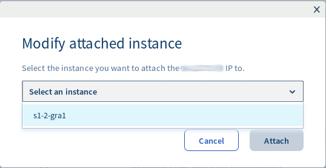
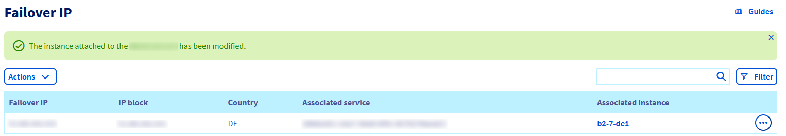

**Última actualización: 6/12/2019**

## Objetivo

Si necesita configurar una dirección IP de conmutación en sus instancias porque:

- Tiene varios sitios web en su instancia 
- Aloja varios proyectos internacionales
- Quiere migrar de un servidor dedicado a una instancia de Public Cloud

... puede importar una dirección IP de conmutación que esté asociada a otro servicio de OVHcloud.

**Esta guía explica cómo importar esta IP de conmutación en su proyecto de Public Cloud de OVHcloud.**

## Requisitos

* Tener acceso al [área de cliente de OVHcloud](https://ca.ovh.com/auth/?action=gotomanager){.external}
* Tener una [dirección IP de conmutación](https://www.ovh.com/world/es/servidores_dedicados/ip_failover.xml){.external} asignada a un [servidor dedicado de OVHcloud](https://www.ovh.com/world/es/servidores_dedicados/){.external}

## Procedimiento

Primero, inicie sesión en el [área de cliente de OVHcloud](https://ca.ovh.com/auth/?action=gotomanager){.external}, haga clic en el menú `Public Cloud`{.action} y, después, en su `proyecto`{.action}.

Seguidamente, seleccione `«IP de conmutación»`{.action} en la sección «Red».

{.thumbnail}

A continuación, se mostrarán todas las direcciones IP que se pueden importar en su proyecto de Public Cloud:

{.thumbnail}

Haga clic en los tres puntos a la derecha de la IP que quiere importar y haga clic en `«Importar esta IP de conmutación»`{.action}.

{.thumbnail}

Haga clic en `«Importar»`{.action}:

{.thumbnail}

A continuación, se volverá a cargar la página y se mostrará la siguiente información para confirmar que la IP se ha migrado correctamente.

Una vez importada la IP de conmutación, haga clic en los tres puntos a la derecha y, después, en `«Modificar la instancia asociada»`{.action}.

{.thumbnail}

Se abrirá una ventana emergente donde podrá elegir la instancia a la que desea migrar su IP:

{.thumbnail}

Haga clic en `«Asociar»`{.action}. A continuación, se volverá a cargar la página con una confirmación de que la IP se ha asociado a la instancia:

{.thumbnail}

Ahora, su IP de conmutación está asociada a su instancia.

El siguiente paso será configurar la IP en su sistema operativo. Puede consultar nuestra guía a continuación: [Configurar una IP de conmutación](https://docs.ovh.com/gb/en/public-cloud/configure_a_failover_ip/){.external}

## Más información

Interactúe con nuestra comunidad de usuarios en <https://community.ovh.com/en/>.
