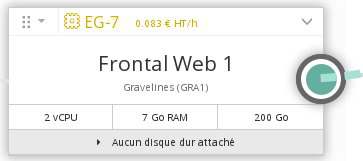
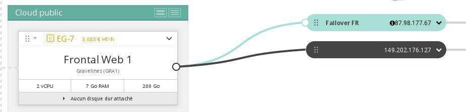
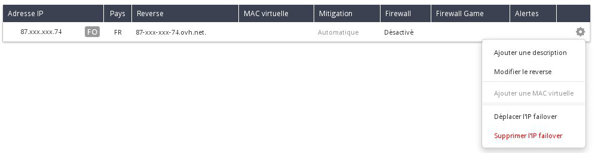

## Preambule
Si vous avez besoin de configurer une adresse IP Fail Over sur vos instances, que cela soit parce que :

- vous avez plusieurs sites sur votre instance,
- vous hébergez des projets internationaux,
- vous voulez migrer votre activité depuis un serveur dédié vers une instance Public cloud,

Il est possible d'importer une adresse IP Fail Over lié à un autre service OVH.

Ce guide explique comment importer cette IP Fail Over dans votre projet Public Cloud OVH.

### Prérequis
- Détenir une IP Fail Over liée à un serveur dédié.

Exemple : Dans la section Dédié de l'espace client, on a une IP disponible :

{.thumbnail}

## Importation de l'IP Fail Over

### Vers le Public Cloud
- Se rendre dans la section Cloud de l'espace client.
- Cliquer sur Importer une IP Failover :

{.thumbnail}

- On obtient la fenêtre suivante :

{.thumbnail}

- Cocher l'IP Fail Over de votre choix, puis cliquer sur Confirmer.
- L'import met quelques secondes :

{.thumbnail}

- L'IP est maintenant importée :

{.thumbnail}

- Cliquer sur le chevron pour choisir le serveur virtuel auquel rattacher l'IP :

{.thumbnail}

- Sélectionner le serveur souhaité par une coche :

{.thumbnail}

- Confirmer en cliquant sur Attacher
- L'IP est rattachée

{.thumbnail}

### Vers un serveur dedie
Il est possible de remigrer votre Ip Fail Over vers votre serveur dédié.

Pour cela, rendez vous de nouveau dans le menu "IP" dans la partie "Dédié" de votre Espace Client OVH, et cliquer sur le rouage se trouvant à droite de votre adresse IP Fail Over :

{.thumbnail}

Il suffit ensuite de déplacer votre IP vers votre serveur dédié.