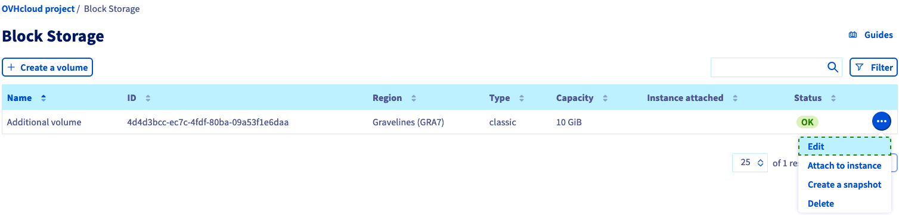
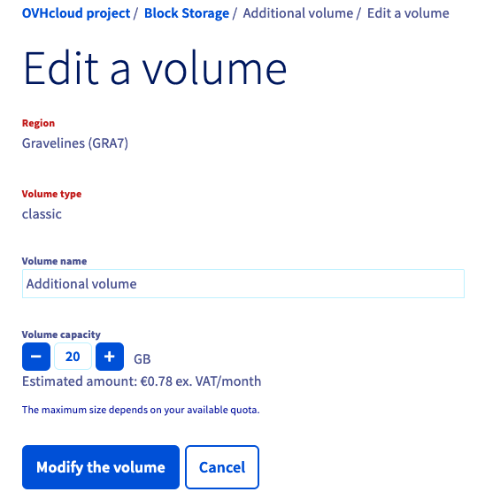
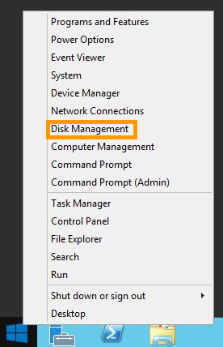
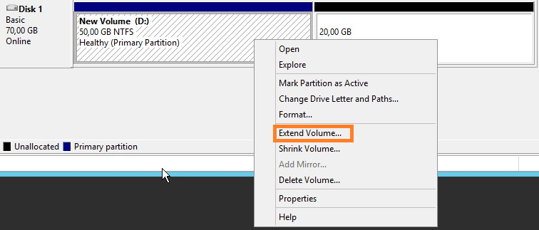
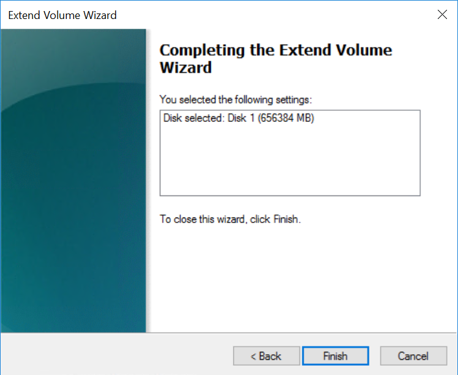

**Last updated 28th January 2019**

## Objective

If you have reached the maximum storage capacity on your additional disk, you can still increase its size. 

**This guide will show you how to increase the size of an additional disk as well as enlarging its main partition.**

## Requirements

* a [Public Cloud Instance](https://www.ovh.co.uk/public-cloud/instances/){.external} in your your OVH account
* an [addition disk](https://www.ovh.co.uk/public-cloud/storage/additional-disks/){.external} attached to your instance
* access to the [OVH Control Panel](https://www.ovh.com/auth/?action=gotomanager){.external}
* administrative (root) access to your instance via SSH (for Linux only)
* administrative access to your instance via RDP (for Windows only)

## Intructions

### Using the Control Panel

Firstly, log in to the [OVH Control Panel](https://www.ovh.com/auth/?action=gotomanager){.external} and click the `Cloud`{.action} menu. Then click the Servers side-menu to expand your list of projects.

When you’ve found your project in the list, click it and then select the `Infrastructure`{.action} tab.

{.thumbnail}

Locate your instance in your project and then click the the additional disk attached to it.

{.thumbnail}

Next, click the disk size option and then use the slider to adjust the disk capacity. alternatively, you can manually enter the desired capacity.

When you've finished, click the `Apply`{.action} button.

{.thumbnail}

### Using Linux

First, unmount the disk using this command.

```
admin@server-1:~$ sudo unmount /mnt/disk
```

Next, recreate the partition.

```
admin@server-1:~$ sudo fdisk /dev/vdb
Welcome to fdisk (util-linux 2.25.2).
Changes will remain in memory only, until you decide to write them.
Be careful before using the write command
```

```
Command (m for help): d

Selected partition 1
Partition 1 has been deleted.
```

```
Command (m for help): n

Partition type
p primary (0 primary, 0 extended, 4 free)
e extended (container for logical partitions)
Select (default p):
Using default response p.
Partition number (1-4, default 1):
First sector (2048-146800639, default 2048):
Last sector, +sectors or +size{K,M,G,T,P} (2048-146800639, default 146800639):

Created a new partition 1 of type 'Linux' and of size 70 GiB.
```

```
Command (m for help): w

The partition table has been altered.
Calling ioctl() to re-read partition table.
Syncing disks.
```

Next, verify and recheck the partition.

```
#admin@server-1:~$ sudo e2fsck -f /dev/vdb1

e2fsck 1.42.12 (29-Aug-2014)
Pass 1: Checking inodes, blocks, and sizes
Pass 2: Checking directory structure
Pass 3: Checking directory connectivity
Pass 4: Checking reference counts
Pass 5: Checking group summary information
/dev/vdb: 12/3276800 files (0.0% non-contiguous), 251700/13107200 blocks
```

```
#admin@server-1:~$ sudo resize2fs /dev/vdb1

resize2fs 1.42.12 (29-Aug-2014)
Resizing the filesystem on /dev/vdb to 18350080 (4k) blocks.
The filesystem on /dev/vdb is now 18350080 (4k) blocks long.
```

Finally, mount and check the disk.

```
#admin@server-1:~$ sudo mount /dev/vdb1 /mnt/disk/
```

```
#admin@server-1:~$ df -h
Filesystem Size Used Avail Use% Mounted on
/dev/vda1 9.8G 840M 8.6G 9% /
udev 10M 0 10M 0% /dev
tmpfs 393M 5.2M 388M 2% /run
tmpfs 982M 0 982M 0% /dev/shm
tmpfs 5.0M 0 5.0M 0% /run/lock
tmpfs 982M 0 982M 0% /sys/fs/cgroup
/dev/vdb1 69G 52M 66G 1% /mnt/disk
```

### Using Windows

Establish an RDP connection to your instance. When you've logged in, right-click on the `Start Menu`{.action} button and then click `Disk Management`{.action}.

{.thumbnail}

When the disk management tool opens you’ll see your new disk as an unkown volume with unallocated space as shown below.

{.thumbnail}

If the disk is offline this is likely due to a policy in place on the instance. To fix this, right-click on the disk and select Online.

{.thumbnail}

> [!primary]
>
Depending on your version of Windows, you may need to initialise your additional disk before you can use it. To initialise your disk, right-click it again and this time select `Initialise Disk`{.action}.
>

If the main volume on you disk is smaller than the entire disk capacity, right-click on the volume and then click `Extend Volume`{.action}

{.thumbnail}

The Extend Volume Wizard will now be displayed. Click `Next`{.action} to start the wizard.

{.thumbnail}

Now increase the volume to the desired size and click `Next`{.action} when you're finished.

{.thumbnail}

Finally, click `Finish`{.action} to complete the process.

{.thumbnail}

## Go further

* [Create and configure an additional disk on an instance](https://docs.ovh.com/gb/en/public-cloud/create_and_configure_an_additional_disk_on_an_instance/){.external}
* Join our community of users on <https://community.ovh.com/en/>.

