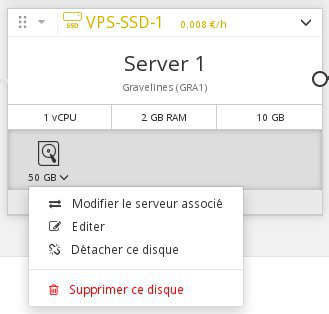

## Préambule
Si vous avez atteint la capacité de stockage maximale sur votre disque additionnel, il vous est toujours possible d'augmenter la taille de celui ci.

Ce guide vous explique comment augmenter la taille d'un disque supplémentaire ainsi que l'agrandissement de la partition.


### Prérequis
- Une instance
- Un disque additionnel


## Augmentation de la taille du disque
- Se connecter à [l'espace client
OVH](https://www.ovh.com/manager/cloud/){.external}
- Cliquer sur la flèche en bas à droite de votre disque :


{.thumbnail}

- Sélectionner "Éditer", un nouveau menu apparait :


{.thumbnail}

Vous pouvez depuis ce nouveau menu :

- Changer le nom de votre disque
- La taille de votre disque
- Cliquer sur "Appliquer"


> [!alert]
>
> Sous Linux, afin que l'intitulé ne soit pas changé durant cette manipulation (vdb > vdc par exemple), il est conseillé de démonter votre disque avant d'effectuer cette opération :
> 
> ```bash
> admin@server-1:~$ sudo umount /point/de/montage
> ```
>

## Reconfiguration de la partition

### Avec Linux
- Démonter le disque :
- Recréer la partition :
- Vérifier et redimensionner la partition :
- Monter et vérifier le disque :


### Avec Windows
- Lancer le gestionnaire de disque et effectuer un clic droit sur votre disque :


{.thumbnail}

- Cliquer sur Extend Volume