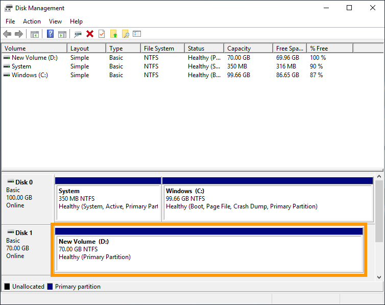

> [!primary]
> Tłumaczenie zostało wygenerowane automatycznie przez system naszego partnera SYSTRAN. W niektórych przypadkach mogą wystąpić nieprecyzyjne sformułowania, na przykład w tłumaczeniu nazw przycisków lub szczegółów technicznych. W przypadku jakichkolwiek wątpliwości zalecamy zapoznanie się z angielską/francuską wersją przewodnika. Jeśli chcesz przyczynić się do ulepszenia tłumaczenia, kliknij przycisk “Zaproponuj zmianę” na tej stronie.
> 

**Ostatnia aktualizacja z dnia 29-03-2022**

## Wprowadzenie

Jeśli osiągniesz maksymalną pojemność dodatkowego dysku, możesz dodać przestrzeń dyskową, zwiększając jej rozmiar. 

**Niniejszy przewodnik wyjaśnia, jak zwiększyć rozmiar dodatkowego dysku i jak odpowiednio rozszerzyć partycję główną.**

## Wymagania początkowe

- Instancja [Public Cloud](https://www.ovhcloud.com/pl/public-cloud/) w Twoim projekcie Public Cloud
- [Dodatkowy dysk](../utworzenie_i_konfiguracja_dodatkowego_dysku_dla_instancji/) utworzony w Twoim projekcie
- Dostęp do [Panelu client OVHcloud](https://www.ovh.com/auth/?action=gotomanager&from=https://www.ovh.pl/&ovhSubsidiary=pl)
- Dostęp administracyjny (root) do Twojej instancji przez SSH (Linux) lub RDP (Windows)

## W praktyce

Kolejne etapy zakładają, że skonfigurowałeś już dodatkowy dysk zgodnie z instrukcjami zawartymi w [naszym przewodniku](../utworzenie_i_konfiguracja_dodatkowego_dysku_dla_instancji/).

### Zmień rozmiar dysku

Zaloguj się do [Panelu client OVHcloud](https://www.ovh.com/auth/?action=gotomanager&from=https://www.ovh.pl/&ovhSubsidiary=pl) i otwórz swój projekt `Public Cloud`{.action}. Następnie w menu po lewej stronie kliknij `Block Storage`{.action}.

Jeśli wolumen jest przypisany do **instancji Windows**, kliknij przycisk `...`{.action} z prawej strony odpowiedniego wolumenu i wybierz opcję `Odłącz instancję`{.action}.

Kliknij przycisk `...`{.action} po prawej stronie odpowiedniego wolumenu i wybierz `Edytuj`{.action}.

{.thumbnail}

W oknie, które się wyświetli wskaż nowy rozmiar wolumenu i kliknij `Zmień wolumen`{.action}.

{.thumbnail}

Zanim przejdziesz dalej, upewnij się, że wolumen jest przypisany do Twojej instancji. Jeśli tak nie jest, w wierszu wolumenu kliknij `...`{.action} i wybierz `Przypisz do instancji`{.action}.

### Rozszerzenie partycji (instancja Linux)

Otwórz połączenie SSH z Twoją instancją, aby dostosować partycję do zmienionego dysku.

Rozmontuj najpierw dysk, używając polecenia:

```bash
admin@server:~$ sudo umount /mnt/disk
```

Odtwórz partycję:

```bash
admin@server:~$ sudo fdisk /dev/vdb
```
```console
Welcome to fdisk (util-linux 2.25.2).
Changes will remain in memory only, until you decide to write them.
Be careful before using the write command
```
```console
Command (m for help): d

Selected partition 1
Partition 1 has been deleted.
```
```console
Command (m for help): n

Partition type
p primary (0 primary, 0 extended, 4 free)
e extended (container for logical partitions)
Select (default p):
Using default response p.
Partition number (1-4, default 1):
First sector (2048-146800639, default 2048):
Last sector, +sectors or +size{K,M,G,T,P} (2048-146800639, default 146800639):

Created a new partition 1 of type 'Linux' and of size 70 GiB.
```
```console
Command (m for help): w

The partition table has been altered.
Calling ioctl() to re-read partition table.
Syncing disks.
```

Sprawdź partycję:

```bash
admin@server:~$ sudo e2fsck -f /dev/vdb1

e2fsck 1.42.12 (29-Aug-2014)
Pass 1: Checking inodes, blocks, and sizes
Pass 2: Checking directory structure
Pass 3: Checking directory connectivity
Pass 4: Checking reference counts
Pass 5: Checking group summary information
/dev/vdb: 12/3276800 files (0.0% non-contiguous), 251700/13107200 blocks
```

```bash
admin@server:~$ sudo resize2fs /dev/vdb1

resize2fs 1.42.12 (29-Aug-2014)
Resizing the filesystem on /dev/vdb to 18350080 (4k) blocks.
The filesystem on /dev/vdb is now 18350080 (4k) blocks long.
```

Podnieś i sprawdź dysk:

```bash
admin@server:~$ sudo mount /dev/vdb1 /mnt/disk/
```

```bash
admin@server:~$ df -h
Filesystem Size Used Avail Use% Mounted on
/dev/vda1 9.8G 840M 8.6G 9% /
udev 10M 0 10M 0% /dev
tmpfs 393M 5.2M 388M 2% /run
tmpfs 982M 0 982M 0% /dev/shm
tmpfs 5.0M 0 5.0M 0% /run/lock
tmpfs 982M 0 982M 0% /sys/fs/group
/dev/vdb1 69G 52M 66G 1% /mnt/disk
```

### Rozszerzenie partycji (instancja Windows)

Utwórz połączenie RDP (Remote Desktop) dla Twojej instancji Windows.

Po zalogowaniu kliknij prawym przyciskiem myszy przycisk `Start`{.action} i otwórz `Zarządzanie dyskami`{.action}.

{.thumbnail}

Rozszerzony dysk posiada większą pojemność w postaci nieprzydzielonej przestrzeni.

{.thumbnail}

Kliknij prawym przyciskiem myszy wolumen i wybierz `Rozszerz wolumen`{.action} z menu kontekstowego.

{.thumbnail}

W asystencie rozszerzenia wolumenu kliknij Dalej, `aby kontynuować`{.action}.

Możesz zmienić przestrzeń dyskową na tym etapie, jeśli chcesz dodać pojemność mniejszą niż cała partycja.

Kliknij `Dalej`{.action}.

{.thumbnail}

Kliknij przycisk `Zakończ`{.action}, aby zakończyć proces.

Zmieniony rozmiar przestrzeni dyskowej zawiera teraz dodatkową przestrzeń dyskową.

{.thumbnail}

## Sprawdź również

[Zarządzanie wolumenem instancji Public Cloud](../utworzenie_i_konfiguracja_dodatkowego_dysku_dla_instancji/)

Przyłącz się do społeczności naszych użytkowników na stronie <https://community.ovh.com/en/>.