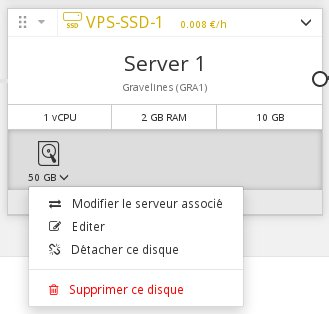
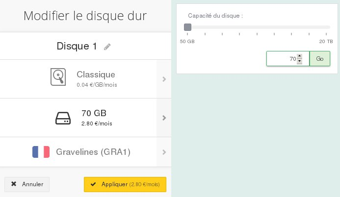
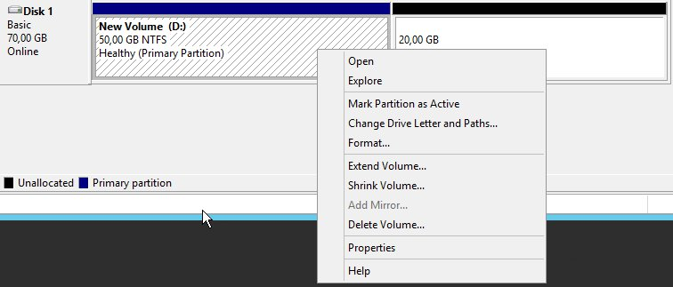

## 
Se atingiu a capacidade máxima de armazenamento no seu disco adicional, é possível que aumente o seu tamanho.

Este guia explica-lhe como poderá aumentar o tamanho de um disco suplementar bem como redimensionar a partição.


## Pré-requisitos

- Uma instância
- Um disco adicional


## 

- Ligar-se ao [Espaço Cliente OVH](https://www.ovh.com/manager/cloud/)
- Clique na seta à direita do seu disco:


{.thumbnail}

- Ao selecionar "Editar", um novo menu será apresentado:


{.thumbnail}
Poderá, neste menu, efetuar as seguintes operações:

- Alterar o nome do seu disco
- Aumentar o tamanho do disco


- Clique em "Aplicar"


## Atenção:
Se utiliza Linux, e para que não hajam problemas durante esta manipulação (vdb > vdc, por exemplo), aconselhamos que desmonte o disco antes de efetuar esta operação:

```
admin@server-1:~$ sudo umount /point/de/montage
```


## Com Linux

- Desmontar o disco:

```
admin@server-1:~$ sudo umount /mnt/disk
```


- Recriar a partição

```
admin@server-1:~$ sudo fdisk /dev/vdb
Welcome to fdisk (util-linux 2.25.2).
Changes will remain in memory only, until you decide to write them.
Be careful before using the write command
```


```
Command (m for help): d

Selected partition 1
Partition 1 has been deleted.
```


```
Command (m for help): n

Partition type
p primary (0 primary, 0 extended, 4 free)
e extended (container for logical partitions)
Select (default p):
Using default response p.
Partition number (1-4, default 1):
First sector (2048-146800639, default 2048):
Last sector, +sectors or +size{K,M,G,T,P} (2048-146800639, default 146800639):

Created a new partition 1 of type 'Linux' and of size 70 GiB.
```


```
Command (m for help): w

The partition table has been altered.
Calling ioctl() to re-read partition table.
Syncing disks.
```


- Verificar e redimensionar a partição:

```
admin@server-1:~$ sudo e2fsck -f /dev/vdb1

e2fsck 1.42.12 (29-Aug-2014)
Pass 1: Checking inodes, blocks, and sizes
Pass 2: Checking directory structure
Pass 3: Checking directory connectivity
Pass 4: Checking reference counts
Pass 5: Checking group summary information
/dev/vdb: 12/3276800 files (0.0% non-contiguous), 251700/13107200 blocks
```


```
admin@server-1:~$ sudo resize2fs /dev/vdb1

resize2fs 1.42.12 (29-Aug-2014)
Resizing the filesystem on /dev/vdb to 18350080 (4k) blocks.
The filesystem on /dev/vdb is now 18350080 (4k) blocks long.
```


- Montar e verificar o disco:

```
admin@server-1:~$ sudo mount /dev/vdb1 /mnt/disk/
```


```
admin@server-1:~$ df -h
Filesystem Size Used Avail Use% Mounted on
/dev/vda1 9.8G 840M 8.6G 9% /
udev 10M 0 10M 0% /dev
tmpfs 393M 5.2M 388M 2% /run
tmpfs 982M 0 982M 0% /dev/shm
tmpfs 5.0M 0 5.0M 0% /run/lock
tmpfs 982M 0 982M 0% /sys/fs/cgroup
/dev/vdb1 69G 52M 66G 1% /mnt/disk
```


## Com Windows

- Inicie o gestor de discos e efetue um clique direito no seu disco:


{.thumbnail}

- Clique em Extend Volume


## 
[Voltar à página principal dos guias Cloud]({legacy}1785)

