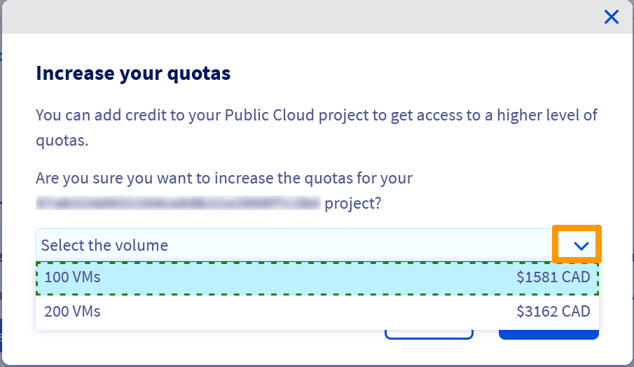

**Last updated 14/10/2021**

## Objective

By default, the Public Cloud projects as well as the resources total (RAM, CPU, disk space, number of instances, etc.) you can use are limited for security reasons.

To be able to use additional resources and projects, the quotas need to be increased.

**This guide explains how to request and increase a Public Cloud quota in the OVHcloud Control Panel.**

## Requirements

- access to the [OVHcloud Control Panel](https://ca.ovh.com/auth/?action=gotomanager&from=https://www.ovh.com/ca/en/&ovhSubsidiary=ca)
- a [valid payment method](../../billing/manage-payment-methods/) registered in your OVHcloud account
- you have exhausted the project quota of your OVHcloud account

## Instructions

### Increasing your resources quota

In compliance with internal criteria (seniority, existence of paid invoices, etc.), you are now free to request quota increases for your Public Cloud projects resources directly from your OVHcloud Control Panel.

You can increase your resources quota manually or automatically.

#### Increasing your resources quota manually

This procedure allows you to manually request a quota increase and validate it with an upfront payment (Public Cloud credit).

Log in to the [OVHcloud Control Panel](https://ca.ovh.com/auth/?action=gotomanager&from=https://www.ovh.com/ca/en/&ovhSubsidiary=ca) and switch to the `Public Cloud`{.action} section. Click on `Quota and Regions`{.action} in the left-hand sidebar.

{.thumbnail}

This page provides an overview of regions and their available resources. A warning will be displayed next to a resource as soon as 80% of its current quota is reached.

{.thumbnail}

Click on the `Increase your quota!`{.action} button and select the Public Cloud project of your choice.

Next, click on the drop down arrow next to "Select the volume" to view the list of quotas currently available to upgrade your resources to. This section also displays the amount needed to benefit from these resources.

{.thumbnail}

In our example above, we wish to raise our resources quota to « 100 Vms ».

In this case, **$1581 CAD** will be automatically charged to the payment method on file once we click on the `Confirm`{.action} button.

> [!warning]
> Please note that this is an imstant process.
>
> Once you click on the `Confirm`{.action} button, the order is automatically created and charged to your account.
> 

#### Increasing your resources quota automatically through « Auto-scaling quota »

This option allows you to request an automatic and gradual increase of your resources quota. This is not an immediate process and the resources quota are increased over the course of time.

Log in to the [OVHcloud Control Panel](https://ca.ovh.com/auth/?action=gotomanager&from=https://www.ovh.com/ca/en/&ovhSubsidiary=ca) and switch to the `Public Cloud`{.action} section. Click on `Quota and Regions`{.action} in the left-hand sidebar.

Click on the `?`{.action} button to find more information about this feature, then click on `Auto-scaling quota`{.action} to enable it.

Once done, auto-scaling will be enabled for your project and your resources quota will be increased over the course of time.

### Increasing the quota of your Public Cloud projects

If you have exhausted the project quota of your OVHcloud account, you can request an increase by creating a support ticket. It is not possible to raise your project quota from the OVHcloud manager.

## Go further

Join our community of users on <https://community.ovh.com/en/>.
