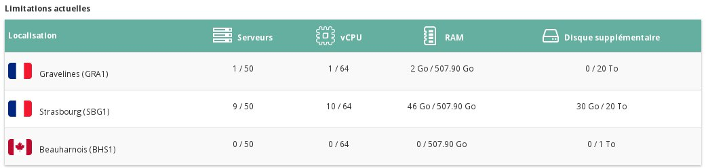

## 
Per ragioni di sicurezza, il tuo progetto Public Cloud viene creato con alcune restrizioni relativamente alla possibilità di aggiungere istanze e dischi supplementari.
Questi limiti non sono fissi: in quasiasi momento puoi richiedere al supporto OVH di aumentare le risorse del tuo progetto.

Questa guida ti mostra come effettuare questa operazione.

## Requisiti necessari

- [Aggiungi una modalità di pagamento]({legacy}1984)

## 

- Accedi allo Spazio Cliente Public Cloud OVH
- Clicca su "Gestione e consumo del progetto", in alto a destra:

{.thumbnail}

- Clicca sul tab "Quota":

{.thumbnail}
Visualizza i limiti attivi sulle tue risorse:

{.thumbnail}

- Clicca sul tasto "Modifica limiti":

{.thumbnail}

- Crea il tuo ticket di supporto per richiedere di aumentare la tua quota:

{.thumbnail}

- Seleziona il progetto di cui vuoi aumentare la quota
- Scegli il team di supporto che vuoi contattare
- Inserisci l'oggetto del tuo ticket
- Scrivi il tuo messaggio

Utilizza questa procedura anche per aumentare il numero dei tuoi progetti.

## 
[Ritorna all'indice delle guide Cloud]({legacy}1785)

