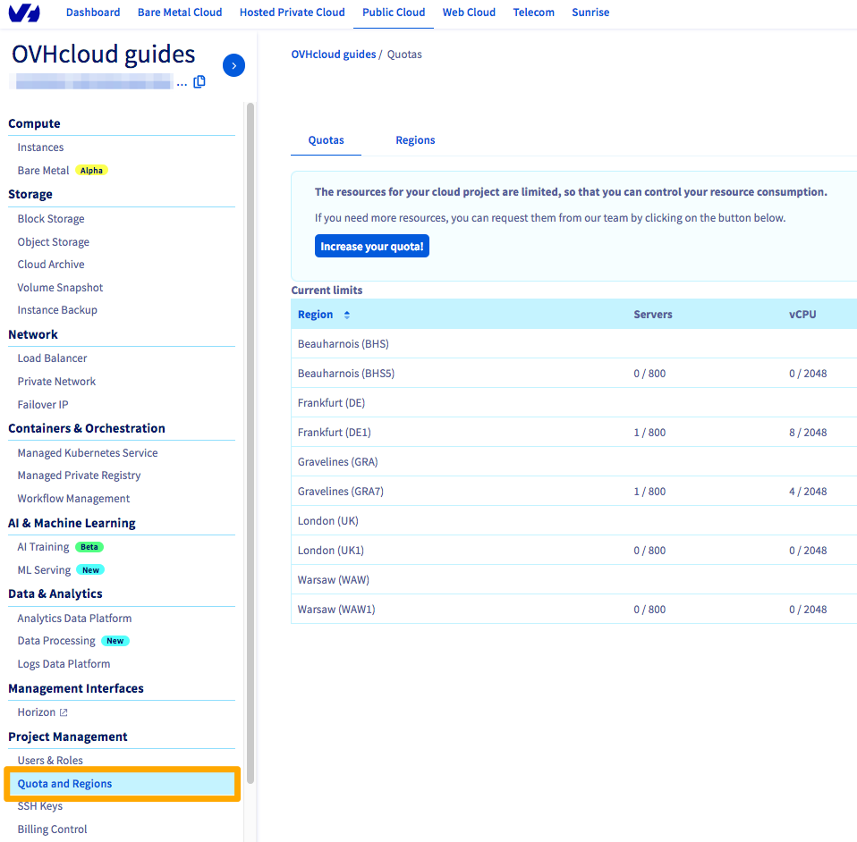
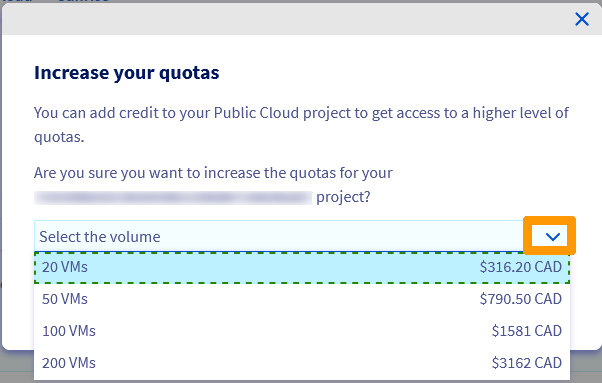
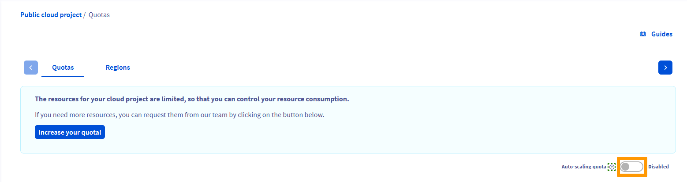

> [!primary]
> Esta tradução foi automaticamente gerada pelo nosso parceiro SYSTRAN. Em certos casos, poderão ocorrer formulações imprecisas, como por exemplo nomes de botões ou detalhes técnicos. Recomendamos que consulte a versão inglesa ou francesa do manual, caso tenha alguma dúvida. Se nos quiser ajudar a melhorar esta tradução, clique em "Contribuir" nesta página.
>

**Última atualização 25/10/2021**

## Objetivo

Por predefinição, o número de recursos (RAM, CPU, espaço em disco, número de instâncias..) e de projetos que pode criar é limitado.

Se deseja criar mais, é necessário um aumento de quota.

**Saiba como solicitar um aumento de limite Public Cloud a partir da Área de Cliente OVHcloud.**

## Requisitos

- Estar ligado à [Área de Cliente OVHcloud](https://www.ovh.com/auth/?action=gotomanager&from=https://www.ovh.pt/&ovhSubsidiary=pt).
- [Ter um método de pagamento válido](../../billing/gerir-metodos-de-pagamento/) na Área de Cliente OVHcloud.

## Instruções

### Aumentando sua cota de recursos

Em conformidade com critérios internos (antiguidade, existência de faturas pagas, etc.), você agora está livre para solicitar aumentos de cota para os recursos de projetos Public Cloud diretamente da sua Área de cliente OVHcloud.

Você pode aumentar a cota de recursos manualmente ou automaticamente.

#### Aumentando manualmente a cota de recursos

Este procedimento permite solicitar manualmente um aumento de cota e validá-lo com um pagamento antecipado (crédito Public Cloud).

Depois de aceder à [Área de Cliente OVHcloud](https://www.ovh.com/auth/?action=gotomanager&from=https://www.ovh.pt/&ovhSubsidiary=pt) vá à secção `Public Cloud`{.action} e selecione seu projeto de Public Cloud.

   Na rubrica `Project Management`, clique em `Quota and Regions`{.action}.

{.thumbnail}

Esta página apresenta um resumo das quotas atuais do seu projeto, por região. Ao lado de um recurso surge uma advertência quando 80% da sua quota é atingida.

Para solicitar um aumento de quota, clique em `Aumentar os meus limites`{.action}.

{.thumbnail}

Em seguida, clique na seta descendente ao lado de "Selecione o volume" para exibir a lista de cotas atualmente disponíveis para atualizar seus recursos. Esta seção apresenta igualmente o montante a pagar para beneficiar destes recursos.

{.thumbnail}

A tabela abaixo mostra os recursos obtidos para cada cota:

|Quota|Instâncias|CPU/Cores|RAM|Tamanho do volume|Volumes|Snapshots|
|---|---|---|---|---|---|---|
|10 VMs|10|20|40GB|20TB|20|20|
|20 VMs|20|40|240GB|20TB|40|40|
|50 VMs|50|64|496GB|20TB|100|100|
|100 VMs|100|128|992GB|39TB|200|200|
|200 VMs|200|512|3.9TB|78TB|400|400|

Depois de selecionar o volume, clique em `Confirmar`{.action}. Seu pagamento será processado o mais rapidamente possível.

> [!warning]
> Observe que o processo de facturação é imediato.
>
> Uma vez que clique no botão `Confirmar`{.action}, a ordem é automaticamente criada e debitada na sua conta.
>

#### Aumentar automaticamente a sua quota de recursos através de « Quota autoscaling »

Esta opção permite solicitar um aumento automático e gradual da sua quota de recursos. Sua cota será aumentada dependendo do seu uso e com base em um certo número de critérios internos.

Não se trata de um processo instantâneo e as quotas de recursos são aumentadas ao longo do tempo.

Depois de aceder à [Área de Cliente OVHcloud](https://www.ovh.com/auth/?action=gotomanager&from=https://www.ovh.pt/&ovhSubsidiary=pt) vá à secção `Public Cloud`{.action} e selecione seu projeto de Public Cloud.

   Na rubrica `Project Management`, clique em `Quota and Regions`{.action}.

Clique no `?`{.action} para obter mais informações sobre esse recurso, clique no `ícone de alternância`{.action} para alternar o status para "**Ativado**".

{.thumbnail}

Uma vez terminada a operação, *Autoscaling* é ativado para o seu projeto e a sua quota de recursos é aumentada ao longo do tempo.

### Aumentando a cota de seus projetos Public Cloud

Se atingiu o número máximo de projetos Public Cloud autorizados no sua Área de Cliente e deseja criar projetos suplementares, queira enviar um pedido às nossas equipas de suport.

## Quer saber mais?
 
Fale com a nossa comunidade de utilizadores: <https://community.ovh.com/en/>.