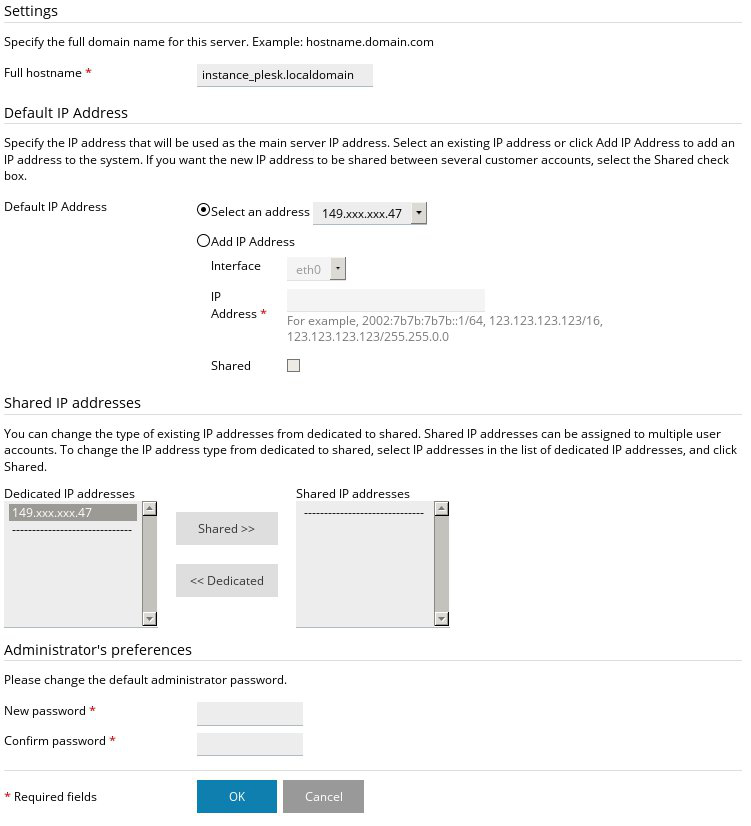
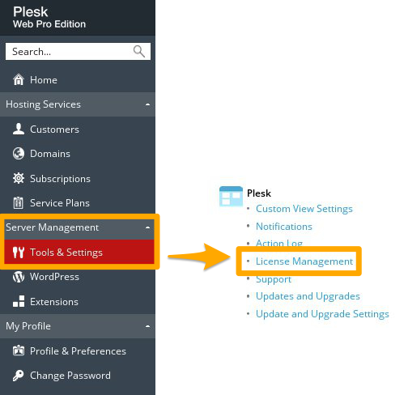

**Last updated 26th March 2018**

## Objective

Plesk is an easy-to-use hosting control panel. You can install and use it on OVH Public Cloud instances.

**Find out how to install Plesk on an OVH Public Cloud instance.** 

> [!warning]
> 
> OVH provides services which you are responsible for.  In fact, as we not not have administrative access to these machines, we are not administrators and we cannot provide you with support. This means that it is up to you to manage the software and security daily.
>
> We have provided you with this guide in order to help you with common tasks. However, we advise contacting a specialist provider if you experience any difficulties or doubts about administration, usage or server security. Feel free to visit our [community forum](https://community.ovh.com/en/){.external} to interact with other users.
>

## Requirements

- [an instance created via the OVH Control Panel](../create_an_instance_in_your_ovh_customer_account/)
- [root access to the instance](../become_the_root_user_and_select_a_password/)

## Instructions

### Step 1: Install Plesk.

Plesk can be installed easily via an SSH connection. To do this, download and launch the Plesk installation script using the command that best suits your situation below.

- **For a default, non-custom Plesk installation**:

```bash
# sh <(curl https://autoinstall.plesk.com/one-click-installer || wget -O - https://autoinstall.plesk.com/one-click-installer)
```

- **For a custom Plesk installation**:

```bash
# sh <(curl https://autoinstall.plesk.com/plesk-installer || wget -O - https://autoinstall.plesk.com/plesk-installer)
```

Then wait for the installation process to complete. 

### Step 2: Configure Plesk.

You can now log in to the Plesk interface and configure it. To do this, use the address `https://instance.IP.address:8443` in your web browser, replacing ‘instance.IP.address’ with your own instance’s IP address. You will then be asked to enter your **root** credentials.

{.thumbnail}

Once you have logged in, a configuration wizard will appear. Here, you can configure the type of view that the Plesk interface will have. Pick a view type that suits your activity.

{.thumbnail}

Select the Plesk interface view type you want to apply.

{.thumbnail}

You you will then need to enter information regarding access to your instance:

- the host name
- the IP address
- the root password

Enter this information in the specified fields.

{.thumbnail}

Finally, you will need to fill in the **administrator** account information.

{.thumbnail}

### Step 3: Add a licence.

To add your Plesk licence, take the key that was sent to you by your service provider.

> [!primary]
>
> We do not sell Plesk licences for our Public Cloud solutions. However, you can order one from the [Plesk](https://www.plesk.com/){.external} website.
> 

When you first log in to the interface, you will see a page that offers to set up your Plesk licence.

{.thumbnail}

Want to change your licence, to replace a test key or change your solution, for example? From the Plesk interface, go to the `Server Management` section and click `Tools & Settings`{.action}. Then go to the **Plesk** section, and select `License Management`{.action}.

Once you have added the new key, you can view the type of licence installed at the top of the menu bar, on the left.

{.thumbnail}

## Go further

[Official Plesk documentation](https://docs.plesk.com/en-US/onyx/){.external}.

Join our community of users on <https://community.ovh.com/en/>.