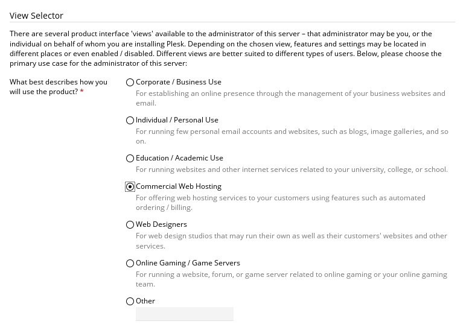
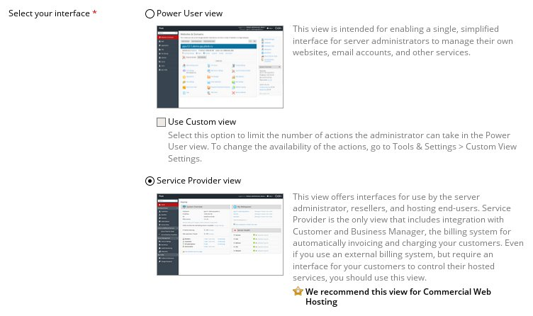
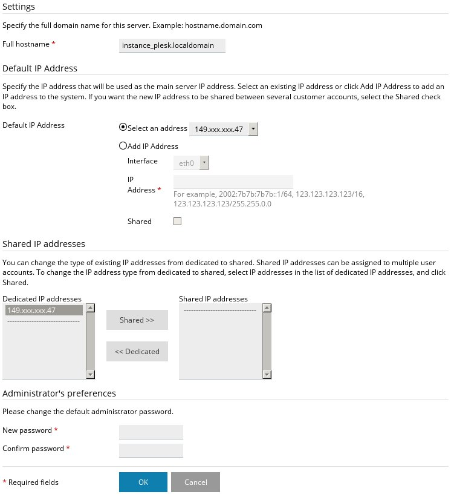
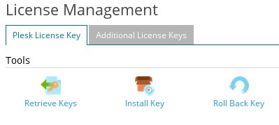
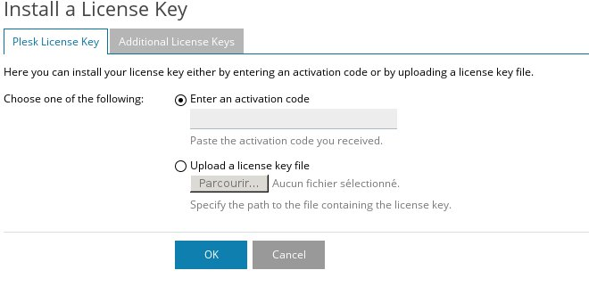
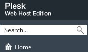

## 
Plesk to prosty w użytkowaniu interfejs administracyjny dla serwerów dedykowanych. Jest on proponowany dla serwerów dedykowanych i dla serwerów VPS OVH, ale nie ma go wśród obrazów dla usługi Public Cloud.

Można zainstalować ten interfejs i korzystać z niego na jednej z instancji Public Cloud. 

Źródło: [Plesk](http://download1.parallels.com/Plesk/Doc/en-US/online/plesk-installation-upgrade-migration-guide/)


## Wymagania

- [Utworzenie instancji w panelu klienta OVH]({legacy}1775)
- [Dostęp root i zdefiniowanie hasła]({legacy}1786)


## Instalacja
Interfejs Plesk można zainstalować z poziomu połączenia przez SSH. Należy pobrać pliki interfejsu i wykonać skrypt instalacyjny Pleska:


```
user@poste:~$ wget -O - http://autoinstall.plesk.com/one-click-installer | sh
```


Można wykonać spersonalizowaną instalację pobierając i uruchamiając ten skrypt:


```
user@poste:~$ wget http://autoinstall.plesk.com/plesk-installer
user@poste:~$ sh ./plesk-installer
```


## Konfiguracja
Instalacja została zakończona. Można zalogować się do interfejsu Plesk, aby dokończyć jego konfigurację.
W tym celu uruchom przeglądarkę i zaloguj się na stronie https://IP.instancji:8443 korzystając z danych do konta root.

{.thumbnail}
Po zalogowaniu pojawi się asystent konfiguracji, który pozwoli Ci na skonfigurowanie sposobu wyświetlania informacji w interfejsie Plesk. Wybór będzie się opierać na kryteriach związanych z rodzajem działalności, na przykład z odsprzedażą hostingu www:


- Opisz, jak będziesz korzystać z interfejsu Plesk:


{.thumbnail}

- Wybierz typ wyświetlania dla interfejsu:


{.thumbnail}
Po wykonaniu tych czynności będziesz mógł podać informacje dotyczące dostępu do instancji:


- Hostname
- Adres IP
- Hasło root


{.thumbnail}
Aby dokończyć konfigurację, wystarczy podać informacje dotyczące konta administratora:

{.thumbnail}


## Dodawanie licencji
Kolejny etap dotyczy dodawania licencji.

## Uwaga
Nie sprzedajemy licencji Plesk dla usługi Public Cloud. Możesz zamówić licencję bezpośrednio na [stronie Pleska](http://www.plesk.com/fr/#editions).
Możesz również uzyskać klucz testowy na tej [stronie](http://www.odin.com/fr/products/plesk/download/).
Podczas pierwszego logowania pojawi się strona z propozycją dodania licencji:

{.thumbnail}
Możesz więc zainstalować klucz licencyjny.

{.thumbnail}
uwaga
Jeśli chcesz zmienić licencję (wymiana klucza testowego, zmiana oferty), możesz to zrobić z poziomu interfejsu Plesk w części Server Management i Tools & Settings:

{.thumbnail}
Następnie przejdź do sekcji Plesk i wybierz License Management:

{.thumbnail}
Po dodaniu nowego klucza będziemy mogli sprawdzić, że licencja się zmieniła:

{.thumbnail}


## 
[Przewodniki Cloud]({legacy}1785)

