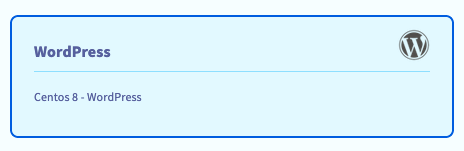

**Last updated 26th July 2021**

## Objective

WordPress is a content management system (CMS) which lets you create your website quickly and easily. You do not need to have any programming skills to manage it.

This tutorial includes the basic steps for a fully manual installation which involves configuring a web server. You can also pre-configure your instance for using WordPress by selecting our WordPress (on CentOS) template when creating the instance.

**This guide explains how to install WordPress on a Public Cloud instance.**


## Requirements

- a [Public Cloud project](https://www.ovhcloud.com/en-au/public-cloud/) in your OVHcloud account
- access to the [OVHcloud Control Panel](https://ca.ovh.com/auth/?action=gotomanager&from=https://www.ovh.com.au/&ovhSubsidiary=au)
- administrative access (root) to your instance via SSH

## Instructions

- For a fully manual installation, proceed with the instructions below. (Create an instance first if necessary; we recommend to consult the [Public Cloud first steps guide](../public-cloud-first-steps/).)
- For an installation using the OVHcloud template for WordPress, follow the [instance creation guide](../public-cloud-first-steps/) and choose `WordPress`{.action} in step 3 of the process, "Select an image". <br><br> {.thumbnail} <br> With a successfully created WordPress instance, the software is already installed but you still need to configure the database. Proceed with the instructions for the [MariaDB configuration below](#sqlconf).

### Installing a web server

First of all, you have to install a web server on your Public Cloud instance.

To do this, you have ensure that your instance is up-to-date:

- **For Debian/Ubuntu**

```bash
admin@instance:~$ sudo apt-get update && sudo apt-get upgrade -y
```

- **For Fedora/CentOS**

```bash
[admin@instance ~]$ sudo yum update && sudo yum upgrade
```

You can then install a web server of your choice. This example uses the Apache web server with the following elements:

- PHP
- PHP-MySQL
- MySQL server or MariaDB server

> [!primary]
>
> Since software packages are regularly updated, you might need to adjust the following instructions according to the latest versions.


- **For Debian/Ubuntu**

```bash
admin@instance:~$ sudo apt-get install apache2 php php-mysql mysql-server -y
```

- **For Fedora/CentOS**

```bash
[admin@instance ~]$ sudo yum install httpd php php-mysqlnd mariadb-server -y
```

You will be asked to enter a password to configure the "root" account for the MySQL database.

Restart the web server to make sure that this has been registered:

- **For Debian/Ubuntu**

```bash
admin@instance:~$ sudo systemctl restart apache2
```

- **For Fedora/CentOS**

```bash
[admin@instance ~]$ sudo systemctl restart httpd.service
```

### Download WordPress

Go to the [WordPress website](https://wordpress.org/download/) to retrieve the download link for the latest version. Then download the file:

```bash
admin@instance:~$ wget https://wordpress.org/latest.tar.gz
```

Uncompress the downloaded archive:

```bash
admin@instance:~$ tar zxvf latest.tar.gz
```

Delete the web server default folder:

```bash
admin@instance:~$ sudo rm -R /var/www/html/
```

Replace the default web server folder with the WordPress folder:

```bash
admin@instance:~$ sudo mv wordpress /var/www/html
```

Now you can give the web server write permissions for the folder.

- **For Debian/Ubuntu**

```bash
admin@instance:~$ sudo chown -R www-data:www-data /var/www/html/
```

- **For Fedora/CentOS**

```bash
[admin@instance ~]$ sudo chown -R apache:apache /var/www/html/
```

### MySQL configuration <a name="sqlconf"></a>

Unlike a MySQL server which you can install on Debian/Ubuntu, MariaDB does not configure your root password during installation.
You therefore have to launch the MariaDB server and set your password using the following commands.

Start the database server:

```bash
[admin@instance ~]$ sudo systemctl start mariadb.service
```

Reconfigure the "root" password:

```bash
[admin@instance ~]$ sudo /usr/bin/mysql_secure_installation
```

```bash
Set root password? [Y/n] Y
New password:
```

You will also be prompted to confirm some security-related actions, such as removing the default "anonymous user" and disabling root logins.

The following instructions are valid for both MySQL and MariaDB.

Once you have your "root" password you can log on to your database server:

```bash
admin@instance:~$ sudo mysql -u root -p
```

You can now create a new user, set a password and create a database dedicated to WordPress:

Create a user:

```sql
mysql> CREATE USER 'wordpress'@'localhost' IDENTIFIED BY 'your_password';
```

Create a database:

```sql
mysql> CREATE DATABASE `wordpress`;
```

Grant all rights to the "wordpress" user on the "wordpress" database:

```sql
mysql> GRANT ALL PRIVILEGES ON `wordpress` . * TO 'wordpress'@'localhost';
```

Close the database CLI:

```sql
mysql> exit;
```

### WordPress configuration

After configuring the database, you can launch a browser and log in to your WordPress website by entering your instance's IP address (or the domain name if you have [attached one to the instance yet](../../domains/web_hosting_how_to_edit_my_dns_zone/)).

The WordPress configuration assistant allows you to configure access to your database. Enter the details you have defined in the previous steps.

{.thumbnail}

In the second step, you can configure your website's general information, as well as your WordPress admin user.

{.thumbnail}

Once this is confirmed, you will be able to log in to your website's administation panel with the user you have just created.


## Go further

Join our community of users on <https://community.ovh.com/en/>.