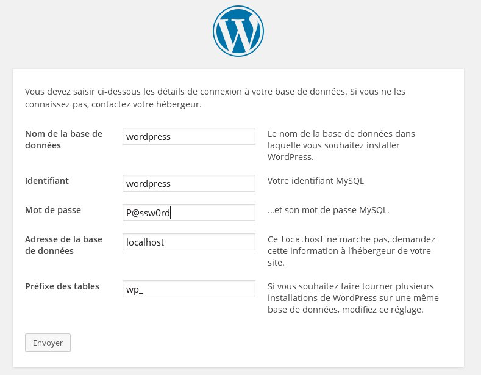
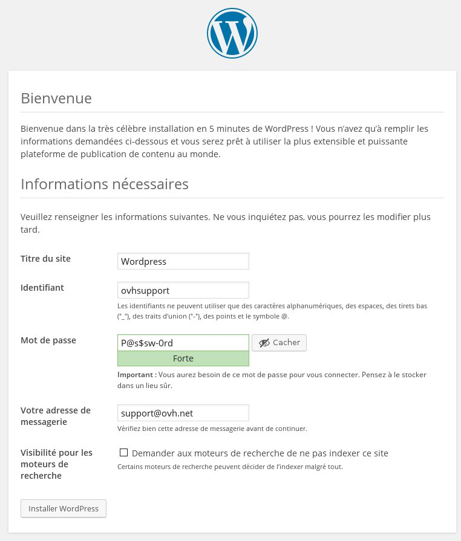

## 
WordPress is a content management system (CMS) which lets you create your website quickly and easily. You do not need to have any programming skills to manage it.

Unlike OVH VPS, there are no Wordpress templates installed on your Public Cloud instance. However, it is still possible to install Wordpress yourself on an instance.

This guide shows you how to install Wordpress on a Public Cloud instance .


## Prerequisites

- [Launch an instance in your OVH Control Panel]({legacy}1775)


## Installing a web server
First of all, you have to install a web server on your Public Cloud instance.

To do this, you have to check that your instance is up-to-date:


- For Debian/Ubuntu


```
admin@instance:~$ sudo apt-get update && sudo apt-get upgrade -y
```


- For Fedora/CentOS


```
[admin@instance ~]$ sudo yum update && sudo yum upgrade
```


You can then install a web server.
In this example we are going to use the Apache web server with the following elements:

- Php5
- Php5-mysql
- Serveur Mysql

- For Debian/Ubuntu


```
admin@instance:~$ sudo apt-get install apache2 php5 php5-mysql mysql-server -y
```


- For Fedora/CentOS


```
[admin@instance ~]$ sudo yum 
install httpd php php-mysql mariadb-
server -y
```


You will be asked to enter a password to configure the "root" account for the MySQL database

You then have to restart the web server to make sure that this has been registered.


- For Debian/Ubuntu


```
admin@instance:~$ sudo service 
apache2 restart
```


- For Fedora/CentOS


```
admin@instance:~$ sudo service httpd restart
```


## Download Wordpress
Go to the [Wordpress](https://wordpress.org/download/) website to get the latest version:


```
admin@instance:~$ wget 
https://wordpress.org/wordpress-4.4.tar.gz
```


Then uncompress the archive that you have just downloaded:


```
admin@instance:~$ tar zxvf wordpress-4.4.tar.gz
```


- Delete the web server default folder


```
admin@instance:~$ sudo rm -R /var/www/html/
```


- Replace the default web server folder with the Wordpress folder 


```
admin@instance:~$ sudo mv wordpress /var/www/html
```


- Once this has been replaced, you can give the Web server write permissions for the folder. 

- For Debian/Ubuntu


```
admin@instance:~$ sudo chown -R www-data:www-data /var/www/html/
```


- For Fedora/CentOS


```
[admin@serveur-7 ~]$ sudo chown -R apache:apache /var/www/html/
```


## MySQL configuration
Unlike MySQL-Server that you can install on Debian/Ubuntu, MariaDB does not configure your root password during installation.
You therefore have to launch the MariaDB server and set your password using the following commands:


- Launch the database server:


```
[admin@instance ~]$ sudo 
/sbin/service mariadb start
```


- Reconfigure "root" password

:


```
[admin@instance ~]$ sudo /usr/bin/mysql_secure_installation
```


Once you have your "root" password you can log on to your database server:


```
admin@instance:~$ sudo mysql -u 
root -p
```


You can now create a new user and a database dedicated to Wordpress:


- Create a user


```
mysql> CREATE USER 'wordpress'@'localhost' IDENTIFIED BY 'P@ssw0rd';
```


- Create database


```
mysql> CREATE DATABASE `wordpress` ;
```


- You then grant all rights to the "wordpress" user on the "wordpress" database


```
mysql> GRANT ALL PRIVILEGES ON `wordpress` . * TO 
'wordpress'@'localhost';
```


## Wordpress configuration
After configuring the database, you can launch a browser and log in to your WordPress website by entering your instance's IP address in your browser.

A Wordpress page appears, first of all you can configure access to your database.

{.thumbnail}
After that, you can configure your website's general information, as well as your admin user access.

{.thumbnail}
Once this is confirmed, you will be able to log in to your website's administation panel with the user you have just created.


## 

- [url=GUIDE#1708]How to use Docker to optimise a WordPress website hosted on a VPS

[/url]


## 
[Go back to the index of Cloud guides]({legacy}1785)

