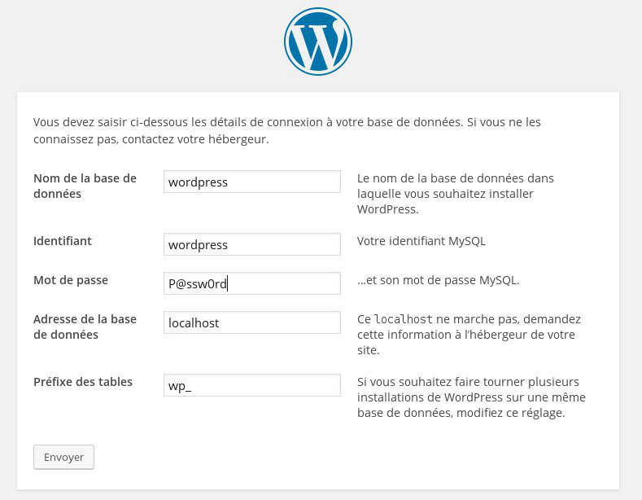
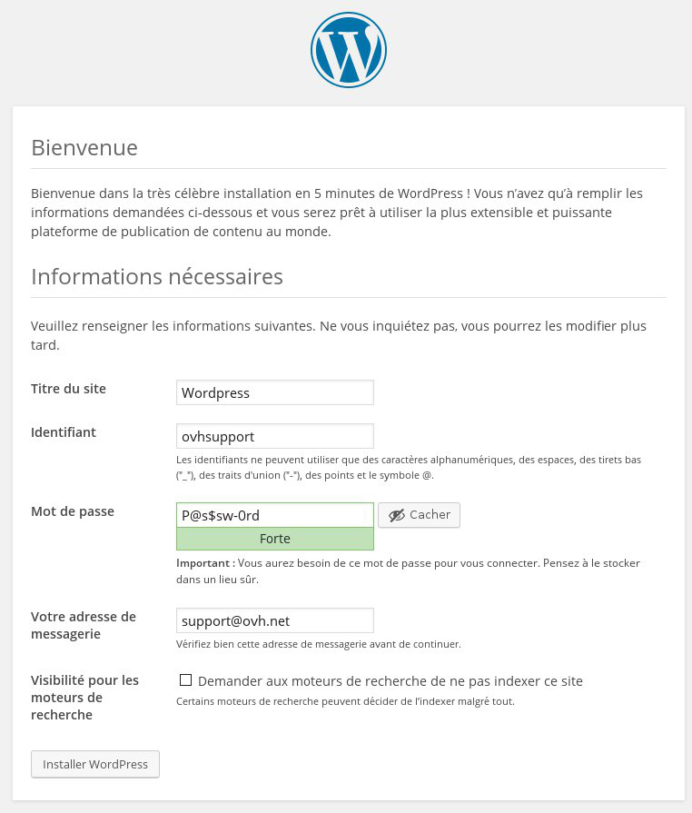

## Préambule
WordPress est un système de gestion de contenu (CMS) vous permettant de créer votre site de manière rapide et simple. Celui ci ne nécessite pas de compétences particulières en programmation pour l'administrer.

Contrairement aux VPS OVH, il n'y a pas de templates Wordpress prévus pour l'installation de votre instance Public Cloud, cependant, il vous est toujours possible d'installer vous même Wordpress sur une instance.

Ce guide vous montre les différentes étapes à suivre afin d'installer Wordpress sur une instance Public Cloud.


### Prérequis
- [Créer une instance dans l'espace client OVH](../guide.fr-fr.md){.ref}


## Installation de Wordpress

### Installation du serveur Web
Dans un premier temps, il faudra procéder à l'installation du serveur Web sur votre instance Public Cloud.

Pour effectuer cela, nous allons nous assurer que notre instance est bien à jour :

- Pour Debian / Ubuntu

```bash
admin@instance:~$ sudo apt-get update && sudo apt-get upgrade -y
```

- Pour Fedora / CentOS

```bash
[admin@instance ~]$ sudo yum update --obsoletes -y && sudo yum upgrade
```


Ensuite, il est possible d'installer le serveur Web. Nous allons donc utiliser Apache avec les éléments suivants :

- Php5
- Php5-mysql
- Serveur Mysql
- Pour Debian / Ubuntu

```bash
admin@instance:~$ sudo apt-get install apache2 php5 php5-mysql mysql-server -y
```

- Pour Fedora / CentOS

```bash
[admin@instance ~]$ sudo yum install httpd php php-mysql mariadb-server -y
```


Un mot de passe vous sera alors demandé pour configurer le compte "root" de la base de donnée MySQL

On redémarre ensuite le serveur Web pour que cela soit pris en compte.

- Pour Debian / Ubuntu

```bash
admin@instance:~$ sudo service apache2 restart
```

- Pour Fedora / CentOS

```bash
admin@instance:~$ sudo service httpd restart
```


### Telechargement de Wordpress
Rendez vous sur le site de [Wordpress](https://fr.wordpress.org/txt-download/){.external} afin de télécharger la version la plus récente :


```bash
admin@instance:~$ wget https://fr.wordpress.org/wordpress-4.4-fr_FR.tar.gz
```

On va ensuite décompresser l'archive que l'on vient de télécharger :


```bash
admin@instance:~$ tar zxvf wordpress-4.4-fr_FR.tar.gz
```

- Suppression du dossier par défaut du serveur Web

```bash
admin@instance:~$ sudo rm -R /var/www/html/
```

- Déplacement du dossier Wordpress vers le dossier par défaut du serveur Web

```bash
admin@instance:~$ sudo mv wordpress /var/www/html
```


Une fois le remplacement effectué, nous pouvons donner au serveur Web le droit d'écrire dans le dossier.

- Pour Debian / Ubuntu


```bash
admin@instance:~$ sudo chown -R www-data:www-data /var/www/html/
```

- Pour Fedora / CentOS

```bash
[admin@serveur-7 ~]$ sudo chown -R apache:apache /var/www/html/
```


### Configuration de MySQL
Contrairement à MySQL-Server que vous pouvez installer sur Debian / Ubuntu, MariaDB ne configure pas votre mot de passe root lors de l'installation. Il faudra donc lancer le serveur MariaDB puis configurer votre mot de passe à l'aide des commandes suivantes :

- Lancement du serveur de base de données :

```bash
[admin@instance ~]$ sudo /sbin/service mariadb start
```

- Reconfiguration du mot de passe "root" :

```bash
[admin@instance ~]$ sudo /usr/bin/mysql_secure_installation
```


Une fois en possession de votre mot de passe "root" vous pouvez désormais vous connecter sur votre serveur de base de données :


```bash
admin@instance:~$ sudo mysql -u root -p
```

Il est ensuite possible de créer un nouvel utilisateur et une base de données dédié à WordPress :

- Création de l'utilisateur

```bash
mysql> CREATE USER 'wordpress'@'localhost' IDENTIFIED BY 'P@ssw0rd';
```

- Création de la base de données

```bash
mysql> CREATE DATABASE `wordpress` ;
```

- On donne ensuite tout les droits à l'utilisateur "wordpress" sur la base de donnée "wordpress"

```bash
mysql> GRANT ALL PRIVILEGES ON `wordpress` . * TO 'wordpress'@'localhost';
```


### Configuration de Wordpress
Une fois la base de données configurée, vous pouvez lancer un navigateur et vous connecter sur votre site Wordpress en renseignant l'adresse IP de votre instance dans votre navigateur.

Une page Wordpress apparait, vous pouvez dans un premier temps configurer les accès à votre base de données.


{.thumbnail}

Après cela, vous pouvez configurer les informations générales de votre site, ainsi que les accès de votre utilisateur administrateur.


{.thumbnail}

Une fois cela validé, vous serez en mesure de vous connecter au panneau d'administration de votre site à l'aide de l'utilisateur que vous venez juste de créer.
