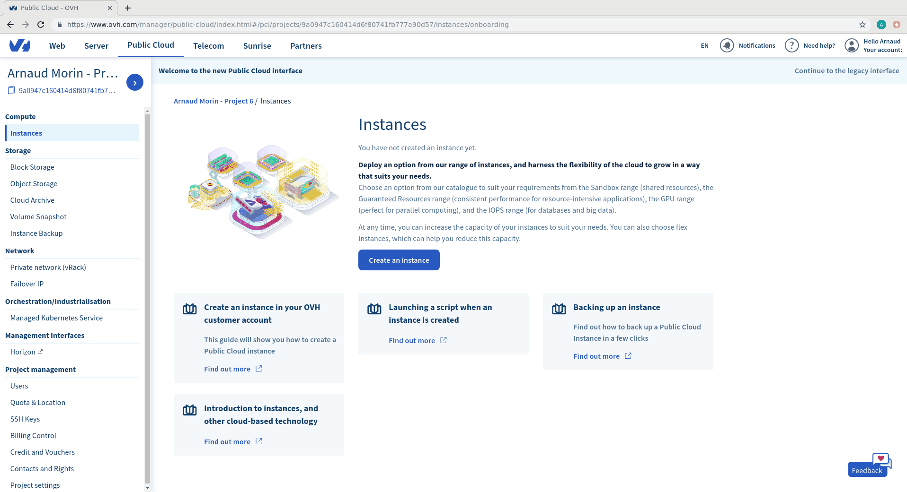
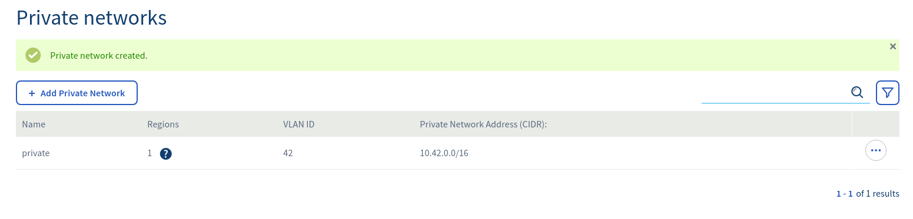

# Introduction

Within OVH Public Cloud, private networking rely on a technology called vRack.
So, to be able to create private networks, you'll first have to:

- Order a new vRack
- Associate a Public Cloud project to the new vRack
- Create a private network within it
- Boot instances in this private network

# Order a new vRack

See [order a vRack](/gb/en/public-cloud/order-vrack/)

# Associate your project

See [associate a project to a vRack](/gb/en/public-cloud/associate-vrack-project/)

# Create a network
## From Manager

Follow the steps:




As a result, you should have something like:



## From OpenStack CLI

First, create a *network*. In the following example, we create a network named _private_, with VLAN ID 42.

```
$ openstack network create --provider-segment 42 --provider-network-type vrack private
```

Then, create a *subnet* in this network. In the following example, we create a subnet named _192.168.42.0/24_ with OVH DNS, DHCP enabled but no gateway.
```
$ openstack subnet create --dhcp --gateway none --dns-nameserver 213.186.33.99 --subnet-range 192.168.42.0/24 --network private 192.168.42.0/24
```

Check the result:

```
$ openstack network show private
+---------------------------+--------------------------------------+
| Field                     | Value                                |
+---------------------------+--------------------------------------+
| admin_state_up            | UP                                   |
| availability_zone_hints   |                                      |
| availability_zones        | nova                                 |
| created_at                | 2019-06-12T13:01:02Z                 |
| description               |                                      |
| dns_domain                | None                                 |
| id                        | d303e8ed-8adc-48cc-9db9-053476dd771f |
| ipv4_address_scope        | None                                 |
| ipv6_address_scope        | None                                 |
| is_default                | None                                 |
| is_vlan_transparent       | None                                 |
| location                  | None                                 |
| mtu                       | 9000                                 |
| name                      | private                              |
| port_security_enabled     | False                                |
| project_id                | 4f079382095041e1b0e373ce5cdee2bs     |
| provider:network_type     | vrack                                |
| provider:physical_network | None                                 |
| provider:segmentation_id  | 42                                   |
| qos_policy_id             | None                                 |
| revision_number           | 4                                    |
| router:external           | Internal                             |
| segments                  | None                                 |
| shared                    | False                                |
| status                    | ACTIVE                               |
| subnets                   | 2a1ea28f-114e-4888-b9b6-54d13c601d9b |
| tags                      |                                      |
| updated_at                | 2019-06-12T13:01:06Z                 |
+---------------------------+--------------------------------------+

```


# Boot an instance
## From Manager
TODO

## From OpenStack CLI

To be able to boot an instance, you will need a SSH key. See [create SSH key](/gb/en/public-cloud/create-ssh-keys/) to create a new one.

The following command will create an instance with two network interfaces:
- One on _Ext-Net_ network (public network, accessible from internet)
- One on _private_ network

```
$ openstack server create --image 'Debian 9' --net Ext-Net --net private --key-name my-key --flavor c2-7 instance1
+-----------------------------+-------------------------------------------------+
| Field                       | Value                                           |
+-----------------------------+-------------------------------------------------+
| OS-DCF:diskConfig           | MANUAL                                          |
| OS-EXT-AZ:availability_zone |                                                 |
| OS-EXT-STS:power_state      | NOSTATE                                         |
| OS-EXT-STS:task_state       | scheduling                                      |
| OS-EXT-STS:vm_state         | building                                        |
| OS-SRV-USG:launched_at      | None                                            |
| OS-SRV-USG:terminated_at    | None                                            |
| accessIPv4                  |                                                 |
| accessIPv6                  |                                                 |
| addresses                   |                                                 |
| adminPass                   | gnvPrA3HzSF6                                    |
| config_drive                |                                                 |
| created                     | 2019-06-12T13:03:16Z                            |
| flavor                      | c2-7 (efef3ef8-738e-43f1-b350-bd47cbfb78d1)     |
| hostId                      |                                                 |
| id                          | 09db9aad-fb75-4b80-8d3a-c330ef46256a            |
| image                       | Debian 9 (dc90739d-d59e-4892-9e0e-b6353f5def52) |
| key_name                    | arnaud-ovh                                      |
| name                        | instance1                                       |
| progress                    | 0                                               |
| project_id                  | 4f079382095041e1b0e373ce5cdee2be                |
| properties                  |                                                 |
| security_groups             | name='default'                                  |
| status                      | BUILD                                           |
| updated                     | 2019-06-12T13:03:16Z                            |
| user_id                     | 4772d30a24954f309d32c81ec6dc8f9c                |
| volumes_attached            |                                                 |
+-----------------------------+-------------------------------------------------+

```

Wait for the VM to boot by checking it's status:

```
$ openstack server list
+--------------------------------------+-----------+--------+-----------------------------------------------------------------------+----------+--------+
| ID                                   | Name      | Status | Networks                                                              | Image    | Flavor |
+--------------------------------------+-----------+--------+-----------------------------------------------------------------------+----------+--------+
| 09db9aad-fb75-4b80-8d3a-c330ef46256a | instance1 | ACTIVE | Ext-Net=2001:41d0:701:1000::1a35, 51.68.167.129; private=192.168.42.6 | Debian 9 | c2-7   |
+--------------------------------------+-----------+--------+-----------------------------------------------------------------------+----------+--------+
```

As you can see, my instance is having two IPv4 addresses:
- 51.68.167.129 (on Ext-Net)
- 192.168.42.6 (on private)

Now try to connect to your instance using public address:

```
ssh debian@51.68.167.129 -i my-key

The authenticity of host '51.68.167.129 (51.68.167.129)' can't be established.
ECDSA key fingerprint is SHA256:hzDc/5J491Yr1Tik4QNz1hgMnESG2XCe8oNRfIJ3s/E.
Are you sure you want to continue connecting (yes/no)? yes
Warning: Permanently added '51.68.167.129' (ECDSA) to the list of known hosts.
Linux instance1 4.9.0-9-amd64 #1 SMP Debian 4.9.168-1+deb9u2 (2019-05-13) x86_64

The programs included with the Debian GNU/Linux system are free software;
the exact distribution terms for each program are described in the
individual files in /usr/share/doc/*/copyright.

Debian GNU/Linux comes with ABSOLUTELY NO WARRANTY, to the extent
permitted by applicable law.
debian@instance1:~$

```

Check the network interfaces and addresses:

```
debian@instance1:~$ ip a
1: lo: <LOOPBACK,UP,LOWER_UP> mtu 65536 qdisc noqueue state UNKNOWN group default qlen 1
    link/loopback 00:00:00:00:00:00 brd 00:00:00:00:00:00
    inet 127.0.0.1/8 scope host lo
       valid_lft forever preferred_lft forever
    inet6 ::1/128 scope host 
       valid_lft forever preferred_lft forever
2: ens3: <BROADCAST,MULTICAST,UP,LOWER_UP> mtu 1500 qdisc pfifo_fast state UP group default qlen 1000
    link/ether fa:16:3e:72:a0:a3 brd ff:ff:ff:ff:ff:ff
    inet 51.68.167.129/32 brd 51.68.167.129 scope global ens3
       valid_lft forever preferred_lft forever
    inet6 fe80::f816:3eff:fe72:a0a3/64 scope link 
       valid_lft forever preferred_lft forever
3: ens4: <BROADCAST,MULTICAST,UP,LOWER_UP> mtu 9000 qdisc pfifo_fast state UP group default qlen 1000
    link/ether fa:16:3e:8a:e5:2b brd ff:ff:ff:ff:ff:ff
    inet 192.168.42.6/24 brd 192.168.42.255 scope global ens4
       valid_lft forever preferred_lft forever
    inet6 fe80::f816:3eff:fe8a:e52b/64 scope link 
       valid_lft forever preferred_lft forever

```

Done!

