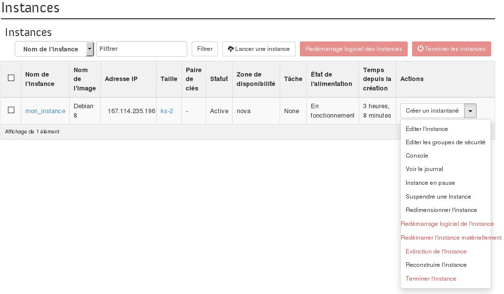
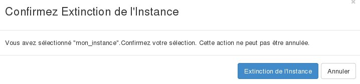

## 
Można wyłączyć instancję, aby zawiesić jej działalność lub w celu wykonania różnych testów. 
Przewodnik ten wyjaśnia, jak to zrobić w interfejsie OpenStack Horizon.

## Informacja
Pomimo tej zmiany instancja nadal będzie odpłatna.

## Wstępne wymagania

- [Dostęp do interfejsu Horizon]({legacy}1773)
- Instancja

## 
Aby wyłączyć instancję, należy:	

- Zalogować się do interfejsu Horizon.
- Kliknąć na Instancje w menu z lewej strony.
- Wybrać Wyłącz instancję z rozwijalnej listy dla tej instancji.

{.thumbnail}

- Pojawi się wiadomość z potwierdzeniem.

{.thumbnail}

- Kliknij na Wyłącz instancję.

## 
[Przewodniki Cloud]({legacy}1785)

