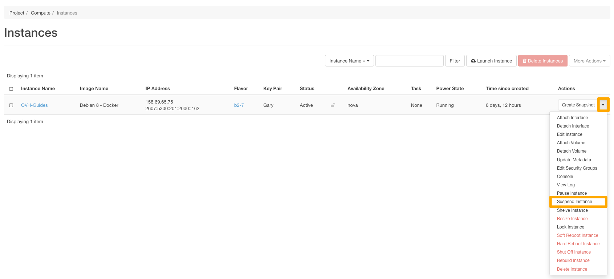

**Last updated 28th July 2020**

## Objective

Horizon is the native OpenStack web interface to it's services (Nova, swift, glance, etc.). You have the option of using this interface as well as the OVHcloud Control Panel.

**This guide provides some information on the basic functions of the Horizon interface.**

## Requirements

- A [Public Cloud Project]({ovh_www}/public-cloud/){.external}
- An [Openstack user](../creation-and-deletion-of-openstack-user/)

## Instructions

### Accessing Openstack Horizon.

Once you have your Openstack username and password, you can login at <https://horizon.cloud.ovh.net/auth/login/?next=/>.

### Select your Region

Before making any changes, be sure that you are working on the correct region. Click the Region on top and make your selection.

{.thumbnail}

### Compute

#### Overview

On the Overview page, you can see details on your quota usage including a list of instances created in the selected region and the resources assigned to them.

#### Instances

The Instances page is where you will be doing most of your instance management. We will detail most of the common functions below.

To access this page click on the `Compute`{.action} and then click on `Instances`{.action}

{.external)

##### Creating an instance

To create a new instance, click on the `Launch Instance`{.action} buutton.

{.thumbnail)

You will then need to fill in the information requested. If you need to do so, you can use the table below to fill in the fields. Please note that this grid is not exhaustive.

|Information|Details|
|---|---|
|Availability zone|Leave "nova" (default choice).|
|Instance name|Specify the name you want for the Instance that will be launched.|
|Template|Select the type of Instance to launch.|
|Count|Specify the number of Instances to launch.|
|Instance launch source|Select the source for launching an instance (e.g. "Launch from an image" or "Launch from a snapshot").|
|Image name|Select the Instance image (only when launching from an image).|
|Instance snapshot|Choose an Instance snapshot (only for launching from a snapshot).|
|Key pair|Select an SSH key to use for connecting to the Instance later (you can create a key by clicking the "+" sign).|
|Security groups|Specify the security group for the Instance (authorisation for opening ports).|
|Selected networks|Select the network(s) for the Instance you want to create, from the list of available networks.|
|Custom script source|Specify the source between a "direct entry" or a "file".|
|Script data|Enter the script code in the input field (16KB maximum).|
|Script file|Click ‘browse’ to select the post-installation script.|
|Disk partitioning|Choose between "automatic" or "manual".|
|Configuration disk|Configure OpenStack to write metadata on to a specific configuration disk that will be attached to the Instance when it is launched.|

> [!success]
>
> Please note that when selecting a Flavor any options with "-flex" will only have a disk of 50GB, this will allow downgraading the instances in the future.
>

Once you are ready to launch the Instances, click the `Launch Instance`{.action} button.

{.thumbnail}

After a few moments, the instance will be spawned.

##### Suspending or pausing an instance
As part of configuring a highly available infrastructure, you may encounter the need to cut access to your instances in order to perform various tests. OpenStack allows you to suspend or pause your instance. Suspension can be compared to hibernation of your instance and pause to sleep.

> [!success]
>
> The "Suspended" status will also be used in case of billing problems.
>

> [!alert]
>
>These manipulations always result in billing of the instance as the instance is not deleted.
>

###### Suspending an instance
To suspend an instance, click on the `Actions` menu and select `Suspend Instance`

{.thumbnail}

> [!success]
>
> To restart the instance, select the `Resumme Instance`{.action} from the `Actions` menu.
>

###### Pausing an instance

To suspend an instance, click on the `Actions` menu and select `Pause Instance`

{.thumbnail}

##### Restarting an instance
In some situations, you will probably be need to restart your instances.

You have 2 different options for rebooting; software and hardware reboots.

> [!success]
>
>You can restart an instance that has been turned off or suspended:
>by clicking the "Start an instance" button when it is off.
>
>by selecting "Resume Instance" from the drop-down list for a  suspended instance.
>

###### Software Reboot

To do a Soft Reboot, click on the `Actions` menu and select `Soft Reboot Instance`{.action}

{.thumbnail}

You will then be prompted to confirm your choice. You can do so by clicking `Soft Reboot Instance`{.action}

{.thumbnail}

###### Hardware Reboot

To do a Hard Reboot, click on the `Actions` menu and select `Hard Reboot Instance`{.action}

{.thumbnail}

You will then be prompted to confirm your choice. You can do so by clicking `Hard Reboot Instance`{.action}

{.thumbnail}

##### Deleting an instance

To delete an instance, you simply need to click on the `Actions` button and choose `Delete Instance`{.action}.

{.thumbnail)

You will be asked to confirm your choice to delete the instance. You can confirm this by clicking `Delete Instance`{.action}.

!{delete instance)(images/delete_instance_confirm.png){.thumbnail)

##### Rebuilding an instance

Rebuilding an instance will allow you to recreate the instance with another image.

To rebuild an instance, click on the `Actions` menu and choose `Rebuild Instance`{.action}.

{.thumbnail}

Select the Image and if you want Automatic or Manual Disk Partion and then click `Rebuild Instance`{.action}

{.thumbnail}

The rebuilding process will take a few momemnts to complete.

##### Resizing an instance
As a result of increased activity, or simply new needs, your instance may not be able to meet this new burden due to a lack of resources. However, with the Public Cloud, you can increase the resources available to your instance, and this can be done with just a few clicks.

> [!alert]
>
> Only resizing to a higher model is possible for regular models. In addition, this manipulation causes the instance to be shut down for the time of the operation.
>

> [!success]
>
> Flex instances allow resizing to higher or lower models due to a locked  single disk size.
>

To resize the instance, click on the `Actions` manu and select `Resize Instance`{.action}

{.action}

Once the configuration is complete, click `Resize`{.action}
###### Template Selection Tab

This section shows the current template and allows you to select a new template for the instance resource.

{.thumbnail)

##### Editing an instance

To edit an instance, click the `Actions` menu and select `Edit Instance`.

{.thumbnail}

Editing an instance will allow you to do 2 things:

- Modify the name of the instance

{.thumbnail}

- The [Security Groups](./#) that the instance is assigned to.

{.thumbnail}

##### Creating a snapshot of an instance
You will likely need  to back up your data, your configurations, and even your entire instances. To do this, it is possible to create snapshots of your instances, these can be used to restore a earlier configuration on your instance, or to create an exact copy of an instance.

To create a snapshot, click on the `Actions` menu and select `Create Snapshot`{.action}

{.thumbnail}

Give the snapshot a name and then click on `Create Snaphot`{.action}

{.thumbnail}

The snapshot will be saved in the [Images](./#images) section of Horizon.

##### Accessing the console of an instance

In the event of loss of access to your instance, wether caused by a configuration error, or a malfunctioning SSH service, you are always able to reconfigure your instance with the assistance of the VNC conole.

Click on the Actions menu beside the instance of choice and select the `Console` option in the drop down menu.

{.thumbnail}

The VNC Console now appears.

> [!success]
>
> If the console stops responding to keyboard inputs, click oon the status bar. To exit full screen view, click on the back button on your browser.
>

{.thumbnail}

# Go further

[Another important related guide](url)

Join our community of users on <https://community.ovh.com/en/>.
