**Last updated 29th October 2021**

## Objective

Horizon is the native OpenStack web interface to it's services (Nova, swift, glance, etc.). You have the option of using this interface as well as the OVHcloud Control Panel.

**This guide provides some information on the basic functions of the Horizon interface.**

## Requirements

- A [Public Cloud Project](https://docs.ovh.com/ca/en/public-cloud/create_a_public_cloud_project/).
- An [Openstack user](../creation-and-deletion-of-openstack-user/){.external}.

## Instructions

### Accessing Openstack Horizon

Once you have your Openstack username and password, you can access the [Horizon interface](https://horizon.cloud.ovh.net/auth/login/).

### Select your Region

Before making any changes, be sure that you are working on the correct region. Click on the Region at the top left corner and make your selection.

{.thumbnail}

### Compute

#### Overview

On the Overview page, you can see details on your quota usage including a list of instances created in the selected region and the resources assigned to them.

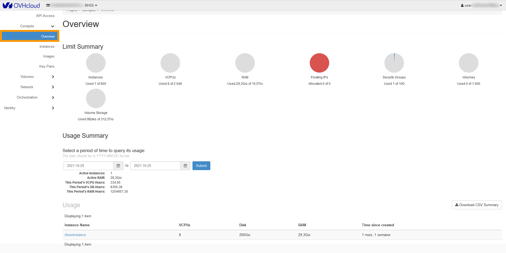{.thumbnail}

#### Instances

The Instances page is where you will be doing most of your instance management. We will detail most of the common functions below.

To access this page, In the left-side bar, click on `Compute`{.action} and then click on `Instances`{.action}.

{.thumbnail}

#### Editing an instance

If you wish to configure your instance's security groups, either to remove or add them, you can do this by editing your instance. 

You can also use this feature to change the name of your instance.

Click on `Compute`{.action} and then click on `Instances`{.action}. Select `Edit Instance`{.action} in the drop list for the corresponding instance.

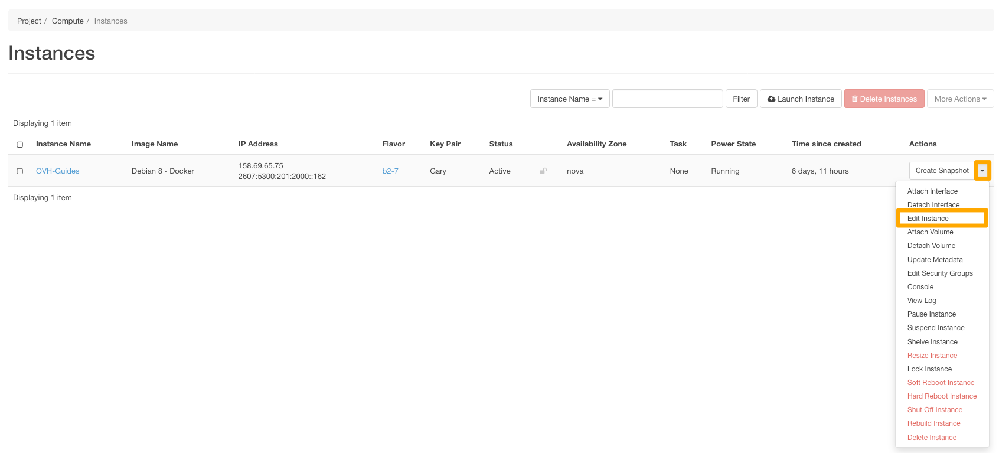{.thumbnail}

##### **Modify the name of the instance**

{.thumbnail}

To confirm, click on `Save`{.action}

##### **Modify the [Security Groups](https://docs.ovh.com/ca/en/public-cloud/configure-security-group-horizon/) assigned to the instance**

{.thumbnail}

Select or deselect the security group for the instance.

To confirm, click on `Save`{.action}

##### **Resizing an instance**

As a result of increased activity, or simply new needs, your instance may not be able to meet this new burden due to a lack of resources. However, with the Public Cloud, you can increase the resources available to your instance, and this can be done with just a few clicks.

> [!alert]
>
> Only resizing to a higher model is possible for regular models. In addition, this manipulation causes the instance to be shut down for the time of the operation.
>

> [!success]
>
> Flex instances allow resizing to higher or lower models due to a locked single disk size.
>

To resize the instance, select `Resize Instance`{.action} in the drop list for the corresponding instance.

{.action}

Once the configuration is complete, click on `Resize`{.action}

##### **Restarting an instance**

In some situations, you will probably need to restart your instances.

You have 2 different options for rebooting; software reboot and hardware reboot.

###### **Software Reboot**

To do a Soft Reboot, select `Soft Reboot Instance`{.action} in the drop list for the corresponding instance. 

{.thumbnail}

You will then be prompted to confirm your choice. You can do so by clicking on `Soft Reboot Instance`{.action}

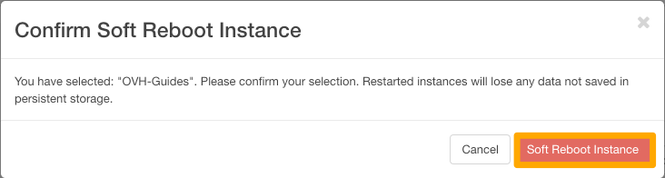{.thumbnail}

###### **Hardware Reboot**

To do a Hard Reboot, select `Hard Reboot Instance`{.action} in the drop list for the corresponding instance.

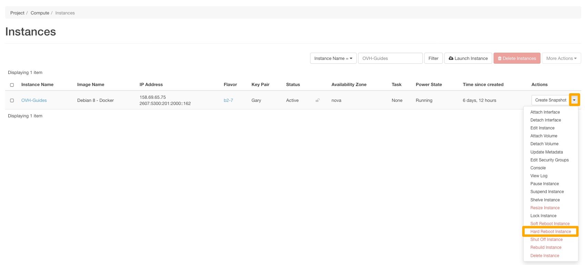{.thumbnail}

You will then be prompted to confirm your choice. You can do so by clicking on `Hard Reboot Instance`{.action}

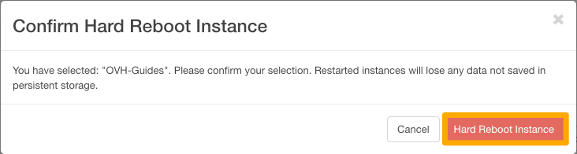{.thumbnail}

##### **Deleting an instance**

To delete an instance, select `Delete Instance`{.action} in the drop list for the corresponding instance.

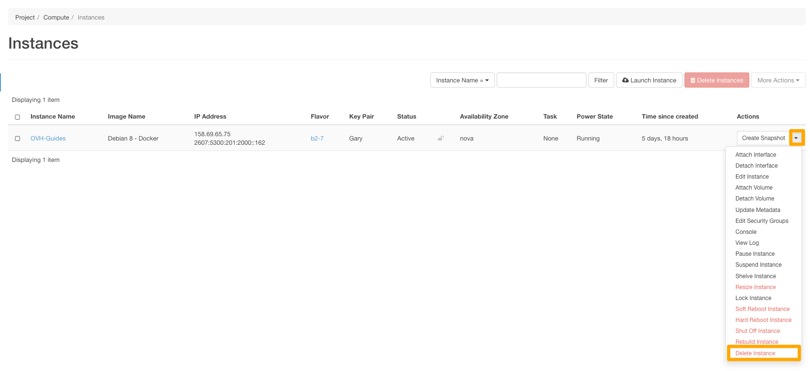{.thumbnail}

You will then be prompted to confirm your choice to delete the instance. You can confirm this by clicking on`Delete Instance`{.action}.

{.thumbnail}

##### **Rebuilding an instance**

Rebuilding an instance will allow you to recreate the instance with another image.

To rebuild an instance, select `Rebuild Instance`{.action} in the drop list for the corresponding instance.

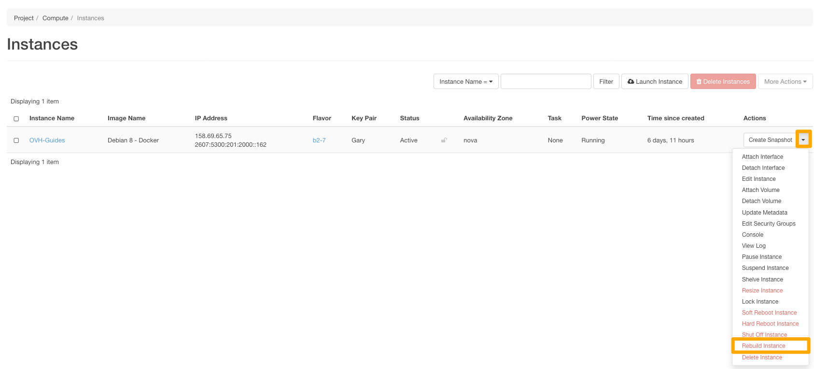{.thumbnail}

Select the Image and the Disk Partion mode, then click on `Rebuild Instance`{.action}.

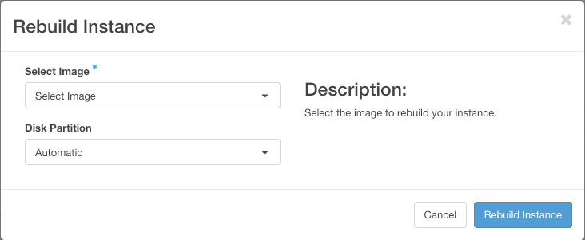{.thumbnail}

The rebuilding process will take a few moments to complete.

###### **Template Selection Tab**

This section shows the current template and allows you to select a new template for the instance resource.

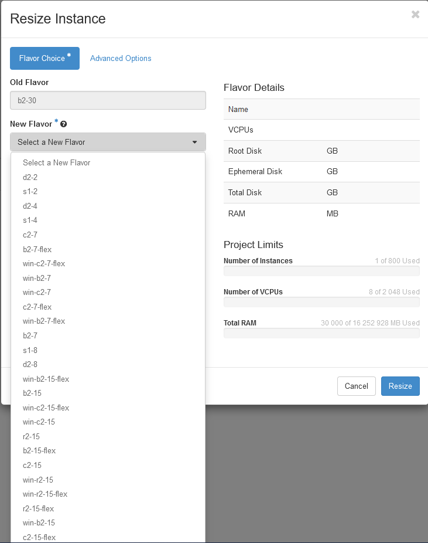

> [!success]
>
> It is possible to preview the resources that will be taken from the total resources available to the project.
>

###### **Advanced Options Tab**

This section allows you to manage the disk partitioning.

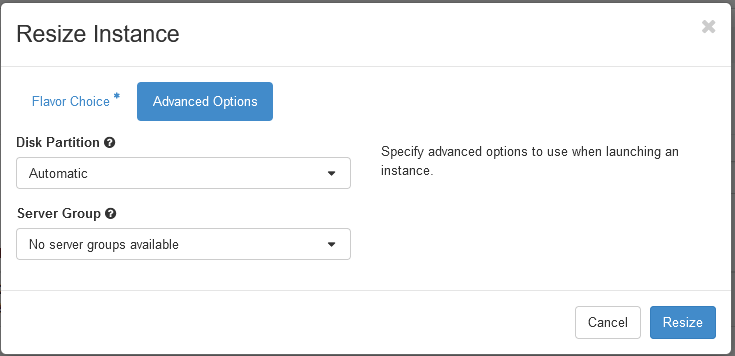

##### Creating a snapshot of an instance

During your activity, you will probably need to back up your data, your configurations, and even your entire instances. You can do this by creating snapshots of your instances, which can be used to restore a later configuration on your instance, or by creating an exact copy of an instance.

To create a snapshot, select `Create Snapshot`{.action} in the drop list for the corresponding instance.

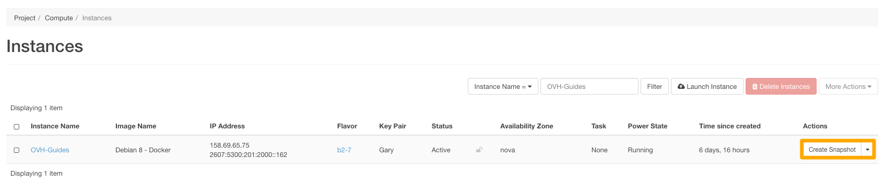{.thumbnail}

Give the snapshot a name and then click on `Create Snapshot`{.action}

{.thumbnail}

The snapshot will be saved in the `Images`{.action} section of Horizon.

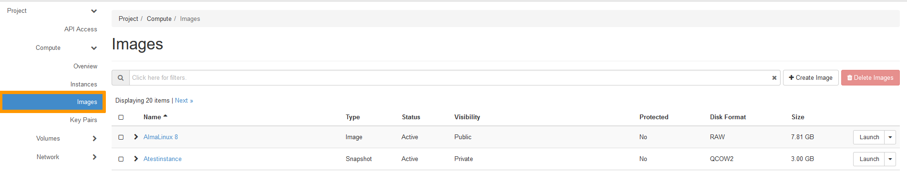{.thumbnail} 

##### Accessing the console of an instance

In the event you lose access to your instance, whether it is caused by a configuration error or a malfunctioning SSH service, you are always able to reconfigure your instance with the assistance of the VNC console.

Select `Console`{.action} in the drop list for the corresponding instance.

{.thumbnail}

The VNC Console now appears.

{.thumbnail}

> [!success]
>
> You can only use the console if you have set a password for your user.  
>

#### Images

You can add custom images via the OpenStack Horizon interface. For example, you can use it to import images from your old virtual machines to the Public Cloud, provided that they are in a compatible format. For more information, consult the following guide: [Creating, launching and deleting images in Horizon](https://docs.ovh.com/ca/en/public-cloud/create-launch-and-delete-images-in-horizon/).

# Go further

Join our community of users on <https://community.ovh.com/en/>.
