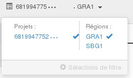
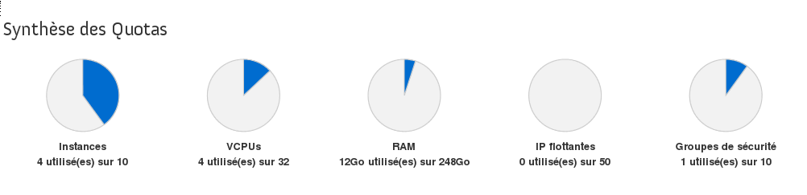
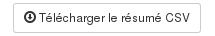
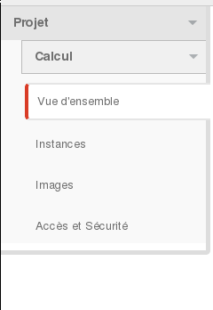
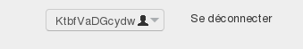

## Preambule
Cette page présente l'interface Horizon, cette interface est nativement proposée avec OpenStack, elle a été adaptée par OVHcloud mais peu modifiée, elle complète l'espace client OVHcloud et fournit davantage de fonctionnalités que celle ci.

### Prérequis
- [Créer un accès à Horizon]({legacy}1773){.ref}

## Vue d'ensemble

### Choix de la region du datacentre
Contrairement à l'Espace Client OVHcloud, Horizon séparera vos services selon leur région. Vous pourrez choisir la région depuis le menu en haut a gauche :

{.thumbnail}

### Synthese des Quotas
On retrouve une synthèse des quotas, qui permet de voir les ressources occupées et disponibles pour vos projets :

{.thumbnail}

### Resume de l'Utilisation
Vient ensuite un résumé de l'utilisation des instances de votre projet, la période de recherche est personnalisable afin d'affiner ce résumé à la période souhaitée.

{.thumbnail}

### Usage
Enfin, un récapitulatif de vos "Usages", il s'agit d'un récapitulatif des différents services associés au projet, comme la liste des instances par exemple.

{.thumbnail}

Le récapitulatif est téléchargeable au format CSV, ce qui  permet d'extraire les informations afin de pouvoir ensuite les analyser avec d'autres outils. Il suffit pour cela de cliquer sur  **Télécharger le résumé CSV**

{.thumbnail}

## A gauche
Ce menu permet de naviguer rapidement dans le projet et dans les différentes fonctionnalités associées.

{.thumbnail}

### Instances
Cette page permettra de lister et administrer les instances. C'est ici par exemple qu'il est possible de créer de nouvelles instances, de mettre en pause, ou accéder à la console de l'instance, ...

### Images
Cette page permettra de lister et administrer les images, il s'agit des templates et des snapshots associés à votre projet.

### Acces et Securite
Cette page permettra de lister et administrer les différents groupes de sécurité, le accès API et paires de clés associées à votre projet.

## En haut de page
Un menu utilisateur en haut à droite, qui permet de modifier les paramètres associés à ce dernier

{.thumbnail}
