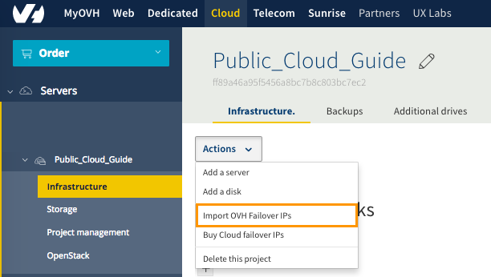
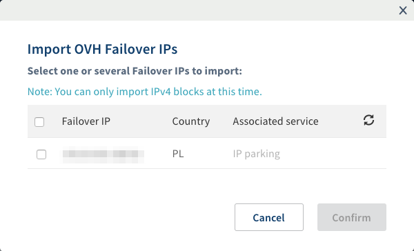
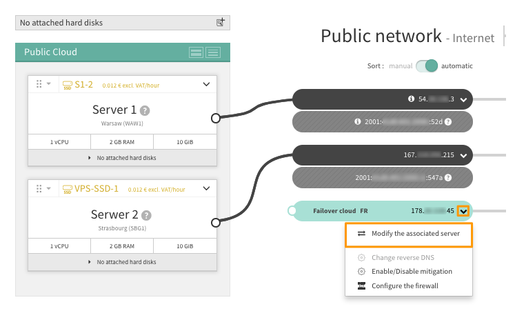
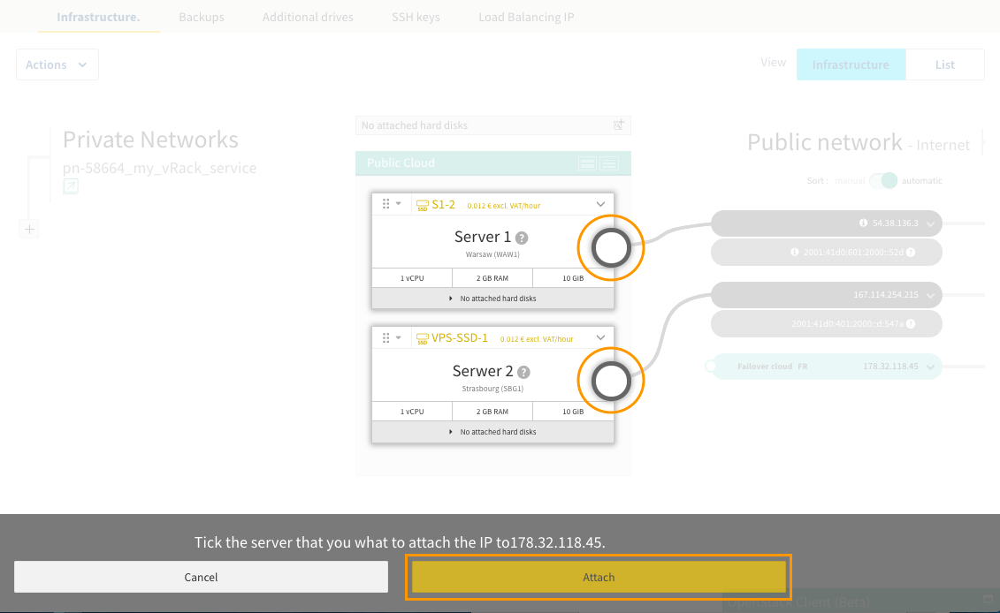

**Ostatnia aktualizacja dnia 2018-03-26**

## Wprowadzenie

Określenie "failover" w IT rozumiane jako przełączanie pomiędzy redundantnymi (nadmiarowymi, zapasowymi) maszynami, sieciami, systemami. W przypadku adresu IP oznacza to możliwość przełączenia danego IP pomiędzy maszynami, w efekcie skierowania ruchu dla danego adresu IP do odpowiedniej maszyny (serwera, instancji).
Usługa [IP Failover](https://www.ovh.pl/serwery_dedykowane/ip_failover.xml){.external} jest szczególnie przydatna, gdy:

- potrzebujesz w łatwy i szybki sposób przekierować ruch na zreplikowany serwer podczas wykonywania konserwacji lub aktualizacji na serwerze produkcyjnym,

- jeśli prowadzisz usługi hostingowe możesz odizolować ruch dla każdego z serwisów oraz przeznaczyć dla nich IP z odpowiednią geolokalizacją, co pomoże zdobyć zaufanie klientów korzystających z Twoich usług,

- planujesz migrację z [serwera dedykowanego](https://www.ovh.pl/serwery_dedykowane/){.external} do infrastruktury Public Cloud](https://www.ovh.pl/public-cloud/instances/funkcje/){.external}.

Dysponując dodatkowymi adresami IP Failover dla swoich usług zainstalowanych na instancjach możesz zwiększyć ich bezpieczeństwo i niezawodność. 

Przykładem może być serwer, na którym zainstalowano różne usługi (serwer poczty, strona internetowa, serwer baz danych) i każdej z usług przydzielono osobne adresy IP, natomiast adres główny serwera jest dostępny tylko do połączenia z określonego adresu IP - np. adresu IP administratora. Możesz zastosować bardzo przejrzystą konfigurację reguł zabezpieczeń przeznaczając poszczególne adresy IP dla ograniczonej liczby protokołów i portów.

**Przewodnik ten opisuje, jak zamówić adres IP Failover dla projektu Public Cloud OVH oraz jak go przenosić pomiędzy usługami OVH.**

## Wymagania początkowe

- [Utworzony projekt Public Cloud](https://docs.ovh.com/pl/public-cloud/pierwsze_kroki_z_public_cloud_logowanie_i_utworzenie_projektu/){.external}
- [Utworzenie instancji w Panelu klienta OVH](https://docs.ovh.com/pl/public-cloud/tworzenie_instancji_w_panelu_klienta_ovh/){.external}

## W praktyce

### Zamówienie adresu IP Failover

Zaloguj się do Panelu klienta i przejdź do sekcji `Cloud`{.action} a następnie wybierz projekt, dla którego chcesz zamówić adres IP FO (Failover). Kliknij na przycisk `Operacje`{.action}. Następnie wybierz `Zamów IP Failover Cloud`{.action}. 

{.thumbnail}

Pojawi się okno, w którym należy wybrać:

- ilość adresów IP Failover
- instancję, dla której adres jest kupowany,

a następnie:

- geolokalizację wszystkich adresów (adresy z różną geolokalizacją należy zamawiać osobno).

> [!primary]
>
> W zależności od dostępności adresów IP, niektóre geolokalizacje mogą być niedostępne i nie wyświetlać się. Po zatwierdzeniu wyboru w głównym oknie wyświetli się informacja o stworzeniu zamówienia i link do sekcji płatności.
>

### Import adresu IP Failover

Adresy i bloki adresów IP FO można przenosić pomiędzy serwerami dedykowanymi i usługami Public Cloud oraz siecią vRack.

Jeśli przenosisz blok, pamiętaj, że nie ma możliwości jego rozdzielenia na mniejsze bloki lub pojedyncze adresy IP. 
Blok adresów jest traktowany jako jedna usługa. Jedynie wewnątrz projektu Public Cloud możesz przydzielić poszczególne adresy z bloku do posiadanych instancji.

Niekiedy przeniesienie adresu lub bloku adresów wymaga dodatkowego kroku pośredniego. Taki blok, po odłączeniu od źródłowej usługi, jest czasowo umieszczany w tzw. statusie **parking**, wtedy nie kieruje na żadną usługę, ale można nim zarządzać z poziomu Panelu klienta i połączyć z nową usługą.

Na przykład odłączając blok IP od usługi vRack zostanie on automatycznie przeniesiony w status **parking** i dopiero wtedy możesz go importować do projektu Public Cloud lub serwera dedykowanego.

> [!primary]
>
> Możesz przenosić adresy IP między serwerami zlokalizowanymi w tym samym centrum danych. 
> Przenoszenie adresów IP między różnymi centrami danych jest możliwe, jeśli centra danych zlokalizowane są w tym samym kraju.
>

Import adresów IP Failover do usługi Public Cloud zrealizujesz korzystając z głównego menu:

{.thumbnail}

Wybierz opcję `Importuj adresy IP Failover OVH`{.action}.

Zostanie wyświetlone okno z informacją o zakupionych przez Ciebie adresach IP Failover.

{.thumbnail}

Zaznacz adres, który chcesz importować do Projektu Public Cloud i potwierdź operację.

Po chwili na ekranie pojawi się potwierdzenie, a w głównym oknie wśród adresów IP pojawi się IP gotowe do przypisania do instancji:

{.thumbnail}

Operację można odwrócić. Opcja przenoszenia adresu IP znajduje się w części `Dedykowane`{.action} w sekcji `IP`{.action}, po kliknięciu na ikonę koła zębatego danego adresu IP.

### Przyporządkowanie IP Failover do instancji

Przy zakupie adresu IP Failover jest on przypisywany do instancji, która została wskazana podczas zamawiania IP.

W przypadku importu IP Failover, możemy w dowolnym momencie takie IP przypisać do jednej z instancji. W tym celu wyświetl menu instancji i wybierz opcję `Zmień przypisany serwer`{.action}

{.thumbnail}

Zostanie wyświetlone okno, w którym należy wskazać instancję a następnie zatwierdzić wybór.

Adresy IP Failover można przepinać między instancjami w dowolnym momencie.

{.thumbnail}

> [!primary]
>
> Możesz przenosić adresy IP między serwerami zlokalizowanymi w tym samym centrum danych. 
> Przenoszenie adresów IP między różnymi centrami danych jest możliwe, jeśli centra danych zlokalizowane są w tym samym kraju.
>

> [!primary]
>
> Niezależnie od tego czy adres jest zakupiony czy migrowany z innej usługi, 
> należy go skonfigurować na interfejsie sieciowym w systemie operacyjnym instancji, do której go przypisałeś.
>

### Usuwanie adresu IP Failover

Opcja usuwania adresu IP znajduje się w części `Dedykowane`{.action} w sekcji `IP`{.action}.

Po kliknięciu na ikonę koła zębatego, w wierszu danego adresu IP wybierz opcję `Usuń IP Failover`.

> [!alert] 
> 
> Usuwanie adresu IP jest operacją nieodwracalną. Nie będziesz miał możliwości ponownego zakupienia tego samego adresu IP, adresy są przydzielane losowo.
>

## Sprawdź również

[Dostęp do panelu Horizon](https://docs.ovh.com/pl/public-cloud/tworzenie_dostepu_do_interfejsu_horizon/){.external}

[Utworzenie instancji w Panelu klienta OVH](https://docs.ovh.com/pl/public-cloud/tworzenie_instancji_w_panelu_klienta_ovh/){.external}

[Zmiana typu rozliczenia z godzinowego na miesięczne dla instancji Public Cloud](https://docs.ovh.com/pl/public-cloud/zmiana-typu-rozliczenia/){.external}

[Połączenie instancji Public Cloud z innymi produktami OVH za pomocą vRack](https://docs.ovh.com/pl/public-cloud/polaczenie-vrack-public-cloud-inne-uslugi/){.external}

Przyłącz się do społeczności naszych użytkowników na stronie <https://community.ovh.com/en/>.

