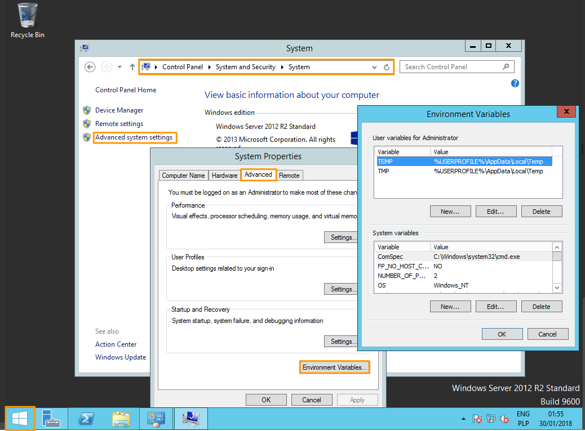

**Ostatnia aktualizacja dnia 2018-02-05**

## Wprowadzenie
W kontekście korzystania z klientów OpenStack konieczne jest załadowanie zmiennych środowiskowych, które umożliwiają uwierzytelnianie w naszych punktach dostępowych. 

**W tym przewodniku wyjaśniamy, jak załadować te zmienne środowiskowe, aby umożliwić uwierzytelnianie i interakcję z różnymi usługami.**

## Wymagania początkowe

- Dostęp do [Panelu klienta](https://www.ovh.com/auth/?action=gotomanager){.external}
- Utworzony użytkownik Horizon OpenStack

## W praktyce

### Pobieranie zmiennych środowiskowych

Zmienne środowiskowe, możesz uzyskać pobierając plik openrc.sh dla swojego użytkownika OpenStack.

Można to zrobić, w sekcji OpenStack danego Projektu.

Kliknij na ikonę klucza - wyświetli się małe menu. Następnie wybierz opcję: Pobierz plik konfiguracyjny OpenStack.

{.thumbnail}

Zostanie pobrany plik openrc.sh.


### Ładowanie zmiennych środowiskowych

#### Dla Linux

Otwórz terminal lub połącz się jako użytkownik, który będzie nawiązywał połączenia z interfejsem API OpenStack

Załaduj zawartość pliku do bieżącego środowiska, wymagane jest hasło odpowiedniego użytkownika OpenStack (używane jest też w interfejsie Horizon):

```sh
admin@vps187763:~$ source openrc.sh Please enter your OpenStack Password:
```


Jeśli CLI OpenStack został już zainstalowany, sprawdź poprawność jego działania:

```sh
admin@vps187763:~$ nova list 
+--------------------------------------+------+--------+------------+-------------+------------------------+
| ID | Name | Status | Task State | Power State | Networks | 
+--------------------------------------+------+--------+------------+-------------+------------------------+
| 2278e269-a529-40cc-9a08-794fda9302d3 | deb8 | ACTIVE | - | Running | Ext-Net=149.202.173.76 | 
+--------------------------------------+------+--------+------------+-------------+------------------------+
```
W pliku openrc.sh można przechowywać hasło użytkownika OpenStack. Wystarczy zmienić go zgodnie z przykładem:

z:
export OS_PASSWORD=$OS_PASSWORD_INPUT

na:

export OS_PASSWORD="Hasło_uzytkownika"
 

Domyślnie konieczne jest załadowanie środowiska po każdym logowaniu.

Możliwe jest trwałe załadowanie środowiska OpenStack poprzez dodanie pliku openrc.sh jako źródła do pliku .bashrc - konieczne jest wprowadzenie hasła do pliku openrc.sh.


#### Dla Windows

Pobierz lub utwórz plik OpenStack openrc.sh, aby pobrać informacje do uwierzytelnienia. Plik openrc.sh nie został zaprojektowany do pracy w systemie Windows.

Istnieją dwa rozwiązania do ładowania zmiennych środowiskowych  :


- Rozwiązanie pierwsze: Konieczne jest dostosowanie pliku poprzez modyfikację niektórych poleceń. W rzeczywistości wystarczy zmienić zapisane dane dotyczące hasła zgodnie z przykładem:


z:
export OS_PASSWORD=$OS_PASSWORD_INPUT

na:

export OS_PASSWORD="Hasło_uzytkownika"
 

- Rozwiązanie drugie: Zmienne mogą być ładowane bezpośrednio z parametrów systemu: Panel sterowania / System i Zabezpieczenia/ System / Zaawansowane ustawienia systemu / Zmienne środowiskowe.

{.thumbnail}


## Sprawdź również

[Dostęp do panelu Horizon](https://docs.ovh.com/pl/public-cloud/tworzenie_dostepu_do_interfejsu_horizon/){.external}

Przyłącz się do społeczności naszych użytkowników na stronie <https://community.ovh.com/en/>.