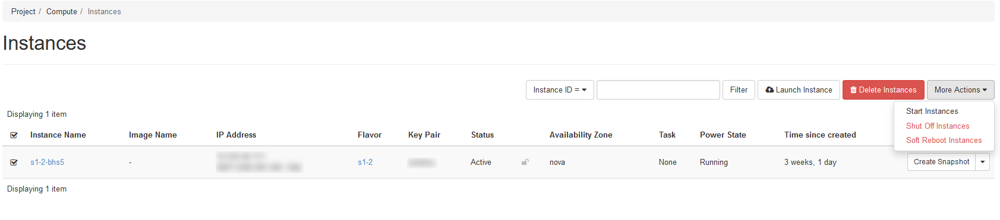
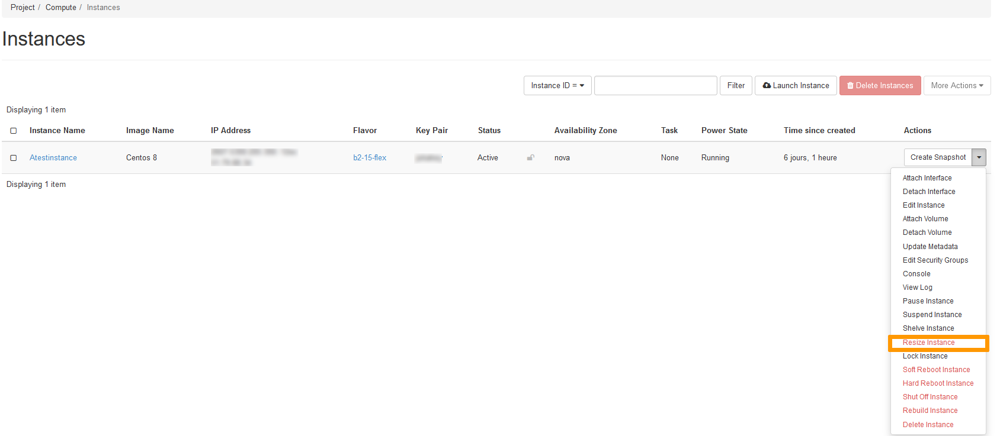
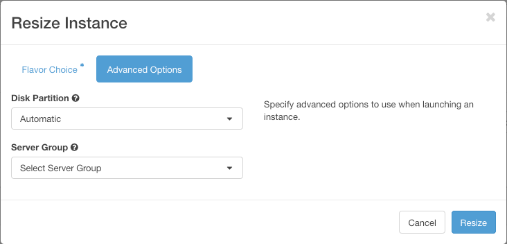
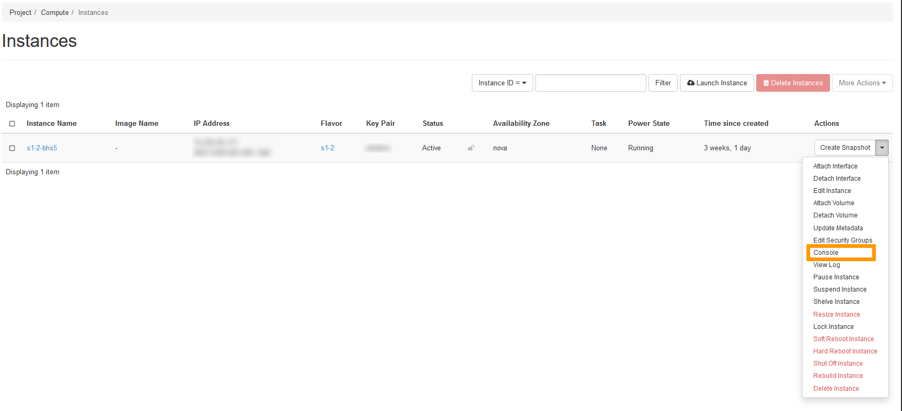
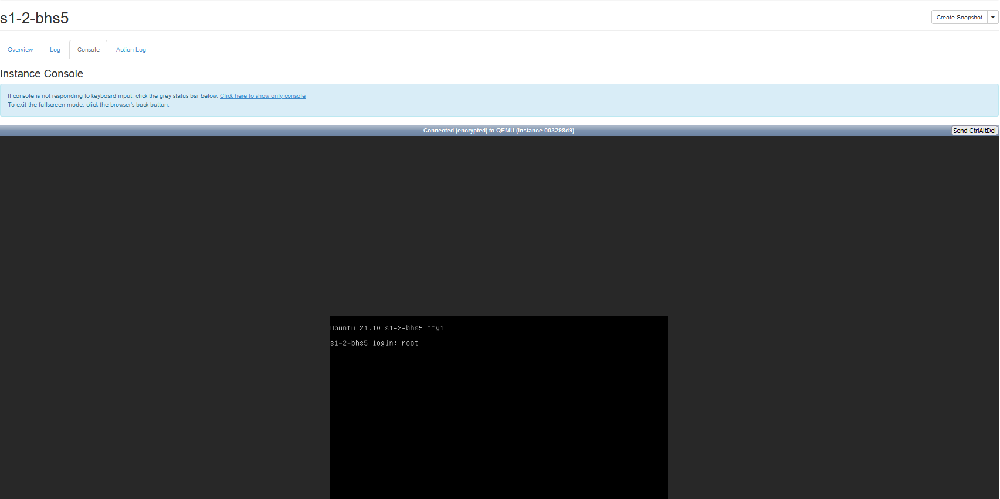
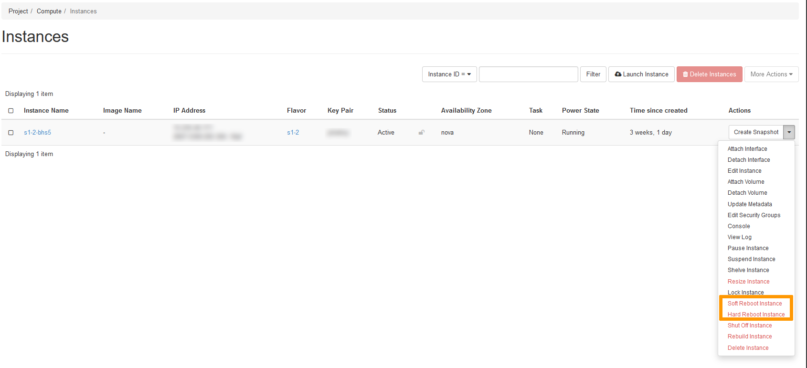

**Dernière mise à jour le 25 Janvier 2022**

## Objectif

Outre l'espace client OVHcloud, vous pouvez également gérer vos projets Public Cloud OVHcloud depuis l'[interface Horizon](https://horizon.cloud.ovh.net/auth/login/). Dans cette interface, vous y trouverez tous vos projets d’infrastructure (instances, sauvegardes, disques, clés SSH, etc.) et de stockage (y compris la liste de vos conteneurs).

**Ce guide vous détaille comment gérer vos instances Public Cloud via l'interface Horizon.**

## Prérequis

- Avoir créé une instance Public Cloud depuis votre [espace client OVHcloud](../premiers-pas-instance-public-cloud/) ou à travers l'[interface Horizon](https://docs.ovh.com/ca/fr/public-cloud/creer-une-instance-dans-horizon/).
- [Avoir créé une clé SSH](../creation-des-cles-ssh/).

## En pratique

### Accéder à l’interface de gestion de l’instance

Tout d’abord, connectez-vous à l'[interface Horizon](https://horizon.cloud.ovh.net/auth/login/).

Contrairement à l'espace client OVHcloud, Horizon sépare vos services selon leur région. Vous pouvez choisir la région depuis le menu en haut à gauche :

{.thumbnail}

Cliquez sur le menu `Compute`{.action} à gauche puis sélectionnez `Instances`{.action}. Sur la page qui s’affiche, vous verrez un résumé de toutes vos instances. Plusieurs informations vont s’afficher ici :

  * le modèle de votre instance (*Flavor*)
  * son nom, son état d'alimentation (Power State) et le temps écoulé depuis sa création (*Time since created*)
  * l’adresse IPv4 et IPV6 de votre instance
  * son réseau privé associé et son adresse IPv4 privée
  * son état (*Status*)
  * l'image utilisée pour l'installation de l'instance (si applicable)

{.thumbnail}

**Launch Instance** 

Cette option vous permet de créer une instance. Consultez [ce guide](https://docs.ovh.com/ca/fr/public-cloud/creer-une-instance-dans-horizon/) pour plus d'informations.

**Delete Instances**

Cette option vous permet de supprimer plusieurs instances en même temps, il suffit de cocher la case à gauche du nom de l'instance.

**More Actions**

Ce menu vous permet d'exécuter les actions suivantes sur une ou plusieurs instances. Assurez-vous d'abord de cocher la case à gauche du nom de l'instance :

- Start Instances : cette option permet de redémarrer une ou plusieurs instances en statut *shutoff* ou *off*.
- Shut Off Instances : cette option permet de suspendre une ou plusieurs instances.
- Soft Reboot Instances : cette option vous permet de faire un rédemarrage logiciel sur une ou plusieurs instances.

**Create Snapshot** : Cette option permet de créé un snapshot (instantané) de votre instance. Consultez [ce guide](https://docs.ovh.com/ca/fr/public-cloud/gestion-des-snapshots-dune-instance-dans-horizon/) pour plus d'informations.

### Modifier une instance

Dans l’interface de gestion de l’instance, sélectionnez l'option souhaitée dans la liste déroulante.

{.thumbnail}

- Attach Interface : cette option permet d'ajouter une ou plusieurs interfaces privées à votre instance via le VLAN. Pour plus d'informations, consultez [cette partie](https://docs.ovh.com/ca/fr/public-cloud/public-cloud-vrack/#ajout-dune-interface-privee) du guide correspondant.
- Detach Interface : cette option permet de supprimer une interface liée à une instance. Pour plus d'informations, consultez [cette partie](https://docs.ovh.com/ca/fr/public-cloud/public-cloud-vrack/#suppression-dune-interface-privee) du guide correspondant.
- Edit Instance : cette option permet de changer le nom de l'instance et les [groupes de sécurité](https://docs.ovh.com/ca/fr/public-cloud/configure-security-group-horizon/).

> [!warning]
> Les options en rouge indiquent la possibilité de perte de données pendant le processus. Assurez-vous de toujours disposer d'une sauvegarde de vos données avant de faire des changements sur votre instance.
>

### Redimensionner une instance

Grâce au Public Cloud, vous pouvez augmenter les ressources dont votre instance dispose, et cela simplement en quelques clics.

> [!warning]
>
> Seul le redimensionnement vers un modèle supérieur est possible pour les modèles classiques.
> De plus, cette manipulation entraine une coupure de l'instance le temps de l'opération.
> 

> [!success]
>
> Les instances de type *flex* permettent le redimensionnement vers les modèles supérieurs ou inférieurs grâce à une taille de disque unique.
> 

Sélectionnez `Resize Instance`{.action} dans le menu déroulant à droite de l'instance concernée.

{.thumbnail}

* Choix du gabarit (*Flavor Choice*) : cette section indique le gabarit actuel (*old flavor*) et vous permet de sélectionner un nouveau gabarit (*new flavor*) pour la ressource de l'instance.

{.thumbnail}

* Détails de gabarit (*Flavor Details*). Dans cette section s'affichent les ressources associées au gabarit choisi. 
* Limites de Projet (*Project Limits*). Visionnez ici les ressources occupées par rapport aux ressources totales allouées au projet.

> [!warning]
> Veuillez noter que vous pouvez uniquement redimensionner une instance d'un modèle Linux à un autre modèle Linux et d'un modèle Windows à un autre modèle Windows.
>

* Options avancées (*Advanced Options*). Cette section permet de gérer le partitionnement du disque (*Disk Partition*) et le groupe de serveurs (*Server Group*).

{.thumbnail}

Une fois la configuration terminée, cliquez sur `Resize`{.action}.

**Redimensionnement du disque sous Windows**

Attention, lors d'un redimensionnement pour une Instance Windows, la taille de la partition n'est pas automatiquement mise à jour, il faudra donc étendre celle ci en utilisant le **gestionnaire de disque**  :

Faites un clic-droit sur le menu `Démarrer`{.action} et lancez le gestionnaire de disque en cliquant sur `Gestion du disque`{.action}.

{.thumbnail}

Faites un clic-droit sur la partition principale, puis cliquez sur `Étendre le volume`{.action}.

{.thumbnail}

Cliquez sur `Suivant`{.action} pour accéder à « l'Assitant Extension du volume ». Choisissez les ressources du disque à étendre et cliquez sur `Suivant`{.action}. 

{.thumbnail}

Cliquez ensuite sur `Terminer`{.action} pour valider votre choix.

{.thumbnail}

La nouvelle taille du disque sera alors affichée dans le gestionnaire de disque.

{.thumbnail}

### Reconstruire une instance

Cette option vous permet de reconfigurer votre instance sur une nouvelle base, ou bien simplement de changer de système d'exploitation.

> [!alert]
> Cette manipulation entraine une suppression des données de l'instance.
> 

Sélectionnez `Rebuild Instance`{.action} dans la liste déroulante correspondant à l'instance.

{.thumbnail}

Sélectionnez l'image pour la reconstruction. 
Sélectionnez le type de partitionnement (« Automatique » ou « Manuel »). Ceci est facultatif. 
Pour finir, cliquez sur `Rebuild Instance`{.action}. Cette operation peut prendre quelques minutes.

### Suspendre ou mettre en pause une instance (Shelve or pause an instance)

Pour savoir comment suspendre ou mettre en pause une instance, cliquez [ici](https://docs.ovh.com/ca/fr/public-cloud/suspendre-ou-mettre-en-pause-une-instance/) pour consulter le guide spécifique à cette méthode.

### Accéder à la console de l'instance

En cas de perte d’accès à votre instance, que cela soit suite à une mauvaise configuration ou à une coupure du service SSH, il vous est toujours possible de reconfigurer votre instance à l’aide de la console VNC.

> [!primary]
>
> Vous pouvez accéder directement à votre instance via la console VNC. Par contre, il vous faudra au préalable configurer un mot de passe pour l’utilisateur root.
> Consultez [ce guide](https://docs.ovh.com/ca/fr/public-cloud/passer-root-et-definir-un-mot-de-passe/) pour plus d'informations.
> La console VNC peut aussi servir de première approche lors d'un dysfonctionnement, afin d'établir un diagnostic grâce à l'analyse de la phase de démarrage de votre instance.
> 

Dans la liste déroulante correspondant à l'instance, sélectionnez `Console`{.action}.

{.thumbnail}

La console de l'instance apparaît.

> [!success]
>
> Si la console ne répond plus aux entrées clavier, cliquez sur la barre d'état.
> Pour quitter le mode plein écran, cliquez sur le bouton retour du navigateur.
> 

**Console de l'instance**

{.thumbnail}

### Redémarrer une instance

Deux méthodes existent pour redémarrer une instance :

- Redémarrage à chaud (logiciel) (Soft Reboot Instance)
- Redémarrage à froid (matériel) (Hard Reboot Instance)

Dans la liste déroulante correspondant à l'instance, sélectionnez soit `Soft Reboot Instance`{.action} soit `Hard Reboot Instance`{.action}.

{.thumbnail}

Confirmez ensuite votre requête dans la fenêtre qui s’affiche.

### Supprimer une instance

Si vous n’avez plus besoin de l’une de vos instances, vous pouvez à tout moment supprimer celle-ci.

> [!alert]
>
> Les données présentes sur l'instance seront supprimées.
> Vous pouvez également créer une sauvegarde de cette instance si vous souhaitez conserver les données et relancer une instance identique ultérieurement.
> 

Dans la liste déroulante correspondant à l'instance, sélectionnez `Delete Instance`{.action}. 

{.thumbnail}

Cliquez ensuite sur `Confirm`{.action} pour lancer le processus.

> [!success]
>
> Une fois supprimée, votre instance ne vous sera plus facturée et vous ne serez plus en mesure de la récupérer.
> 

## Aller plus loin

Échangez avec notre communauté d’utilisateurs sur <https://community.ovh.com>.
