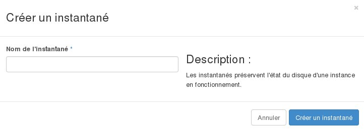

## 
Während des Betriebs können Sie jederzeit eine Sicherung Ihrer Daten, der Konfigurationen oder auch vollständiger Instanzen durchzuführen. Zu diesem Zweck können Sie Speicherauszüge (Snapshots) Ihrer Instanzen erstellen, die dann verwendet werden können, um eine vorherige Konfiguration Ihrer Instanz wiederherzustellen oder eine exakte Kopie einer Instanz zu erstellen.

In dieser Hilfe wird die Verwaltung der Speicherauszüge / Snapshots (Sicherung des Systemzustands zu einem bestimmten Zeitpunkt) im OpenStack Horizon Manager beschrieben.

## 
Um einen Speicherauszug / Snapshot einer Instanz zu erstellen gehen Sie wie folgt vor:

- Verbinden Sie sich mit Horizon
- Klicken Sie in dem Menü auf der linken Seite auf Instanzen
- Klicken Sie in der Zeile mit der gewünschten Instanz auf Speicherauszug erstellen
- Füllen Sie das Formular aus:

Speicherauszugsname: Geben Sie die gewünschte Bezeichnung für den Speicherauszug an. Der Speicherauszug wird anschließend in der Liste der Images aufgeführt,

{.thumbnail}

## 
Um einen Speicherauszug einer Instanz zu löschen gehen Sie wie folgt vor:

- Verbinden Sie sich mit Horizon
- Klicken Sie auf Abbilder
- Wählen Sie das zu löschende Abbild (Snapshot) aus
- Klicken Sie auf Abbild löschen

{.thumbnail}

## 
[Zurück zum Index der Cloud Hilfen]({legacy}1785)

