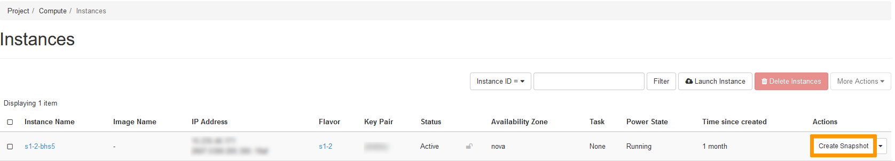

**Last updated 31st January 2022**

## Objective

During your activity, you will probably need to back up your data, configurations and even your entire instances. To do this, you can create snapshots of your instances. These can be used to restore a later configuration on your instance, or to create an exact copy of an instance.

**This guide explains how to manage snapshots from the OpenStack Horizon interface.**

## Requirements

- An [OVHcloud Public Cloud instance](https://docs.ovh.com/ie/en/public-cloud/public-cloud-first-steps/#create-instance) 
- [Access to the Horizon interface](../configure_user_access_to_horizon/)

## Instructions

### Snapshot creation

Log into the Horizon interface, and ensure that you are in the correct region. You can verify this on the top left corner.

{.thumbnail}

Next, click on the `Compute`{.action} menu on the left side and select `Instances`{.action}. Select `Create Snapshot`{.action} next to the corresponding instance.

{.thumbnail}

In the pop-up window, enter the required information:

Snapshot Name: Set a name for the snapshot and click on `Create Snapshot`{.action}.

{.thumbnail}

The snapshot will then be listed in the `Images`{.action} section. For this reason, we recommend naming each snapshot explicitly. 

### Deleting a snapshot

In the horizon interface, click on the `Compute`{.action} menu on the left side, then click on `Images`{.action}.

Next, click the drop-down arrow next to the snapshot you want to delete and click on `Delete Image`{.action}. Confirm the deletion of the snapshot.

{.thumbnail}

## Go further

Join our community of users on <https://community.ovh.com/en/>.