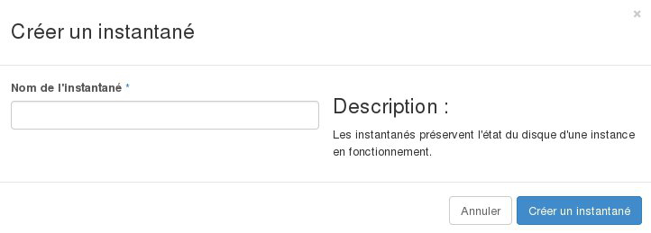
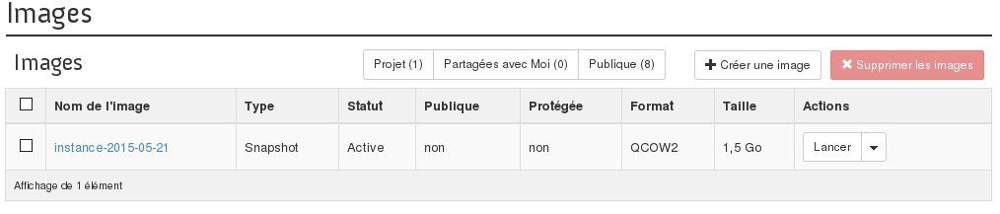

## Preambule
Lors de votre activité, vous serez probablement amené à effectuer une sauvegarde de vos données, de vos configurations, et même de vos instances au complet. Pour cela, il est possible de créer des snapshots de vos instances, ceux ci pourront être utilisés pour restaurer une configuration ultérieure sur votre instance, ou encore de créer une copie exacte d'une instance.

Ce guide vous explique  comment gérer ces snapshots depuis l'interface OpenStack Horizon.

## Création du snapshot
Pour créer un snapshot d'une instance il faut :

- Se connecter à Horizon
- Cliquer sur Instances dans le menu à gauche.
- Cliquer sur Créer un instantané sur la ligne de l'instance.
- Remplir le Formulaire :

Nom du snapshot : Indiquer le nom du snapshot souhaité. Le snapshot sera listé ensuite dans les images. Il est donc conseillé de mettre un nom explicite.

{.thumbnail}

## Supression d'un snapshot
Pour supprimer un snapshot d'une instance il faut :

- Se connecter à Horizon.
- Cliquer sur Images .
- Sélectionner l'image (snapshot) à supprimer.
- Cliquer sur Supprimer les images .

{.thumbnail}
