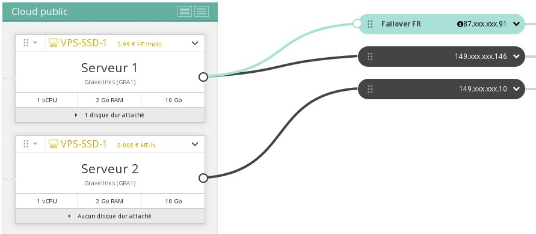
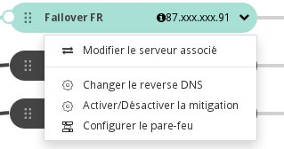
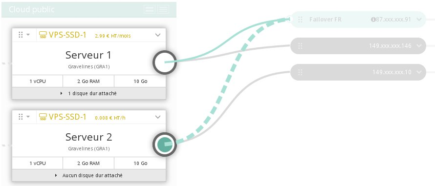

## 
This guide explains how to migrate a failover IP from one instance to another. This action generally limits or removes the possibility that your server will be unavailable and it lets you:

- migrate ton a website in its "new version";
- run your activity on a replicated server while you do a maintenance or run an update on the production server.

## Prerequisites

- At least two running Public Cloud instances
- A failover IP

## 

- To start with, the IP is routed to server 1 and I want to redirect it towards server 2.

{.thumbnail}

- Click on the arrow and then on Modify the associated server

{.thumbnail}
Click the box next to the destination server

{.thumbnail}

- Click Attach

The failover IP can be configured on the destination server before or after carrying out the migration. If it is preconfigured, it will begin to respond as soon as the routing operation is completed.

## 
[Go back to the index of Cloud guides]({legacy}1785)

