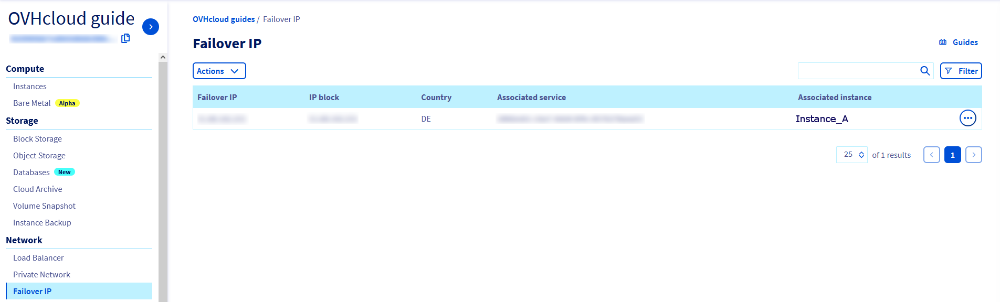
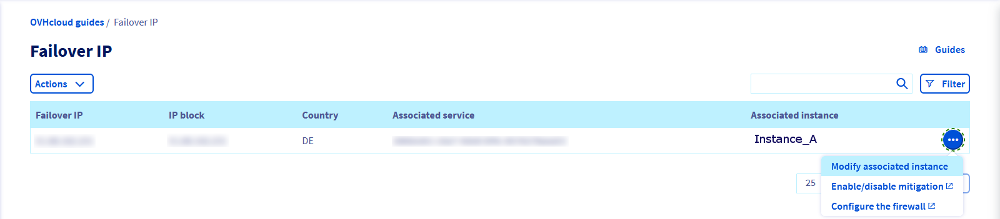

> [!primary]
> Tłumaczenie zostało wygenerowane automatycznie przez system naszego partnera SYSTRAN. W niektórych przypadkach mogą wystąpić nieprecyzyjne sformułowania, na przykład w tłumaczeniu nazw przycisków lub szczegółów technicznych. W przypadku jakichkolwiek wątpliwości zalecamy zapoznanie się z angielską/francuską wersją przewodnika. Jeśli chcesz przyczynić się do ulepszenia tłumaczenia, kliknij przycisk “Zaproponuj zmianę” na tej stronie.
>

**Ostatnia aktualizacja: 06-01-2022**

> [!primary]
>
> Od 6 października 2022 nasze rozwiązanie "Failover IP" nazywa się teraz [Additional IP](https://www.ovhcloud.com/pl/network/additional-ip/). Nie ma to żadnego wpływu na funkcje ani na działanie usług.
>

## Wprowadzenie

W tym przewodniku wyjaśniono, jak przenieść adres Additional IP (używany w przypadku awarii) z jednej instancji do innej. Dzięki tej operacji można ograniczyć czas niedostępności serwera lub uniknąć sytuacji braku dostępności, a ponadto jest możliwe:

- przeniesienie wielu stron internetowych do ich “nowych wersji”,
- prowadzenie działalności na serwerze zreplikowanym przy jednoczesnym przeprowadzaniu konserwacji lub aktualizacji na serwerze produkcyjnym.

## Wymagania początkowe

- Co najmniej dwie działające instancje Public Cloud
- Adres Additional IP
- Dostęp do [Panelu klienta OVHcloud](https://www.ovh.com/auth/?action=gotomanager&from=https://www.ovh.pl/&ovhSubsidiary=pl)

## W praktyce

> [!primary]
> Additional IP nie może być przenoszone między strefami. Na przykład adres IP zlokalizowany w centrum danych SBG może zostać przeniesiony do GRA lub RBX, ale nie może zostać przeniesiony do BHS.
>

### Migracja Additional IP

Po pierwsze zaloguj się do [Panelu klienta OVHcloud](https://www.ovh.com/auth/?action=gotomanager&from=https://www.ovh.pl/&ovhSubsidiary=pl), przejdź do sekcji `Public Cloud`{.action} i wybierz odpowiednią usługę Public Cloud. Następnie wybierz Additional IP w części **Network**.
W naszym przykładzie adres Additional IP przekierowywany jest na "Instance_A" i chcemy go przekierować na "Instance_B".

{.thumbnail}

Kliknij na `...`{.action} obok Additional IP i wybierz `Zmień przypisaną instancję`{.action}.

{.thumbnail}

Kliknij pole obok serwera docelowego.

{.thumbnail}

- Kliknij na `Przypisz`{.action}.

- Po kilku sekundach Panel klienta zostanie zaktualizowany. Zostanie też wyświetlony następujący komunikat z potwierdzeniem pomyślnego przeniesienia:

{.thumbnail}

> [!success]
>
> Additional IP można skonfigurować na serwerze docelowym przed
> wykonać przełączanie, lub po oczywiście. Jeśli jest wstępnie skonfigurowany,
> odpowiedź rozpoczyna się w momencie zakończenia operacji routingu.
>

## Sprawdź również

[Konfiguracja Additional IP](https://docs.ovh.com/pl/public-cloud/konfiguracja-adresu-ip-failover/)

[Importowanie adresu Additional IP](https://docs.ovh.com/pl/public-cloud/importowanie_adresu_ip_fail_over/)
 
Dołącz do społeczności naszych użytkowników na stronie <https://community.ovh.com/en/>.

