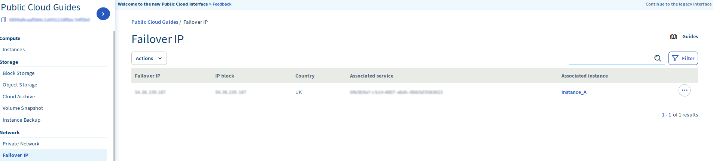
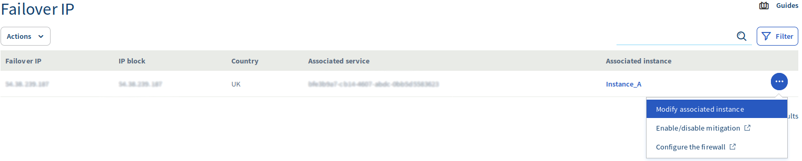
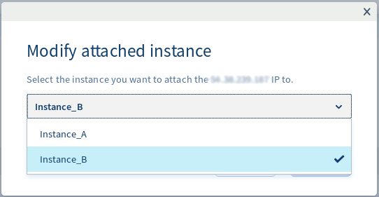
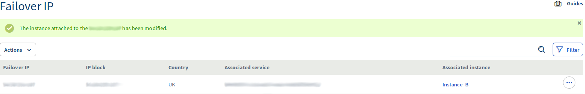

**Última atualização: 4 de dezembro de 2019**

##  Objetivo
Este guia explica como poderá migrar um IP Failover de uma instância para outra. Esta operação pode ter vários objetivos, permitindo geralmente limitar ou eliminar casos de indisponibilidade de serviço:

- migrar um website para a sua “nova versão”;
- passar a sua aplicação para um servidor de backup enquanto efetua uma manutenção ou atualização do servidor de produção.

## Pré-requisitos

- Dispor de, no mínimo, duas instâncias [Public Cloud iniciadas](https://www.ovhcloud.com/pt/public-cloud/){.external}
- Um IP Failover
- Ter acesso à [Área de Cliente OVH](https://www.ovh.com/auth/?action=gotomanager)

## Instruções

- Para iniciar, clique na secção IP Failover situada sobre a opção Rede no menu à esquerda. Poderá ver que o nosso IP Failover está roteado para a « instância_A» quando desejamos redirecioná-lo para a « instância_B ». 

{.thumbnail}

Clique nos três pontos à direita do IP Failover e depois em Modificar a instância associada. 

{.thumbnail}

Clique na opção junto ao servidor de destino

{.thumbnail}

- Clique em Associar

- Após alguns segundos, a área de cliente será atualizada e surgirá a seguinte mensagem a confirmar que a migração foi bem-sucedida:

{.thumbnail}

> [!primary]
>
> O IP poderá ser configurado no servidor de destino antes de efetuar a migração, ou após, como preferir. Se já estiver pré-configurado, passará a responder assim que a operação de migração terminar.

## Quer saber mais?

Fale com a nossa comunidade de utilizadores: [https://community.ovh.com/en/](https://community.ovh.com/en/)